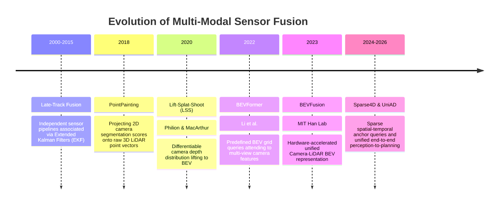
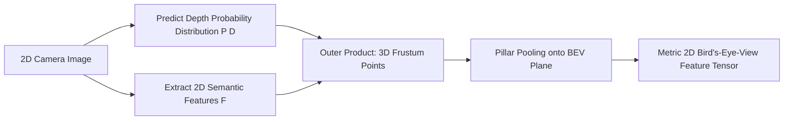
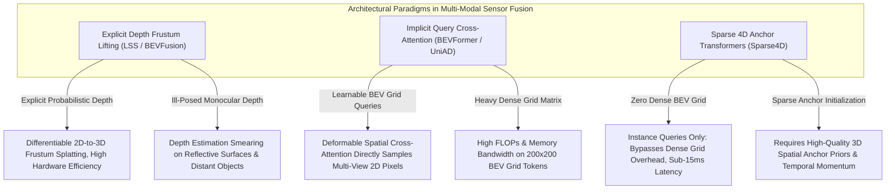

# 📜 Sensor Fusion: Historical Evolution & Paradigms

A didactic breakdown charting how autonomous multi-sensor perception progressed from heuristic Kalman filters and late bounding box association to deep point painting, cross-attention Transformers, and shared Bird's-Eye-View (BEV) foundation spaces.

Related notes: [[topics/sensor-fusion/00-sensor-fusion-moc|Sensor Fusion MOC]], [[topics/real-time-systems/00-real-time-systems-moc|Real-Time Systems MOC]].

---

## 1. Evolution Timeline: From Late Fusion to Unified BEV Spaces

---

## 2. Core Paradigm Breakthroughs Explained

### Breakthrough A: The Three Classical Levels of Fusion
Historically, multi-sensor systems categorized fusion into three structural tiers:
1. **Early Fusion (Data Level)**: Concatenate raw sensor measurements (e.g. RGB image pixels appended with LiDAR depth channels). Sensitive to slight calibration errors.
2. **Feature Fusion (Deep Level)**: Pass independent sensor streams through separate backbones and fuse intermediate feature tensors.
3. **Late Fusion (Decision Level)**: Run independent detectors on camera and LiDAR; match predicted 3D bounding boxes using Hungarian algorithms and average states.
- **Limitation of Late Fusion**: If a dark pedestrian is invisible to the camera and below the point-density threshold of the LiDAR, both independent detectors output zero boxes, making late fusion completely ineffective.

---

### Breakthrough B: Lift-Splat-Shoot (LSS, 2020)
Cameras operate in 2D perspective space $(u, v)$, while autonomous navigation occurs in 3D metric world space $(X, Y, Z)$. LSS solved the dimensional mismatch differentiably:
1. **Lift**: Predict a categorical depth distribution $P(D)$ for each camera feature pixel $(u, v)$.
2. **Splat**: Multiply features by depth probabilities to create a 3D frustum point cloud:
   $$p(u, v, d) = F(u, v) \cdot P(D = d)$$
3. **Shoot**: Use pillar pooling to collapse vertical frustum points into a discrete Bird's-Eye-View (BEV) grid plane.

---

### Breakthrough C: Hardware-Accelerated Fast BEV Pooling (BEVFusion, 2022–2023)
Original LSS pooling suffered from severe irregular GPU memory access, consuming over 500 ms per frame. MIT BEVFusion introduced pre-computed coordinate index sorting, reducing pooling time to **under 12 ms** and establishing unified Camera-LiDAR BEV perception as the industry standard.

---

## 3. Intensive Architectural Taxonomy: Convolutional vs Transformer vs Hybrid Sub-Modules

Autonomous multi-sensor fusion has evolved from late bounding box Kalman association and 2D point painting to explicit camera-depth frustum lifting, spatial-temporal cross-attention BEV transformers, and unified end-to-end multi-modal foundation spaces.

### Comparative Sub-Module Architectural Matrix

| Model Name & Year | Architectural Paradigm | Backbone Sub-Module | Neck / Feature Aggregator | Encoder Sub-Module | Decoder / Head Sub-Module | Primary Bottleneck & Edge Suitability |
| :--- | :--- | :--- | :--- | :--- | :--- | :--- |
| **PointPainting / PointAugmenting** (2018–2021) | Sequential Conv Pipeline | 2D Camera FCN / DeepLab + 3D LiDAR VoxelNet/PointPillars | 2D-to-3D Calibration Projection (Projects 2D segmentation scores onto 3D points) | Standard Convolutional Residual Blocks | Anchor-Based 2D/3D Convolutional Detection Head | **Latency & Pipeline Bound**: Sequential dependency; 2D camera CNN must finish completely before point painting begins; fails if camera-LiDAR calibration drifts. |
| **TransFuser** (2021) | Hybrid CNN-Transformer | Dual Backbone: ResNet-34 (RGB Camera) + ResNet-18 (LiDAR BEV pseudo-image) | Multi-Scale Bidirectional Cross-Attention Transformer Modules (fusing $1/8, 1/16, 1/32$ features) | Convolutional Residual Stages with Interleaved Self/Cross-Attention | Multi-Scale Conv Head + Autoregressive GRU Waypoint Navigation Planner | **Compute & Memory Balanced**: Robust end-to-end driving policy; attention across intermediate feature maps prevents single-sensor failure modes; runs at ~30 FPS on embedded automotive compute. |
| **Lift-Splat-Shoot (LSS)** (2020) | Pure Conv Frustum Lifting | EfficientNet / ResNet-50 2D Camera Feature Backbone | Categorical Depth Distribution Softmax ($D=118$ bins) + Outer Product Frustum Generation | Pillar Splatting & 2D BEV Convolutional Aggregator | Multi-Task 2D Convolutional BEV Head (Semantic map segmentation + 3D boxes) | **Memory Bandwidth & Scatter Bound**: Standard LSS pooling creates irregular GPU memory writes (>500 ms in naive PyTorch); unsuited for embedded edge without custom CUDA kernels. |
| **BEVFormer / BEVFormer v2** (2022–2023) | Hybrid / Pure Transformer | 2D Camera Backbone (ResNet-101 / InternImage) + Perspective FPN | Spatial Cross-Attention (Predefined 3D BEV grid queries deformable-attend to multi-camera 2D views) | Temporal Self-Attention (Fuses history BEV queries from time $t-1$) | Task-Specific Transformer Decoder (3D Bounding Boxes + Vectorized HD Map Tokens) | **Compute & Deformable Attention Bound**: SOTA vision-centric 3D perception; eliminates explicit depth estimation; deformable sampling across 6 cameras is compute-intensive on edge NPUs. |
| **BEVFusion (MIT Han Lab)** (2022–2023) | Unified Multi-Modal Hybrid | Dual Backbone: Swin-T / ConvNeXt (Multi-View Camera) + Sparse 3D SpConv (LiDAR) | Hardware-Accelerated Fast BEV Pooling (Pre-computed coordinate sorting, <12 ms) | Fully Convolutional Dynamic Fusion Module with Channel-Spatial Attention | CenterPoint Anchor-Free 3D Detection Head + 2D BEV Map Segmentation Conv Head | **Memory Bandwidth Optimized**: SOTA accuracy and speed (8.4 FPS on Orin); unified BEV representation; standard for automotive camera-LiDAR perception. |
| **TransFusion** (2022) | Hybrid Transformer Decoder | Sparse 3D LiDAR Backbone (SpConv) + ResNet Camera Backbone | Sparse 3D-to-BEV Feature Scatter Neck | Submanifold Sparse Convolutional Stages | 2-Stage Query Transformer Decoder: Initial LiDAR 3D queries dynamically cross-attend to 2D camera feature maps | **Compute & Feature Sampling Bound**: Robust to camera dropouts (falls back gracefully to pure LiDAR); cross-attention sampling requires synchronized GPU memory buffers. |
| **Sparse4D v1–v3** (2023–2025) | Pure Sparse Anchor Transformer | Multi-Camera ResNet / VoVNet Image Backbone | Hierarchical 4D Deformable Feature Aggregator | Spatial-Temporal Sparse Anchor Query Evolution (No dense BEV grid construction) | Fully Sparse NMS-Free 3D Bounding Box Head | **DRAM Bandwidth Optimized**: Bypasses expensive dense BEV grid construction entirely; constant-time sparse query scaling; ideal for real-time edge automotive deployment (>40 FPS). |
| **UniAD** (2023–2024) | End-to-End Foundation Transformer | Multi-Camera ViT / ResNet Backbone | Unified BEV Query Transformer Encoder | Interleaved Spatial-Temporal Transformer Layers | Hierarchical Query Decoder Pipeline: TrackFormer $\to$ MapTR $\to$ MotionFormer $\to$ OccFormer $\to$ Planner | **KV-Cache & System Latency Bound**: Unifies tracking, mapping, prediction, occupancy, and planning into one query graph; large model footprint (~200 ms latency) requires high-end automotive computers. |

### Didactic Architectural Trade-Off Analysis

#### 1. Explicit Depth Distribution Estimation (LSS) vs. Implicit Spatial Attention (BEVFormer)
- **Explicit Depth Frustum Lifting (Lift-Splat-Shoot, BEVFusion)** predicts a discrete probability distribution $P(D = d \mid u, v)$ over $D$ predefined depth bins for each 2D feature pixel $(u, v)$. Feature vectors are lifted along camera optical rays to create 3D frustum points:
  $$p(u, v, d) = F(u, v) \otimes P(D = d \mid u, v) \in \mathbb{R}^{C \times D \times H \times W}$$
  These points are splatted into a shared 2D BEV grid via pillar pooling. While mathematically transparent and hardware-accelerable (via BEVFusion pre-sorted pooling), it is fundamentally constrained by the accuracy of the monocular depth network; depth estimation errors cause features to "smear" along optical rays in metric space.
- **Implicit Spatial Cross-Attention (BEVFormer)** eliminates explicit depth prediction. Predefined 3D spatial queries $Q \in \mathbb{R}^{H_{\text{bev}} \times W_{\text{bev}} \times C}$ project their 3D physical coordinates into the 2D image planes of all surrounding cameras using known calibration matrices $[K \mid R, T]$. Deformable attention layers then sample 2D features directly around these projection points:
  $$\text{SCA}(Q_p, \mathcal{F}) = \frac{1}{\mathcal{V}_{\text{hit}}} \sum_{i \in \mathcal{V}_{\text{hit}}} \sum_{m=1}^M W_m \sum_{k=1}^K A_{m,i,k} \cdot W_v \mathcal{F}_i\left(\pi_i(p, z_k) + \Delta p_{m,i,k}\right)$$
  This learns depth implicitly from data, eliminating geometric ray-smearing artifacts.

#### 2. Dense BEV Grids vs. Fully Sparse 4D Anchor Queries
- **Dense BEV Grids (BEVFusion, BEVFormer)** discretize world space into a uniform $200 \times 200$ grid ($0.5\text{m}$ resolution). While effective for HD map segmentation, computing attention across 40,000 spatial tokens introduces substantial compute overhead on edge accelerators.
- **Sparse Anchor Transformers (Sparse4D)** completely discard the dense 2D BEV feature map. Instead, a fixed set of ~900 **sparse 4D anchor queries** iteratively update their 3D coordinates $(x, y, z, w, l, h, \theta, v_x, v_y)$ by sampling multi-view camera and LiDAR features only at the anchor bounding box corners, achieving $<15\,\text{ms}$ inference latency on edge NPUs.

#### 3. Asynchronous Temporal Sensor Synchronization
- Real-world autonomous vehicles encounter asynchronous sensor streams: cameras fire at 30 Hz with rolling shutters ($10\text{--}30\,\text{ms}$ readout delay), while LiDAR spins at 10 Hz.
- Modern fusion transformers handle this by appending **continuous temporal delta timestamps** $\Delta t = t_{\text{cam}} - t_{\text{lidar}}$ to positional query encodings and performing ego-motion compensation warping before cross-attention feature aggregation.

