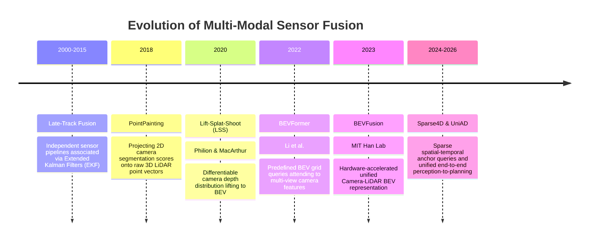
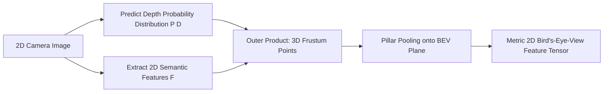

# 📜 Sensor Fusion: Historical Evolution & Paradigms

A didactic breakdown charting how autonomous multi-sensor perception progressed from heuristic Kalman filters and late bounding box association to deep point painting, cross-attention Transformers, and shared Bird's-Eye-View (BEV) foundation spaces.

Related notes: [[topics/sensor-fusion/00-sensor-fusion-moc|Sensor Fusion MOC]], [[topics/real-time-systems/00-real-time-systems-moc|Real-Time Systems MOC]].

---

## 1. Evolution Timeline: From Late Fusion to Unified BEV Spaces

---

## 2. Core Paradigm Breakthroughs Explained

### Breakthrough A: The Three Classical Levels of Fusion
Historically, multi-sensor systems categorized fusion into three structural tiers:
1. **Early Fusion (Data Level)**: Concatenate raw sensor measurements (e.g. RGB image pixels appended with LiDAR depth channels). Sensitive to slight calibration errors.
2. **Feature Fusion (Deep Level)**: Pass independent sensor streams through separate backbones and fuse intermediate feature tensors.
3. **Late Fusion (Decision Level)**: Run independent detectors on camera and LiDAR; match predicted 3D bounding boxes using Hungarian algorithms and average states.
- **Limitation of Late Fusion**: If a dark pedestrian is invisible to the camera and below the point-density threshold of the LiDAR, both independent detectors output zero boxes, making late fusion completely ineffective.

---

### Breakthrough B: Lift-Splat-Shoot (LSS, 2020)
Cameras operate in 2D perspective space $(u, v)$, while autonomous navigation occurs in 3D metric world space $(X, Y, Z)$. LSS solved the dimensional mismatch differentiably:
1. **Lift**: Predict a categorical depth distribution $P(D)$ for each camera feature pixel $(u, v)$.
2. **Splat**: Multiply features by depth probabilities to create a 3D frustum point cloud:
   $$p(u, v, d) = F(u, v) \cdot P(D = d)$$
3. **Shoot**: Use pillar pooling to collapse vertical frustum points into a discrete Bird's-Eye-View (BEV) grid plane.

---

### Breakthrough C: Hardware-Accelerated Fast BEV Pooling (BEVFusion, 2022–2023)
Original LSS pooling suffered from severe irregular GPU memory access, consuming over 500 ms per frame. MIT BEVFusion introduced pre-computed coordinate index sorting, reducing pooling time to **under 12 ms** and establishing unified Camera-LiDAR BEV perception as the industry standard.
