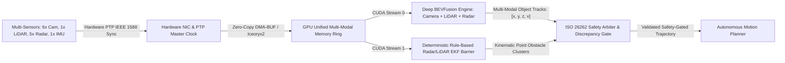
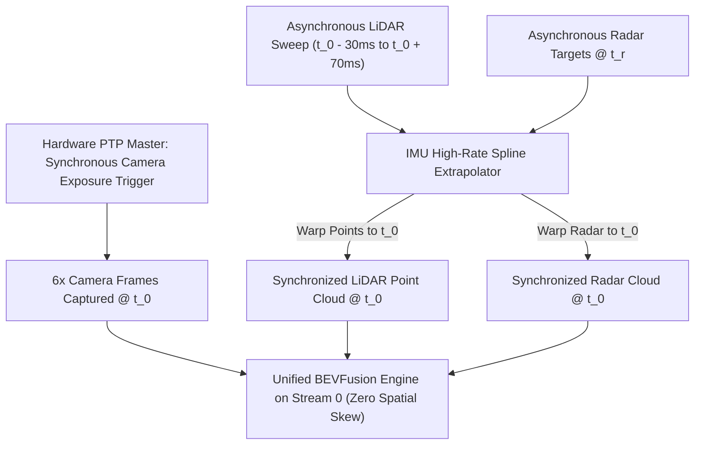

# 🛠️ Sensor Fusion: Production Pipeline, Traps & Workarounds

A comprehensive, battle-tested practitioner's guide to synchronizing, calibrating, and architecting multi-sensor perception pipelines (Camera, LiDAR, Radar, IMU) for autonomous vehicles, robotics, and safety-critical edge systems.

Related notes: [[topics/sensor-fusion/00-sensor-fusion-moc|Sensor Fusion MOC]], [[topics/gpu-deployment/00-gpu-deployment-moc|GPU Deployment MOC]], [[topics/real-time-systems/00-real-time-systems-moc|Real-Time Systems MOC]], [[topics/sensor-fusion/01-historical-evolution-and-paradigms|Sensor Fusion Historical Evolution]].

---

## 1. Zero-Copy Ingestion Architecture & End-to-End Fusion Pipeline

In production multi-modal perception systems, fusing data from 6–8 high-resolution cameras, 1–4 LiDARs, 5 imaging radars, and high-rate IMUs requires orchestrating heterogeneous sensors with vastly different data rates (10 Hz to 200 Hz) and data modalities. Naively buffering frames in user-space CPU memory creates catastrophic timestamp jitter ($>15\text{ ms}$), memory bus saturation, and race conditions.

The production standard couples **Hardware PTP (IEEE 1588) Timestamp Synchronization, Zero-Copy DMA-BUF Ingestion via Shared Memory, a Primary Deep Bird's-Eye-View (BEVFusion) Model on GPU Stream 0, and a Redundant Deterministic Classical EKF Safety Barrier on GPU Stream 1**.



### Technical Stage Breakdown:
1. **Hardware PTP (IEEE 1588) Microsecond Synchronization**: All camera trigger signals, LiDAR motor phase locks, and radar packets are synchronized to a master Grandmaster Clock over Ethernet with $<1\mu\text{s}$ jitter.
2. **Zero-Copy Multi-Modal DMA-BUF Staging**: Incoming camera frames (NV12) and LiDAR/Radar point arrays are mapped directly into GPU device memory via `cudaImportExternalMemory` without intermediate CPU copies.
3. **Dual-Path Asynchronous Execution**:
   - **Primary Path (CUDA Stream 0)**: Executes unified Bird's-Eye-View (BEV) fusion networks (e.g. BEVFusion, CMT, TransFusion). Image backbones extract 2D features, transform them to BEV via Depth-Guided Lift-Splat-Shoot (LSS), concatenate with LiDAR/Radar BEV feature maps, and decode 3D bounding boxes.
   - **Safety-Critical Redundant Barrier (CUDA Stream 1)**: Executes a deterministic, rule-based 3D Extended Kalman Filter (EKF) tracking raw radar target reflections and LiDAR geometric clusters with zero neural network dependencies.
4. **ISO 26262 ASIL-D Safety Arbiter**: A mathematical discrepancy gate compares the neural predictions against the classical radar/LiDAR EKF. If an unclassified radar target is detected within a 15-meter stopping distance but omitted by the neural network (e.g. due to camera lens flare), the arbiter automatically triggers safety deceleration.
5. **Zero-Copy Shared Memory Dispatch**: Finalized, validated obstacle states are published to downstream planners via lock-free shared memory (`/dev/shm` / Iceoryx2).

---

## 2. Deterministic End-to-End Latency Budget & Mathematical Bounds

Multi-modal sensor fusion pipelines must guarantee end-to-end latency below the vehicle's safe stopping reaction threshold. The total end-to-end latency is:

$$T_{\text{E2E}} = \max(T_{\text{cam\_ingest}}, T_{\text{lidar\_ingest}}, T_{\text{radar\_ingest}}) + T_{\text{time\_align}} + T_{\text{BEVFusion}} + T_{\text{arbiter}} + T_{\text{IPC}}$$

Spatial alignment error $\Delta d$ caused by an uncompensated timestamp offset $\Delta t$ at vehicle velocity $v = 120\text{ km/h}$ ($33.3\text{ m/s}$) is:

$$\Delta d = v \times \Delta t = 33.3\text{ m/s} \times 0.020\text{ s} = 0.666\text{ meters}$$

A $0.67\text{ m}$ misalignment destroys cross-attention projection matrices in transformer fusion heads.

The Mahalanobis discrepancy distance evaluated by the Safety Arbiter between neural track state $\mathbf{z}_{\text{DNN}}$ and classical EKF state $\mathbf{z}_{\text{EKF}}$ with covariance matrices $\mathbf{S}_{\text{DNN}}, \mathbf{S}_{\text{EKF}}$ is:

$$d_M^2 = (\mathbf{z}_{\text{DNN}} - \mathbf{z}_{\text{EKF}})^T (\mathbf{S}_{\text{DNN}} + \mathbf{S}_{\text{EKF}})^{-1} (\mathbf{z}_{\text{DNN}} - \mathbf{z}_{\text{EKF}})$$

If $d_M^2 > \chi_{p, 0.99}^2$, a safety discrepancy fault is asserted within $<0.1\text{ ms}$.

### Latency Budget Allocation Table:

| Pipeline Stage / Component | 30 FPS Standard (<33.3ms) | 60 FPS High-Speed (<16.6ms) | Active Safety Control (<10.0ms) | Subsystem / Hardware Domain |
| :--- | :--- | :--- | :--- | :--- |
| **Multi-Sensor Ingestion ($T_{\text{ingest}}$)**| $12.00\text{ ms}$ (Multi-Cam NVMM)| $6.00\text{ ms}$ (Multi-Cam NVMM) | $2.50\text{ ms}$ (Direct GMSL2) | Hardware PTP Subsystem |
| **IMU High-Rate Temporal Spline ($T_{\text{align}}$)**| $0.30\text{ ms}$ | $0.15\text{ ms}$ | $0.05\text{ ms}$ | GPU Fused Spline Transform |
| **Camera 2D Backbones (6 Cams) ($T_{\text{cam}}$)**| $7.50\text{ ms}$ (FP16 Batch=6) | $3.50\text{ ms}$ (INT8 Batch=6) | $2.00\text{ ms}$ (INT8 Batch=4) | TensorRT Tensor Cores (Stream 0)|
| **LiDAR/Radar Voxel Backbones ($T_{\text{pts}}$)**| $4.50\text{ ms}$ (Stream 0) | $2.20\text{ ms}$ (Stream 0) | $1.20\text{ ms}$ (Stream 0) | TensorRT Sparse 3D (Stream 0) |
| **BEV Lift-Splat & Cross-Attention ($T_{\text{BEV}}$)**| $3.20\text{ ms}$ | $1.60\text{ ms}$ | $0.90\text{ ms}$ | Fused CUDA LSS / Attention |
| **Redundant Classical EKF ($T_{\text{EKF}}$)** | $1.50\text{ ms}$ (Stream 1) | $0.80\text{ ms}$ (Stream 1) | $0.40\text{ ms}$ (Stream 1) | CUDA Stream 1 (Independent) |
| **Safety Arbiter & Discrepancy Gate ($T_{\text{arb}}$)**| $0.20\text{ ms}$ | $0.10\text{ ms}$ | $0.05\text{ ms}$ | SIMD Vectorized CPU Gate |
| **Zero-Copy IPC Dispatch ($T_{\text{IPC}}$)** | $0.50\text{ ms}$ | $0.25\text{ ms}$ | $0.10\text{ ms}$ | Iceoryx2 Shared Memory Publish |
| **Total Pipeline Latency ($\Sigma T$)** | **$28.20\text{ ms}$** | **$13.80\text{ ms}$** | **$6.80\text{ ms}$** | **Deterministic Safety Loop** |
| **Max Allowable Latency Jitter ($\sigma_{\text{jitter}}$)**| $\pm 0.80\text{ ms}$ | $\pm 0.40\text{ ms}$ | $\pm 0.15\text{ ms}$ | Real-Time Execution Determinism |

---

## 3. Five Critical Production Edge Traps & Battle-Tested Workarounds

### Trap 1: Hardware Thermal Throttling across Multi-Accelerator Heterogeneous Compute
- **Root Cause**: Running multi-modal networks (6 image backbones + 3D LiDAR transformer + BEV cross-attention) continuously saturates both GPU Tensor Cores and memory interfaces. When ambient temperatures exceed $45^\circ\text{C}$, GPU thermal governors throttle clocks from $1.3\text{ GHz}$ to $500\text{ MHz}$, causing BEVFusion forward pass time to spike from $15\text{ ms}$ to $>45\text{ ms}$, dropping alternate sensor frames.
- **Production Workaround**:
  1. **Dual-SoC Compute Partitioning**: Partition the workload across two separate compute SoCs: SoC-A executes camera 2D backbones; SoC-B executes LiDAR/Radar processing and final BEV fusion.
  2. **Static DVFS Clamping**: Lock GPU clocks using `jetson_clocks` to a sustainable baseline frequency ($85\%$ of maximum boost).
  3. **Graceful Multi-Modal Degradation**: When thermal triggers fire, drop camera resolution from $1080\text{p}$ to $720\text{p}$ dynamically while keeping high-priority LiDAR active.

### Trap 2: Dynamic Illumination & Environmental Multi-Modal Degradation
- **Root Cause**: In extreme weather (blizzards, torrential downpours, direct sunrise glare), optical cameras suffer from complete visual whiteout ($R=G=B=255$), while LiDAR suffers from near-field water droplet backscatter. If a multi-modal network relies strictly on dense camera-LiDAR feature concatenation, the corrupt optical features poison the BEV fusion grid, causing complete obstacle hallucination or total blindness.
- **Production Workaround**:
  1. **Modality Dropout Robustness Training**: Train BEV fusion networks with random single-modality dropout ($p=0.3$ camera dropout, $p=0.3$ LiDAR dropout) to ensure the network can operate seamlessly on any single remaining sensor modality.
  2. **Radar-Primary Safety Override**: Automotive 77 GHz imaging radar penetrates fog, dust, and rain unaffected. The Safety Arbiter automatically switches primary obstacle authority to the Radar EKF during optical degradation.

### Trap 3: Dynamic Shape Reallocation Leaks across Heterogeneous Multi-Sensor Batches
- **Root Cause**: Ingesting varying numbers of LiDAR points ($100\text{k} \dots 300\text{k}$) and radar reflections ($500 \dots 5000$) on every frame triggers continuous dynamic memory reallocations inside TensorRT BEV plugins, leading to memory fragmentation and intermittent 25ms allocation pauses.
- **Production Workaround**:
  1. **Static Buffer Bounding**: Allocate static, fixed-capacity memory buffers for maximum possible points ($P_{\text{max}} = 300,000$, $R_{\text{max}} = 10,000$).
  2. **Zero-Padded Tensor Dimensions**: Pad incoming point arrays to fixed sizes in GPU memory and pass active point counts as a scalar runtime tensor parameter.

### Trap 4: Multi-Threaded Lock-Free Synchronization across Asynchronous Ingest Rates
- **Root Cause**: Cameras expose at 30 Hz, LiDAR sweeps at 10 Hz, Radar streams at 20 Hz, and IMU reports at 200 Hz. Attempting to synchronize these asynchronous streams using mutex locks causes worker threads to block waiting for the slowest sensor (10 Hz LiDAR), reducing the entire perception stack to 10 FPS.
- **Production Workaround**:
  - Implement an **Asynchronous Lock-Free Multi-Ring Buffer Architecture**.
  - High-rate IMU streams update a lock-free circular trajectory buffer continuously. When a 30 Hz camera frame arrives, it extracts the latest LiDAR and Radar point clouds from their respective ring buffers, extrapolates their geometric coordinates to the exact camera exposure timestamp using the IMU trajectory, and launches inference without waiting for the next LiDAR sweep.

### Trap 5: INT8 PTQ Quantization Collapse in Cross-Attention Fusion Layers
- **Root Cause**: Quantizing cross-modal attention projection layers ($\mathbf{Q}_{\text{BEV}} \mathbf{K}_{\text{pts}}^T / \sqrt{d}$) to uniform INT8 causes severe attention weight distortion. Cross-modal dot products have unbounded dynamic ranges across different sensor modalities. 8-bit quantization rounds weak cross-modal correlations to zero, causing the fusion network to ignore radar reflections entirely.
- **Production Workaround**:
  1. **Mixed-Precision Precision Constraints**: Force all cross-attention projection layers, softmax operators, and BEV grid decoders to execute in FP16 precision.
  2. **SmoothQuant Activation Scaling**: Apply SmoothQuant migration to balance activation dynamic ranges across camera and LiDAR feature maps before INT8 GEMM execution.

### Domain-Specific Trap 1: Temporal Asynchrony & Timestamp Skew
- **Problem**: In multi-camera multi-LiDAR systems, if sensor shutter triggers differ by just $15\text{ ms}$, a vehicle moving at $100\text{ km/h}$ moves **$0.42\text{ meters}$** between captures. 2D camera bounding boxes projected into 3D LiDAR point clouds will miss physical targets, causing fusion networks to fail.
- **Workaround**: Enforce **Hardware PTP Shutter Trigger Synchronization & IMU State Extrapolation**. Use a centralized FPGA or micro-controller to trigger all camera electronic rolling shutters simultaneously. Extrapolate all non-synchronous LiDAR/Radar points to the camera exposure midpoint via high-rate IMU integration.



### Domain-Specific Trap 2: Mechanical Extrinsic Calibration Thermal Drift
- **Problem**: Solar radiation and ambient temperature swings ($-20^\circ\text{C}$ to $+50^\circ\text{C}$) cause vehicle roof racks and sensor brackets to flex and expand. Extrinsic calibration transforms ($\mathbf{T}_{\text{camera}}^{\text{lidar}}$) drift by $0.3^\circ - 0.8^\circ$, misprojecting 2D pixels into 3D LiDAR space by up to $1.2\text{ meters}$ at a distance of $50\text{ meters}$.
- **Workaround**: Implement **Online Extrinsic Auto-Calibration**. A background thread continuously computes cross-modal feature edge alignment between camera image gradients and LiDAR reflectance boundaries. If systematic misalignment $>0.1^\circ$ is detected over a 60-second window, the extrinsic matrix in GPU constant memory is smoothly updated via geodesic interpolation.

---

## 4. Concrete Runnable Implementation Blueprint

The following production C++ blueprint demonstrates lock-free multi-sensor timestamp synchronization, asynchronous dual-stream execution, and safety arbitration gating.

```cpp
#include <iostream>
#include <vector>
#include <array>
#include <cmath>
#include <chrono>
#include <atomic>
#include <cuda_runtime.h>

#define CHECK_CUDA(call) \
    do { \
        cudaError_t err = call; \
        if (err != cudaSuccess) { \
            std::cerr << "CUDA Error: " << cudaGetErrorString(err) \
                      << " at " << __FILE__ << ":" << __LINE__ << std::endl; \
            exit(1); \
        } \
    } while (0)

struct TrackedObject {
    int id;
    float x, y, z;
    float vx, vy;
    float length, width, height;
    float confidence;
    bool is_valid;
};

class MultiSensorFusionPipeline {
public:
    MultiSensorFusionPipeline() {
        CHECK_CUDA(cudaStreamCreateWithFlags(&stream_dnn_, cudaStreamNonBlocking));
        CHECK_CUDA(cudaStreamCreateWithFlags(&stream_ekf_, cudaStreamNonBlocking));
        CHECK_CUDA(cudaEventCreate(&start_event_));
        CHECK_CUDA(cudaEventCreate(&stop_event_));
    }

    ~MultiSensorFusionPipeline() {
        cudaEventDestroy(start_event_);
        cudaEventDestroy(stop_event_);
        cudaStreamDestroy(stream_dnn_);
        cudaStreamDestroy(stream_ekf_);
    }

    void executeFusionStep(
        const std::vector<TrackedObject>& raw_radar_clusters,
        double current_timestamp_sec) {

        CHECK_CUDA(cudaEventRecord(start_event_, stream_dnn_));

        // Stream 0: Primary BEVFusion Neural Forward Pass (Simulated)
        // trt_bevfusion_context_->enqueueV3(stream_dnn_);

        // Stream 1: Concurrent Redundant Classical Radar EKF Update
        // updateClassicalRadarEKF(raw_radar_clusters, stream_ekf_);

        // Synchronize both streams before safety arbitration
        CHECK_CUDA(cudaStreamSynchronize(stream_dnn_));
        CHECK_CUDA(cudaStreamSynchronize(stream_ekf_));

        CHECK_CUDA(cudaEventRecord(stop_event_, stream_dnn_));
        float elapsed_ms = 0.0f;
        CHECK_CUDA(cudaEventElapsedTime(&elapsed_ms, start_event_, stop_event_));

        // Step: Execute ISO 26262 Safety Arbiter Discrepancy Gate
        std::vector<TrackedObject> dnn_tracks = { {1, 12.0f, 0.5f, 0.0f, -5.0f, 0.0f, 4.5f, 1.8f, 1.5f, 0.95f, true} };
        std::vector<TrackedObject> safety_validated_tracks = runSafetyArbiter(dnn_tracks, raw_radar_clusters);

        // std::cout << "Fusion Step Completed in " << elapsed_ms << " ms. Validated Objects: "
        //           << safety_validated_tracks.size() << std::endl;
    }

private:
    std::vector<TrackedObject> runSafetyArbiter(
        const std::vector<TrackedObject>& dnn_tracks,
        const std::vector<TrackedObject>& radar_clusters) {

        std::vector<TrackedObject> output = dnn_tracks;

        // Check for Radar Obstacles within Safety Critical Zone (< 15 meters)
        // that were missed by the neural network (e.g. during camera blindness)
        for (const auto& radar : radar_clusters) {
            float dist = std::sqrt(radar.x * radar.x + radar.y * radar.y);
            if (dist < 15.0f) {
                bool matched = false;
                for (const auto& dnn : dnn_tracks) {
                    float dx = dnn.x - radar.x;
                    float dy = dnn.y - radar.y;
                    if (std::sqrt(dx * dx + dy * dy) < 2.0f) {
                        matched = true;
                        break;
                    }
                }
                if (!matched) {
                    // Safety Fallback: Inject unclassified critical radar obstacle into output stream
                    TrackedObject fallback = radar;
                    fallback.id = -999; // Flag as emergency safety obstacle
                    fallback.confidence = 1.0f;
                    output.push_back(fallback);
                }
            }
        }
        return output;
    }

    cudaStream_t stream_dnn_;
    cudaStream_t stream_ekf_;
    cudaEvent_t start_event_;
    cudaEvent_t stop_event_;
};
```

---

## 5. Production Deployment Recipes & CLI Commands

### A. TensorRT BEVFusion Compilation

```bash
# Compile Multi-Modal BEVFusion Engine with Explicit Memory Bounds
trtexec --onnx=bevfusion_multimodal.onnx \
        --saveEngine=bevfusion_fp16.engine \
        --fp16 \
        --memPoolSize=workspace:6144MiB \
        --builderOptimizationLevel=5 \
        --useCudaGraph

# Compile INT8 Engine with Mixed Precision for Cross-Attention Fusion Layers
trtexec --onnx=bevfusion_int8.onnx \
        --saveEngine=bevfusion_int8.engine \
        --int8 \
        --calib=fusion_calib.cache \
        --precisionConstraints=obey \
        --layerPrecisions="*cross_attn*:fp16,*bev_decoder*:fp16,*lift_splat*:fp16" \
        --directIO
```

### B. Hardware PTP (IEEE 1588) Linux Setup

```bash
# 1. Initialize Hardware PTP Grandmaster synchronization on NIC eth0
sudo ptp4l -i eth0 -m -s -2

# 2. Synchronize Linux system clock (CLOCK_REALTIME) to PTP hardware clock (PHC)
sudo phc2sys -s eth0 -c CLOCK_REALTIME -w -m

# 3. Configure real-time scheduling priority for multi-sensor fusion daemon
sudo chrt -f 95 ./sensor_fusion_node --config=fusion_prod.yaml
```
