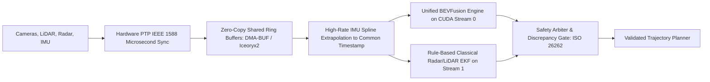

# 🛠️ Sensor Fusion: Production Pipeline, Traps & Workarounds

A practitioner's guide to synchronizing, calibrating, and architecting multi-sensor perception pipelines for autonomous vehicles, robotics, and edge systems.

Related notes: [[topics/sensor-fusion/00-sensor-fusion-moc|Sensor Fusion MOC]], [[topics/real-time-systems/00-real-time-systems-moc|Real-Time Systems MOC]].

---

## 1. End-to-End Production Pipeline Architecture

---

## 2. Common Traps, Edge Cases & Hardware Bottlenecks

### Trap 1: Temporal Asynchrony (Timestamp Skew)
- **Problem**: Cameras expose at 30 Hz (every 33.3 ms), while LiDAR spins at 10 Hz (every 100 ms). If a vehicle is traveling at 120 km/h ($33.3\text{ m/s}$) and sensors are fused with an uncompensated 20 ms timestamp offset, target projections are offset by **0.67 meters**, resulting in false cross-attention matches.

### Trap 2: Mechanical Calibration Drift from Thermal Expansion
- **Problem**: In autonomous operations spanning winter cold ($-10^\circ\text{C}$) to direct summer sun ($+45^\circ\text{C}$), vehicle roof racks expand and flex. Extrinsic calibration transforms ($T_{\text{camera}}^{\text{lidar}}$) drift by fractions of a degree, causing 2D-to-3D projection misalignment.

### Trap 3: Catastrophic Sensor Dropout / Blindness
- **Problem**: If the multi-modal neural network relies strictly on both camera and LiDAR inputs simultaneously, mud splattering across a camera lens can cause the entire deep network to output corrupted predictions, blinding the system.

---

## 3. Battle-Tested Engineering Workarounds

### Workaround 1: Hardware Precision Time Protocol (IEEE 1588 PTP)
Never rely on software timestamps (`std::chrono::system_clock`). Enforce microsecond synchronization across all sensors using hardware PTP:
- LiDAR, Cameras, and Compute host synchronize to a central GPS-disciplined Grandmaster clock.
- Trigger camera exposures via hardware GPIO pulses synchronized to the LiDAR rotational azimuth.

### Workaround 2: Asymmetric Modality Dropout Training
To ensure the multi-modal network survives single-sensor failures, train the model with **modality dropout**:
- Randomly zero out camera features with $p = 0.2$ during training.
- Randomly zero out LiDAR features with $p = 0.2$.
- The network learns to rely on either modality independently when one stream degrades.

### Workaround 3: Dual-Channel Safety Fallback (ISO 26262)
In mission-critical autonomous safety architectures, never rely exclusively on a deep multi-modal transformer:
- **Primary Channel**: High-capacity BEVFusion Transformer (delivering rich semantic detections).
- **Secondary Channel**: Classical, deterministic Radar-LiDAR Extended Kalman Filter (EKF) running in parallel.
- If the deep network output conflicts with the rule-based safety barrier (e.g. an obstacle is detected within 5 meters by Radar but omitted by the neural model), the **Safety Arbiter** forces an emergency deceleration maneuver.
