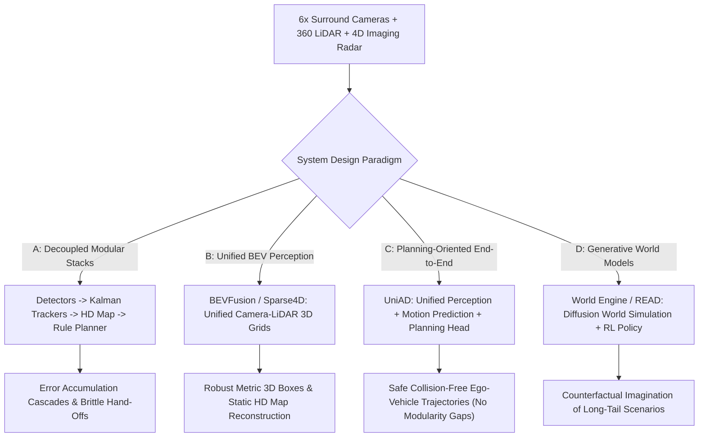

# ⚙️ Sensor Fusion: E2E Autonomous Driving, UniAD & Open Frontiers

A deep systems analysis of multi-modal Bird's-Eye-View (BEV) fusion, Unified Autonomous Driving (UniAD) perception-to-planning stacks, generative world models, and unsolved causal ambiguity challenges in autonomous mobility.

Related notes: [[topics/sensor-fusion/00-sensor-fusion-moc|Sensor Fusion MOC]], [[architectures/3d-pointclouds-and-lidar/bevfusion|BEVFusion & Sparse4D Deep-Dive]].

---

## 1. Multi-Modal Driving Architectures Compared (2025–2026)

The autonomous vehicle perception stack has evolved from disconnected modular pipelines into unified planning-oriented representations:

### Architectural Evaluation Matrix
| Architecture Paradigm | Exemplar Systems | Fusion Mechanism | Handles Missing Sensors? | End-to-End Latency | Prevents Error Cascade? |
| :--- | :--- | :--- | :--- | :--- | :--- |
| **Decoupled Modular** | Autoware.Universe | Bounding Box Kalman Filter | Partially | $120-180\text{ ms}$ | ❌ No (Cascading failure) |
| **Unified BEV Perception**| BEVFusion, Sparse4D | Hardware-cached BEV Pooling | **Yes** (Modality Dropout) | $32-45\text{ ms}$ | Moderate |
| **Planning-Oriented E2E** | UniAD, VAD | Query-based Transformer | **Yes** | $65-80\text{ ms}$ | **Yes** (Joint gradients) |
| **Generative World Models**| World Engine, GAIA-1 | Latent Diffusion Flow | **Yes** | $150-250\text{ ms}$ | **Yes** (Closed-loop RL) |

---

## 2. UniAD: The Unified Planning-Oriented Paradigm

Historically, autonomous vehicles executed tasks sequentially:
$$\text{Detect 3D Boxes} \longrightarrow \text{Track IDs} \longrightarrow \text{Predict 3-sec Trajectories} \longrightarrow \text{Plan Ego-Path}$$
If the 3D detector fails to identify a dark pedestrian, downstream tracking and prediction receive zero input, and the rule-based planner drives directly into the target.

### The UniAD Solution (CVPR Best Paper):
UniAD passes **unified query tokens** through all perception and planning stages simultaneously:
1. **Track Queries**: Localize and track dynamic agents over time.
2. **Map Queries**: Segment lanes and drivable boundaries.
3. **Motion Queries**: Predict the multimodal intent of surrounding vehicles by attending to track and map queries.
4. **Ego-Vehicle Planning Query**: Selects the optimal trajectory that minimizes collision probability and optimizes driving comfort.

---

## 3. Current Open Problems in Sensor Fusion & E2E Driving

### 🔴 Problem 1: Causal Ambiguity & Spurious Correlations
- **The Failure Mode**: An end-to-end neural driving model observes that whenever the leading vehicle stops, the ego-vehicle stops. In training data, the leading vehicle always stopped for red traffic lights. When deployed, if the leading vehicle stops to yield to a pedestrian, the ego-model assumes it can change lanes and accelerate, causing a collision.
- **Root Cause**: Imitation learning (IL) learns statistical correlations rather than causal physics.
- **Recent Frontier Solutions (2025–2026)**:
  - **Counterfactual World Models & Reinforcement Learning (RL)**: Training models inside closed-loop generative simulators (World Engine) where rare causal interventions are injected.

---

### 🔴 Problem 2: Asymmetric Modality Failure & Calibration Drift Under Shock
- **The Failure Mode**: A vehicle strikes a pothole at 80 km/h, causing a $0.3^\circ$ mechanical displacement on the forward camera mounting bracket.
- **Consequence**: The pre-computed extrinsic transform $T_{\text{camera}}^{\text{lidar}}$ projects camera pixels 1 meter above their true physical LiDAR returns, causing cross-attention fusion layers to fail.
- **Recent Frontier Solutions**:
  - **Self-Calibrating Online Extrinsic Networks**: Estimating and refining camera-to-LiDAR calibration matrices continuously during driving using vanishing point and ground-plane alignment.

---

### 🔴 Problem 3: Interpretability & ISO 26262 / ASIL-D Safety Certification
- **The Failure Mode**: Black-box neural network end-to-end planners cannot be certified under traditional functional safety standards (ISO 26262 ASIL-D), which require deterministic execution guarantees.
- **Active Research Direction**:
  - **Differentiable Control Barrier Functions (CBFs)**: Wrapping the neural policy inside a verifiable, mathematical safety filter that guarantees collision avoidance regardless of internal network states.
