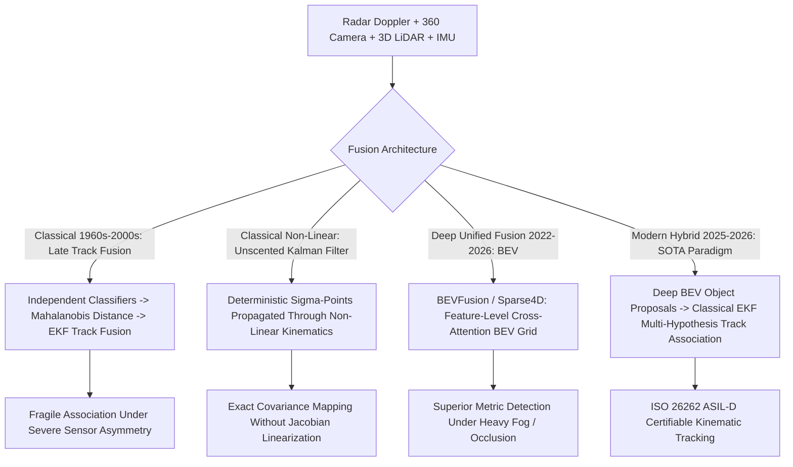

# 📐 Sensor Fusion: Classical Kalman Filters & Deep BEV Hybrids

A deep mathematical treatment of classical multi-sensor fusion (Extended Kalman Filters, Unscented Kalman Filters), statistical data association (Mahalanobis Distance, Joint Probabilistic Data Association), and modern hybrid fusion architectures (BEVFusion, UniAD).

Related notes: [[topics/sensor-fusion/00-sensor-fusion-moc|Sensor Fusion MOC]], [[topics/sensor-fusion/03-uniad-and-open-problems|E2E Autonomous Driving & UniAD]].

---

## 1. Classical State Estimators vs. Deep Unified BEV Transformers

### Sensor Fusion Paradigms Compared
| Metric | Classical Late Fusion (EKF) | Classical Mid-Level (UKF) | Deep BEV Fusion (BEVFusion) | Modern Hybrid (Deep + EKF) |
| :--- | :--- | :--- | :--- | :--- |
| **Fusion Level** | Object Bounding Boxes (Late) | Fused Measurements (Mid) | Feature Maps (Early / Mid) | **Deep Features + Classical States** |
| **Failure Tolerance**| **High** (One sensor failure isolated)| High | Moderate (Requires modality dropout)| **Highest (Automatic graceful degradation)**|
| **Latency** | **$<1\text{ ms}$** | $2-5\text{ ms}$ | $35-50\text{ ms}$ | $36-52\text{ ms}$ |
| **Certification** | Fully Certifiable (Closed-form) | Fully Certifiable | Difficult (Black-box neural network)| **Fully Certifiable (Safety Wrapper)** |
| **Detection mAP** | Low ($\sim 45\%$ nuScenes) | Moderate ($\sim 52\%$) | **Highest ($>72\%$ NDS)** | **Highest ($>72\%$ NDS)** |

---

## 2. Mathematical Formulations: Extended vs. Unscented Kalman Filters

### 1. Extended Kalman Filter (EKF):
For non-linear state transition $x_k = f(x_{k-1}, u_{k-1}) + w_{k-1}$ and non-linear measurement $z_k = h(x_k) + v_k$, the EKF linearizes dynamics via first-order Taylor expansion using Jacobian matrices:
$$F_{k-1} = \left. \frac{\partial f}{\partial x} \right|_{\hat{x}_{k-1|k-1}}, \quad H_k = \left. \frac{\partial h}{\partial x} \right|_{\hat{x}_{k|k-1}}$$
- **State Prediction**: $\hat{x}_{k|k-1} = f(\hat{x}_{k-1|k-1}, u_{k-1})$
- **Covariance Prediction**: $P_{k|k-1} = F_{k-1} P_{k-1|k-1} F_{k-1}^T + Q_{k-1}$
- **Kalman Gain**: $K_k = P_{k|k-1} H_k^T (H_k P_{k|k-1} H_k^T + R_k)^{-1}$
- **State Update**: $\hat{x}_{k|k} = \hat{x}_{k|k-1} + K_k (z_k - h(\hat{x}_{k|k-1}))$

### 2. Unscented Kalman Filter (UKF - Julier & Uhlmann):
When non-linearities are severe (e.g. polar radar coordinates $r, \theta, \dot{r}$ mapped to Cartesian $x, y, v_x, v_y$), Jacobian linearization introduces significant truncation errors. The UKF captures mean and covariance accurately up to the **3rd order** using $2L+1$ deterministic **Sigma Points**:
$$\chi_0 = \bar{x}, \quad \chi_i = \bar{x} + \left(\sqrt{(L + \lambda)P}\right)_i, \quad \chi_{i+L} = \bar{x} - \left(\sqrt{(L + \lambda)P}\right)_i$$
Sigma points are propagated directly through the true non-linear function $y_i = g(\chi_i)$ without computing Jacobians.

---

## 3. Production Hybrid Pattern: Deep BEV Proposals + Classical Multi-Hypothesis Tracking

In high-speed highway autonomous driving (120 km/h), deep end-to-end models occasionally drop a vehicle detection for 1 or 2 frames due to sun glare or camera sensor saturation.

### The Production Fail-Safe Pipeline:
1. **Deep Perception Frontend**: Run **BEVFusion** to generate fused Camera+LiDAR 3D bounding box proposals at $30\text{ Hz}$.
2. **Statistical Data Association**: Compute the **Mahalanobis Distance** between predicted Kalman states and deep proposals:
   $$d_M(z, \hat{z}) = \sqrt{(z - \hat{z})^T S^{-1} (z - \hat{z})}$$
3. **Classical Hungarian Assignment**: Solve the optimal assignment problem in polynomial time $\mathcal{O}(N^3)$ via the Munkres/Hungarian algorithm.
4. **Kalman Coasting Guard**: If BEVFusion drops an obstacle for up to 5 consecutive frames ($160\text{ ms}$), the classical EKF maintains the track using physical momentum ($v \cdot \Delta t$), preventing catastrophic emergency phantom braking.
