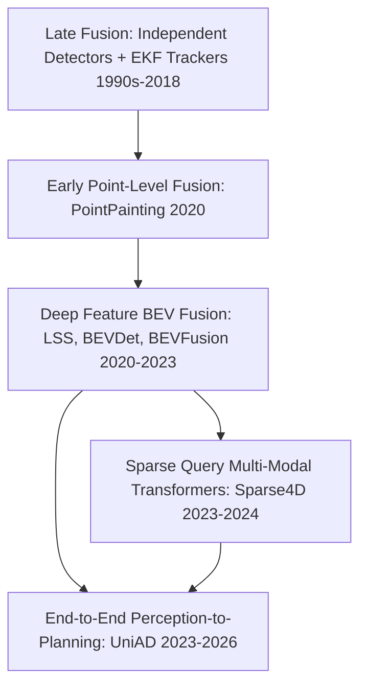
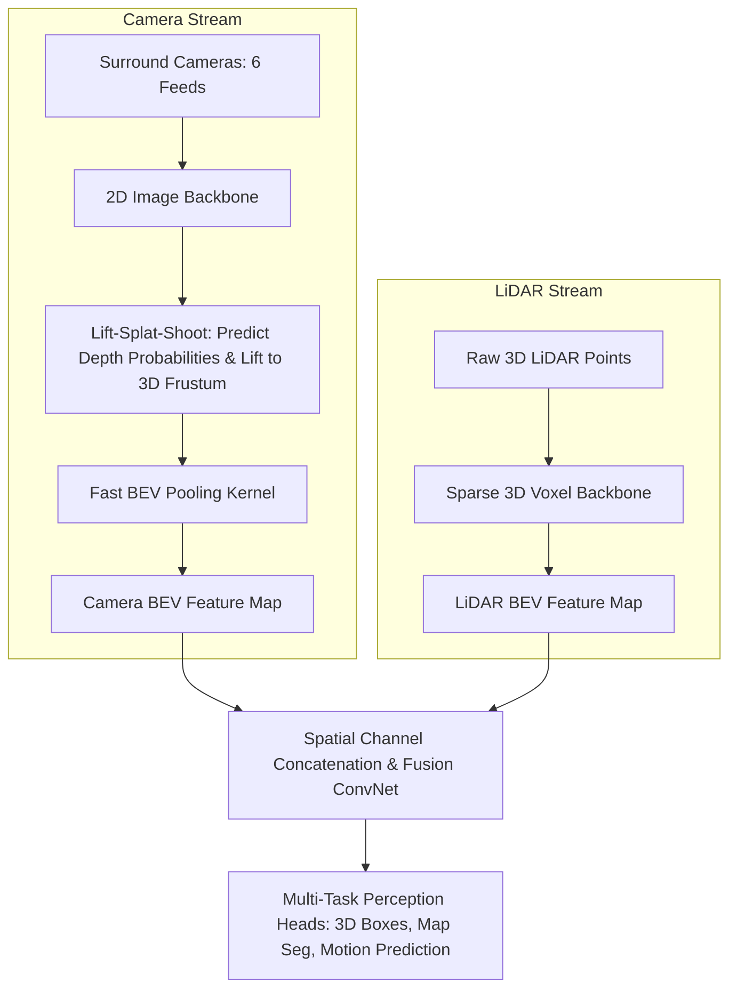

# Sensor Fusion: Historical Evolution & Multi-Modal Paradigms

A didactic examination of multi-sensor perception: comparing Late Fusion (object/track-level Kalman filtering), Early Fusion (raw point decoration via PointPainting), Deep Feature Fusion (Lift-Splat-Shoot and BEVFusion), and modern End-to-End Autonomous Driving (UniAD).

Related notes: [[topics/sensor-fusion/README|Sensor Fusion Playbook]], [[topics/lidar-perception/README|LiDAR Perception]].

---

## 1. The Multi-Sensor Complementary Matrix

No single physical sensor suffices for Level 4/5 autonomous navigation or robust robotic manipulation:

```mermaid
quadrantChart
    title Sensor Physical Trade-offs
    x-axis Low Angular Resolution --> High Angular Resolution
    y-axis Sensitive to Weather / Darkness --> Invariant to Weather / Darkness
    quadrant-1 Metric 3D Geometry invariant to light (LiDAR)
    quadrant-2 Penetrates Rain/Fog with direct Doppler speed (RADAR)
    quadrant-3 Fails in dark or heavy fog (Poor Cameras)
    quadrant-4 Dense texture, fine colors, semantic classification (Cameras)
```

---

## 2. Evolution of Fusion Paradigms



### Paradigm 1: Late / Track-Level Fusion
- Cameras run 2D object detection; LiDAR runs 3D point cloud detection independently.
- 3D bounding boxes are projected and associated using GNN (Global Nearest Neighbor) or Hungarian matching, followed by state estimation using an **Extended Kalman Filter (EKF)**.
- *Critical Flaw*: If an object is severely degraded (e.g. a dark pedestrian in the rain missed by camera, and partially occluded with few points missed by LiDAR), both single-sensor detectors produce zero detections. The late fusion layer has nothing to associate, resulting in a fatal false negative.

---

### Paradigm 2: Early Data-Level Fusion (PointPainting, 2020)
- Ingest camera frame -> Predict semantic segmentation logits (e.g. car, pedestrian, cyclist).
- Project 3D LiDAR points into the camera pixel coordinates using extrinsic calibration matrix $[R \mid t]$ and intrinsics $K$.
- Append the camera class probability vector as additional feature channels onto each LiDAR point:
  $$p = (x, y, z, \text{intensity}) \longrightarrow p' = (x, y, z, \text{intensity}, P_{\text{car}}, P_{\text{ped}}, P_{\text{cyc}})$$
- Pass augmented points into a standard LiDAR 3D detector.
- *Limitation*: Sequential pipeline bottleneck—the camera segmentation network must complete before LiDAR point processing can even begin. Calibration errors severely mispaint background points.

---

### Paradigm 3: Deep Feature BEV Fusion (Lift-Splat-Shoot to BEVFusion, 2020–2024)
Instead of projecting LiDAR points into 2D camera space, project multi-camera feature representations into a unified 3D **Bird's-Eye-View (BEV)** space alongside LiDAR voxel features.



### Why BEVFusion Works:
1. **Unified Coordinate Frame**: The Bird's-Eye View coordinate frame preserves metric scale, eliminates perspective distortion, and models spatial occlusion cleanly.
2. **Robustness to Sensor Dropout**: If camera feeds fail due to lens glare or disconnection, the LiDAR BEV branch maintains accurate 3D geometry. If LiDAR is degraded by heavy snowfall, camera texture features maintain classification.
3. **MIT Fast BEV Pooling**: Solved the irregular memory access of original LSS pooling using pre-computed index caching, delivering an 8.8x speedup on CUDA GPUs.
