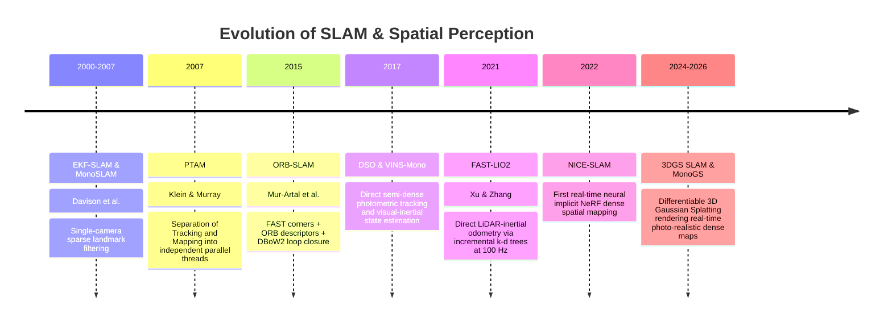
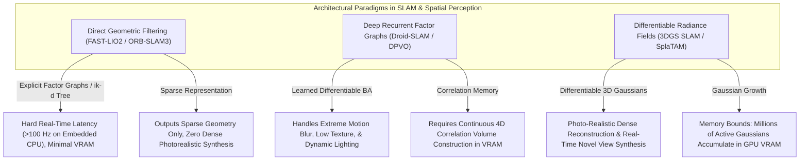

# 📜 SLAM & Spatial Perception: Historical Evolution & Paradigms

A didactic overview tracking the development of geometric spatial understanding: from early filtering (EKF-SLAM) to keyframe bundle adjustment, direct semi-dense tracking, LiDAR-inertial factor graphs, and modern differentiable radiance field mapping (3DGS SLAM).

Related notes: [[topics/slam-and-spatial-perception/00-slam-and-spatial-perception-moc|SLAM MOC]], [[topics/sensor-fusion/00-sensor-fusion-moc|Sensor Fusion MOC]].

---

## 1. Evolution Timeline: From EKF-SLAM to 3D Gaussian Radiance Fields

---

## 2. Core Paradigm Breakthroughs Explained

### Breakthrough A: Parallel Tracking and Mapping (PTAM, 2007)
Prior to PTAM, SLAM processed frames sequentially in a single synchronous loop. PTAM recognized that:
1. **Tracking** must execute at high frame rates (30–60 Hz) on every incoming camera frame to maintain camera pose.
2. **Mapping (Bundle Adjustment)** is computationally intensive, but only needs to run on select **keyframes** when the camera moves into a new physical vantage point.
- Separating these onto asynchronous CPU/GPU threads became the foundation for all modern visual SLAM systems.

---

### Breakthrough B: Direct Semi-Dense vs. Feature-Based Tracking
- **Feature-Based (ORB-SLAM3)**: Extracts sparse corners and descriptors (ORB/SIFT). Minimizes geometric reprojection error. Robust to rapid viewpoint changes, but fails in textureless corridors (white walls).
- **Direct Tracking (DSO)**: Minimizes photometric brightness error directly over high-gradient pixels. Operates effectively in low-texture environments, but is sensitive to non-Lambertian surface reflections and camera auto-exposure changes.

---

### Breakthrough C: The Radiance Field Revolution (3DGS SLAM)
Classic SLAM produced sparse point clouds with zero physical volume or mesh connectivity. 3D Gaussian Splatting SLAM parameterizes the entire physical world into continuous, differentiable 3D ellipsoids:
- Evaluates tracking loss by differentiably rendering the 3D scene from the current pose and minimizing pixel differences.
- Produces dense, photo-realistic 3D reconstructions capable of real-time novel view synthesis and collision checking for robotics.

---

## 3. Intensive Architectural Taxonomy: Convolutional vs Transformer vs Hybrid Sub-Modules

Simultaneous Localization and Mapping (SLAM) and 3D spatial perception have transitioned from sparse hand-crafted feature factor graphs to deep recurrent optical flow bundle adjustment, dense neural implicit fields (NeRFs), direct LiDAR ik-d tree filtering, and differentiable 3D Gaussian Splatting.

### Comparative Sub-Module Architectural Matrix

| Model Name & Year | Architectural Paradigm | Backbone Sub-Module | Neck / Feature Aggregator | Encoder Sub-Module | Decoder / Head Sub-Module | Primary Bottleneck & Edge Suitability |
| :--- | :--- | :--- | :--- | :--- | :--- | :--- |
| **ORB-SLAM3** (2020) | Classical Handcrafted Geometric | FAST Corner Detector + Multi-Scale Image Pyramid ($8\text{ levels}$) | Oriented FAST and Rotated BRIEF (ORB) 256-bit Binary Descriptor Extractor | DBoW2 Visual Vocabulary Tree for Place Recognition & Loop Closing | Non-linear Factor Graph Optimization: Co-visibility Graph Bundle Adjustment (g2o / Ceres) | **CPU Factor Graph Bound**: Industry standard for sparse visual-inertial SLAM; executes in real-time (~30–60 Hz) on embedded CPUs; fails in textureless environments. |
| **SuperPoint + LightGlue** (2018–2023) | Hybrid Conv-Transformer Matcher | SuperPoint: VGG-style 8-layer Convolutional Encoder with shared representation | Depth-to-Space Pixel Unshuffling Neck | Standard Convolutional Residual Blocks with BatchNorm | LightGlue: Deep Transformer Matcher (Self & Cross-Attention) with Adaptive Early-Exit Head | **Compute & Early-Exit Optimized**: High keypoint matching precision under extreme illumination changes; LightGlue early-exit cuts latency by 60% (~10 ms on edge GPUs). |
| **Droid-SLAM** (2021) | Deep Recurrent Flow Factor Graph | Shared 6-layer Convolutional Feature & Context Encoders ($1/8\text{ resolution}$) | Multi-Scale 4D Correlation Volume Construction between all keyframe pairs | Convolutional Residual Stages + ConvGRU Recurrent Optimizer | Differentiable Dense Bundle Adjustment (DBA) Layer computing Gauss-Newton camera pose & depth updates | **Memory Bandwidth & Correlation Bound**: Exceptional tracking accuracy; constructing 4D correlation volumes across keyframe graphs consumes high GPU VRAM; ~15 FPS on desktop GPUs. |
| **NICE-SLAM** (2022) | Neural Implicit Representation | Hierarchical Multi-Resolution 3D Voxel Grid Feature Extractor | Coarse-to-Fine Multi-Level Geometric Grid Aggregator | Hierarchical Feature Encoding Grids (Coarse, Mid, Fine levels) | Tiny MLPs ($2\text{ layers}$) decoding Signed Distance Fields (SDF) and RGB via Differentiable Volume Rendering | **Rendering Latency Bound**: Generates complete watertight 3D meshes; ray sampling and volume integration limit frame rate to ~2–5 FPS; unsuitable for edge robotics. |
| **FAST-LIO2 / Point-LIO** (2021–2023) | Direct Geometric Filter | Raw LiDAR Point Cloud Stream (No voxelization or feature extraction) | Incremental k-d Tree (**ik-d tree**) supporting dynamic point insertion and spatial ray deletion | Direct Point-to-Plane Metric Residual Formulation | Iterated Error-State Kalman Filter (IESKF) updating IMU state at >100 Hz | **CPU / Cache Friendly**: World-leading computational efficiency (>100 Hz on Raspberry Pi / embedded ARM CPUs); zero neural network compute; metric accuracy <0.1% drift. |
| **SplaTAM / 3DGS-SLAM** (2023–2025) | Differentiable Radiance Field | RGB-D Stream / Monocular Frame Stream | Multi-View Camera Pose Graph & Keyframe Selection Buffer | Explicit 3D Gaussian Representation: Centers $\mu$, Covariance $\Sigma$, Opacity $\alpha$, Spherical Harmonics $C$ | Differentiable 3D Tile-Based Rasterizer minimizing Photometric ($L_1 + \text{D-SSIM}$) and Depth Loss | **GPU VRAM & Rasterization Bound**: Photo-realistic dense spatial mapping in real-time (15–30 FPS on GPU); map size grows linearly with explored space (~100k–1M Gaussians). |
| **MonoGS** (2024) | Monocular 3D Gaussian SLAM | Single RGB Camera Stream + Depth Foundation Network (Depth Anything V2) | Monocular Geometric Guidance Neck | Explicit 3D Gaussian Primitive Optimization | Differentiable Gaussian Splatting Camera Tracking and Scene Densification Head | **Compute Bound**: First robust monocular 3DGS SLAM; resolves depth scale ambiguity via foundation models; requires GPU rasterizer acceleration. |
| **DPVO (Deep Patch VO)** (2022–2024) | Recurrent Patch Transformer | ResNet-style Convolutional Feature Extractor on $P \times P$ image patches | Multi-Scale Patch Correlation Pyramid Neck | 1D Transformer Attention across patch trajectories | Differentiable Factor Graph BA updating camera poses and patch inverse depths | **Compute & Edge Friendly**: Outperforms Droid-SLAM at $4\times$ speed and $1/5$ the memory footprint; executes at >30 FPS on Jetson Orin. |

### Didactic Architectural Trade-Off Analysis

#### 1. Classical Factor Graph Optimization vs. Differentiable Neural Rendering (3DGS)
- **Factor Graph Bundle Adjustment (ORB-SLAM3, FAST-LIO2)** minimizes geometric reprojection or point-to-plane residuals:
  $$\min_{\mathbf{T}_k, \mathbf{p}_i} \sum_{k} \sum_{i} \rho\left( \left\| \mathbf{z}_{k,i} - h(\mathbf{T}_k, \mathbf{p}_i) \right\|_{\Sigma}^2 \right)$$
  Because the state space is compact (sparse keypoints and camera poses), the resulting Hessian matrix is sparse and can be solved in milliseconds via Levenberg-Marquardt or Iterated Kalman filtering on edge CPUs.
- **Differentiable 3D Gaussian Splatting SLAM (SplaTAM, 3DGS SLAM)** replaces sparse points with millions of continuous 3D ellipsoidal Gaussians. Tracking is formulated as minimizing the photometric and depth difference between rendered views and incoming physical sensor frames:
  $$\mathcal{L}_{\text{tracking}} = (1 - \lambda) \| I_{\text{sensor}} - I_{\text{rendered}}(\mathbf{T}) \|_1 + \lambda \, \text{D-SSIM}(I_{\text{sensor}}, I_{\text{rendered}}(\mathbf{T})) + \gamma \| D_{\text{sensor}} - D_{\text{rendered}}(\mathbf{T}) \|_1$$
  Backpropagating this loss directly with respect to the camera Lie algebra pose $\mathfrak{se}(3)$ achieves dense spatial mapping and photo-realistic rendering simultaneously.

#### 2. Embedded Real-Time Performance: CPU Odometry vs. GPU Radiance Fields
- **LiDAR-Inertial Direct Odometry (FAST-LIO2)** achieves over $100\,\text{Hz}$ execution on an embedded Raspberry Pi 4 CPU with zero GPU requirement by utilizing an incremental k-d tree (**ik-d tree**) that supports spatial point insertion, tree rebalancing, and box clipping in $\mathcal{O}(\log N)$ time.
- **Neural Radiance Fields (NeRFs and 3DGS)** require dedicated GPU rasterization hardware. While 3DGS SLAM reaches 30 FPS on desktop GPUs (RTX 4090), embedded mobile robotics (e.g. quadrupeds, micro-drones) face severe thermal and battery constraints, necessitating lightweight patch-based tracking (DPVO) or hybrid CPU-GPU architectures.

#### 3. Memory Scaling in Persistent Long-Term Mapping
- In classical SLAM, co-visibility keyframe culling and loop-closure pose-graph optimization bound memory usage over multi-kilometer trajectories.
- In 3DGS SLAM, Gaussian primitives continuously split and densify in newly observed areas. Without active **submap hierarchical management** and spatial Gaussian pruning (e.g., merging overlapping ellipsoids whose volume ratio $<0.1$), the memory footprint quickly exceeds the 8–16 GB VRAM limits of edge robotics hardware.

