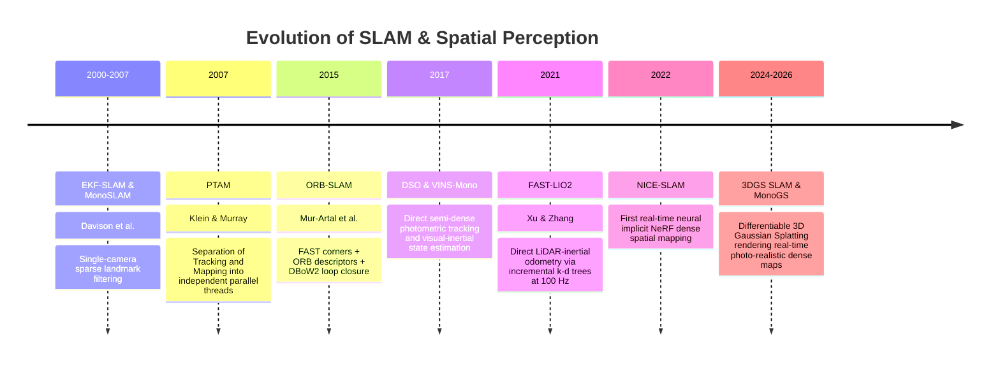

# 📜 SLAM & Spatial Perception: Historical Evolution & Paradigms

A didactic overview tracking the development of geometric spatial understanding: from early filtering (EKF-SLAM) to keyframe bundle adjustment, direct semi-dense tracking, LiDAR-inertial factor graphs, and modern differentiable radiance field mapping (3DGS SLAM).

Related notes: [[topics/slam-and-spatial-perception/00-slam-and-spatial-perception-moc|SLAM MOC]], [[topics/sensor-fusion/00-sensor-fusion-moc|Sensor Fusion MOC]].

---

## 1. Evolution Timeline: From EKF-SLAM to 3D Gaussian Radiance Fields

---

## 2. Core Paradigm Breakthroughs Explained

### Breakthrough A: Parallel Tracking and Mapping (PTAM, 2007)
Prior to PTAM, SLAM processed frames sequentially in a single synchronous loop. PTAM recognized that:
1. **Tracking** must execute at high frame rates (30–60 Hz) on every incoming camera frame to maintain camera pose.
2. **Mapping (Bundle Adjustment)** is computationally intensive, but only needs to run on select **keyframes** when the camera moves into a new physical vantage point.
- Separating these onto asynchronous CPU/GPU threads became the foundation for all modern visual SLAM systems.

---

### Breakthrough B: Direct Semi-Dense vs. Feature-Based Tracking
- **Feature-Based (ORB-SLAM3)**: Extracts sparse corners and descriptors (ORB/SIFT). Minimizes geometric reprojection error. Robust to rapid viewpoint changes, but fails in textureless corridors (white walls).
- **Direct Tracking (DSO)**: Minimizes photometric brightness error directly over high-gradient pixels. Operates effectively in low-texture environments, but is sensitive to non-Lambertian surface reflections and camera auto-exposure changes.

---

### Breakthrough C: The Radiance Field Revolution (3DGS SLAM)
Classic SLAM produced sparse point clouds with zero physical volume or mesh connectivity. 3D Gaussian Splatting SLAM parameterizes the entire physical world into continuous, differentiable 3D ellipsoids:
- Evaluates tracking loss by differentiably rendering the 3D scene from the current pose and minimizing pixel differences.
- Produces dense, photo-realistic 3D reconstructions capable of real-time novel view synthesis and collision checking for robotics.
