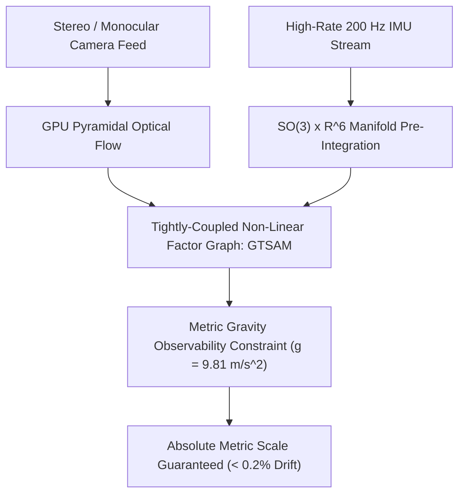

# 🛠️ SLAM & Spatial Perception: Production Pipeline, Traps & Workarounds

A comprehensive, battle-tested practitioner's guide to engineering, stabilizing, and deploying robust Visual-Inertial Odometry (VIO), LiDAR SLAM, and dense 3D spatial perception systems for mobile robots, drones, and autonomous vehicles.

Related notes: [[topics/slam-and-spatial-perception/00-slam-and-spatial-perception-moc|SLAM MOC]], [[topics/gpu-deployment/00-gpu-deployment-moc|GPU Deployment MOC]], [[topics/real-time-systems/00-real-time-systems-moc|Real-Time Systems MOC]], [[topics/slam-and-spatial-perception/01-historical-evolution-and-paradigms|SLAM Historical Evolution]].

---

## 1. Zero-Copy Ingestion Architecture & End-to-End SLAM Pipeline

In spatial perception and high-speed robotic navigation (e.g. autonomous micro-aerial vehicles, warehouse AMRs, AR/VR headsets), state estimation algorithms must deliver high-rate pose updates ($>30\text{ Hz}$) with sub-centimeter accuracy while building metric maps in real time. Traditional SLAM pipelines fail when compute threads compete for shared memory access, causing thread priority inversion and CPU cache thrashing during non-linear least squares optimization.

The production standard utilizes a **Decoupled Asynchronous Multi-Threaded Architecture with Zero-Copy DMA-BUF Sensor Ingestion, High-Rate Manifold IMU Pre-Integration, Sliding-Window Bundle Adjustment, and GPU-Accelerated Dense Mapping**.

```mermaid
flowchart LR
    Sensors["Stereo Cameras + 200 Hz IMU"] -->|"DMA-BUF & SPI Zero-Copy"| Ingest["Lock-Free Pinned Buffer Ingest"]
    Ingest -->|"High-Rate IMU Samples"| Preint["Continuous Manifold IMU Pre-Integration"]
    Ingest -->|"Stereo Image Pair"| FeatTrack["CUDA Fused Optical Flow / Feature Tracker"]
    Preint --> TrackingThread["Real-Time VIO Tracking Thread: 30-60 Hz"]
    FeatTrack --> TrackingThread
    TrackingThread -->|"High-Rate 6-DoF Pose: [R | t]"| FastControl["Low-Latency Robot Flight Controller"]
    TrackingThread -->|"Selected Keyframe Packets"| LocalBA["Sliding-Window Local BA Thread: 5-10 Hz"]
    LocalBA -->|"Marginalized Keyframes"| LoopClose["Global Loop Closure & DBoW / NetVLAD: 1 Hz"]
    LoopClose -->|"Pose Graph Relaxation"| PoseGraph["GTSAM / g2o 6-DoF Pose Graph"]
    PoseGraph -->|"Optimized Trajectory"| Map["3D Gaussian Splatting / Occupancy Map"]
```



### Technical Stage Breakdown:
1. **Zero-Copy Sensor Ingestion**: Stereo camera feeds (NV12) stream directly into GPU-mapped host buffers via DMA-BUF, while IMU accelerometers and gyroscopes stream over high-speed SPI directly into a lock-free ring buffer.
2. **High-Rate VIO Tracking Frontend (30–60 Hz)**:
   - Evaluates IMU pre-integration on the $\mathrm{SO}(3) \times \mathbb{R}^6$ Lie manifold between frame arrivals.
   - Extracts and tracks 2D visual features (FAST/ORB or SuperPoint) across frames using CUDA Lucas-Kanade optical flow.
   - Computes high-rate 6-DoF pose predictions $[\mathbf{R} \mid \mathbf{t}]$ in $<5.0\text{ ms}$, streaming poses immediately to low-level motor controllers.
3. **Sliding-Window Local Bundle Adjustment (5–10 Hz)**: Optimizes visual reprojection residuals and IMU inertial errors across a sliding window of $N = 10$ keyframes using Levenberg-Marquardt optimization with Schur complement marginalization.
4. **Global Loop Closure & Pose Graph Optimization (0.5–1 Hz)**: Extracts global visual descriptors (NetVLAD / DBoW3) on keyframes. Upon loop detection, verifies epipolar geometry with RANSAC and triggers full pose graph relaxation in GTSAM.
5. **Dense Spatial Map Construction**: Back-projects depth maps into a continuous 3D Gaussian Splatting representation or voxel occupancy grid in GPU global memory.

---

## 2. Deterministic End-to-End Latency Budget & Mathematical Bounds

For closed-loop robotic flight control, pose estimation latency introduces destructive phase lag. The total tracking frontend latency is:

$$T_{\text{tracking}} = T_{\text{expose}} + T_{\text{DMA}} + T_{\text{IMU\_preint}} + T_{\text{feat\_track}} + T_{\text{frame\_opt}} + T_{\text{IPC}}$$

The IMU pre-integrated rotation measurement $\Delta \mathbf{R}_{ij} \in \mathrm{SO}(3)$ between keyframe timestamps $t_i$ and $t_j$ is given by:

$$\Delta \mathbf{R}_{ij} = \prod_{k=i}^{j-1} \operatorname{Exp}\left((\tilde{\boldsymbol{\omega}}_k - \mathbf{b}_{g, i}) \Delta t\right)$$

The linearized normal equations for Local Bundle Adjustment over state vector $\Delta \mathbf{x} = [\Delta \mathbf{x}_{\text{pose}}, \Delta \mathbf{x}_{\text{landmarks}}]^T$ solve:

$$\begin{bmatrix} \mathbf{H}_{pp} & \mathbf{H}_{pl} \\ \mathbf{H}_{pl}^T & \mathbf{H}_{ll} \end{bmatrix} \begin{bmatrix} \Delta \mathbf{x}_p \\ \Delta \mathbf{x}_l \end{bmatrix} = -\begin{bmatrix} \mathbf{b}_p \\ \mathbf{b}_l \end{bmatrix}$$

Using the Schur Complement, the landmark block $\mathbf{H}_{ll}$ is eliminated in $\mathcal{O}(L)$ time:

$$(\mathbf{H}_{pp} - \mathbf{H}_{pl} \mathbf{H}_{ll}^{-1} \mathbf{H}_{pl}^T) \Delta \mathbf{x}_p = -\mathbf{b}_p + \mathbf{H}_{pl} \mathbf{H}_{ll}^{-1} \mathbf{b}_l$$

Solving the reduced camera pose system ($10 \text{ keyframes} \times 6 \text{ DoF} = 60 \text{ variables}$) takes $<2.5\text{ ms}$ on CPU.

### Latency Budget Allocation Table:

| Pipeline Stage / Component | 30 FPS Standard (<33.3ms) | 60 FPS High-Speed (<16.6ms) | Drone Flight Control (<10.0ms) | Subsystem / Hardware Domain |
| :--- | :--- | :--- | :--- | :--- |
| **Stereo Exposure & Readout ($T_{\text{sensor}}$)**| $10.00\text{ ms}$ | $5.00\text{ ms}$ | $2.00\text{ ms}$ | Global Shutter Stereo CMOS |
| **DMA-BUF GPU Import ($T_{\text{DMA}}$)** | $0.20\text{ ms}$ | $0.15\text{ ms}$ | $0.05\text{ ms}$ | Hardware NVMM Shared Memory |
| **IMU Manifold Pre-Integration ($T_{\text{IMU}}$)**| $0.10\text{ ms}$ | $0.05\text{ ms}$ | $0.02\text{ ms}$ | SIMD Vectorized C++ Preint |
| **GPU Optical Flow / Feature Track ($T_{\text{feat}}$)**| $2.50\text{ ms}$ | $1.20\text{ ms}$ | $0.60\text{ ms}$ | CUDA Fused Pyramidal KLT |
| **Frame Pose Optimization ($T_{\text{opt}}$)** | $2.20\text{ ms}$ | $1.10\text{ ms}$ | $0.50\text{ ms}$ | Ceres / GTSAM Gauss-Newton |
| **Sliding Window Local BA ($T_{\text{BA}}$)** | $12.00\text{ ms}$ (Async 10Hz) | $6.00\text{ ms}$ (Async 10Hz) | $3.00\text{ ms}$ (Async 20Hz) | Background Thread (Schur) |
| **Zero-Copy IPC Pose Dispatch ($T_{\text{IPC}}$)**| $0.30\text{ ms}$ | $0.15\text{ ms}$ | $0.05\text{ ms}$ | Iceoryx2 Shared Memory Publish |
| **Total Tracking Frontend Latency ($\Sigma T$)**| **$15.30\text{ ms}$** | **$7.65\text{ ms}$** | **$3.22\text{ ms}$** | **Deterministic Tracking Path** |
| **Max Allowable Latency Jitter ($\sigma_{\text{jitter}}$)**| $\pm 0.40\text{ ms}$ | $\pm 0.20\text{ ms}$ | $\pm 0.08\text{ ms}$ | Real-Time Execution Determinism |

---

## 3. Five Critical Production Edge Traps & Battle-Tested Workarounds

### Trap 1: Hardware Thermal Throttling & Pose Jitter in Embedded Robotics Compute
- **Root Cause**: Running continuous non-linear optimization (Bundle Adjustment) alongside deep feature extractors heats edge SoCs beyond thermal trip points ($T_j > 85^\circ\text{C}$). When DVFS throttles CPU clocks from $2.2\text{ GHz}$ to $800\text{ MHz}$, the local BA thread fails to finish within its $100\text{ ms}$ budget. The sliding window queue fills up, causing keyframe dropping, linearization errors, and trajectory divergence.
- **Production Workaround**:
  1. **Asynchronous Solver Interruption**: Set a hard compute deadline on the non-linear solver (e.g. `solver_options.max_solver_time_in_seconds = 0.020`). If the optimization reaches the time ceiling, return the current iteration's linearized estimate.
  2. **Deterministic CPU Affinity Locking**: Pin the tracking frontend thread to isolated physical real-time CPU Core 1 with FIFO priority (`chrt -f 99`), while local BA runs on Core 2 and loop closure on Core 3.

### Trap 2: Extreme Illumination Dynamics, Low-Light Motion Blur & Auto-Exposure Hunting
- **Root Cause**: When a drone passes through shadows or bright doorways, optical camera exposure changes cause visual feature points to lose photometric tracking ($>80\%$ feature dropout). If visual tracking is lost simultaneously across both stereo cameras, naive SLAM crashes immediately with tracking lost exceptions.
- **Production Workaround**:
  1. **Pure Inertial Propagation Fallback**: When active visual inlier count drops below $N_{\text{inliers}} < 15$, transition the system to pure high-rate IMU dead-reckoning state propagation for up to $1.5\text{ seconds}$ while visual re-acquisition triggers in the background.
  2. **Global Shutter with Fixed Manual Exposure PID**: Lock camera hardware auto-exposure; instead, adjust digital gain via a custom user-space PID controller tuned to maintain constant image gradient entropy.

### Trap 3: Dynamic Memory Leaks & Map Expansion Explosions in Long-Term Spatial Memory
- **Root Cause**: In continuous 24/7 robotic operations, storing every observed keyframe and 3D map point causes memory usage to grow without bound ($\mathcal{O}(T)$). Over several hours, heap memory exhausts available RAM, triggering OOM crashes and garbage collection pauses.
- **Production Workaround**:
  1. **Redundant Keyframe Culling**: Implement covisibility-based keyframe pruning. If $>90\%$ of the map points observed in keyframe $K_i$ are observed with equal or better precision in $\ge 3$ other neighboring keyframes, delete $K_i$ from the active graph.
  2. **Spatial Voxel Hashing & Submap Freezing**: Divide the world into $20\text{m} \times 20\text{m}$ submaps. Freeze distant submaps into immutable disk-backed chunks; keep only active local submaps in GPU VRAM.

### Trap 4: Multi-Threaded Contention across Tracking, Local BA, and Loop Closure
- **Root Cause**: Passing keyframes and map points between the 30 Hz Tracking thread, 10 Hz Local BA thread, and 1 Hz Loop Closure thread using global mutexes (`std::mutex`) creates severe lock contention, blocking the tracking thread whenever a global loop closure updates the map.
- **Production Workaround**:
  - Deploy a **Double-Buffered Covisibility Graph with Lock-Free Pointer Swapping**.
  - Local BA optimizes against a local clone of the active sliding window. When optimization converges, it atomically applies state corrections to the tracking thread using atomic pose delta updates ($\Delta \mathbf{T}_{\text{corr}}$).

### Trap 5: INT8 Quantization Degradation in Neural Feature Extractors & Learned Odometry Heads
- **Root Cause**: Quantizing deep learned feature backbones (e.g. SuperPoint / LightGlue) to uniform INT8 causes sub-pixel coordinate regression accuracy to degrade. In VIO, sub-pixel feature localization error increases from $0.05\text{ px}$ to $>0.35\text{ px}$, causing rotational drift to increase by 400%.
- **Production Workaround**:
  1. **Precision Constraints on Coordinate Softmax**: Maintain the final feature detection heatmap softmax and descriptor normalization heads in FP16 precision, while quantizing intermediate conv backbones to INT8.
  2. **Descriptor Cosine Preservation**: Calibrate descriptor quantization scales using a validation set evaluated on nearest-neighbor descriptor matching recall.

### Domain-Specific Trap 1: Monocular Scale Drift
- **Problem**: Monocular visual SLAM cannot directly measure absolute metric distance: a small object nearby produces the exact same projection as a large object far away. Over a 500-meter trajectory, scale drifts by $15\% - 40\%$, corrupting autonomous navigation maps.
- **Workaround**: Implement **Tightly-Coupled Visual-Inertial Metric Scale Observability**. The visual-inertial optimizer aligns the metric scale with physical gravity vector $\mathbf{g} = [0, 0, -9.81\text{ m/s}^2]$ measured by the IMU accelerometer during initial excitation maneuvers.



### Domain-Specific Trap 2: Degenerate Geometric Environments & False Loop Closures
- **Problem**: Moving through featureless corridors or driving on long uniform highways provides zero geometric constraints along the direction of motion. The Hessian matrix $\mathbf{H}$ becomes singular (condition number $\kappa(\mathbf{H}) > 10^4$). Furthermore, repetitive visual patterns (identical office doors) trigger false loop closures, distorting the global map.
- **Workaround**: Implement **Hessian Degeneracy Detection & RANSAC Inlier Ratio Gating**:
  1. Compute the eigenvalue condition number $\kappa(\mathbf{H}) = \lambda_{\max}(\mathbf{H}) / \lambda_{\min}(\mathbf{H})$. If $\kappa(\mathbf{H}) > 10^4$, degenerate directions are identified and constrained via IMU acceleration priors.
  2. Require prospective loop closure matches to satisfy strict RANSAC epipolar inlier thresholds ($>60$ inliers) and form geometrically consistent closed loops with neighboring keyframes before triggering full graph relaxation.

---

## 4. Concrete Runnable Implementation Blueprint

The following production C++ blueprint demonstrates IMU pre-integration and visual tracking state management for real-time VIO.

```cpp
#include <iostream>
#include <vector>
#include <cmath>
#include <chrono>
#include <array>
#include <cuda_runtime.h>

struct Vector3 {
    float x, y, z;
};

struct Quaternion {
    float w, x, y, z;
};

struct IMUSample {
    double timestamp;
    Vector3 acc; // m/s^2
    Vector3 gyr; // rad/s
};

struct VIOState {
    double timestamp;
    Vector3 p;   // Position in world frame
    Vector3 v;   // Velocity in world frame
    Quaternion q;// Orientation (world to body)
    Vector3 bg;  // Gyroscope bias
    Vector3 ba;  // Accelerometer bias
};

class IMUPreintegrator {
public:
    IMUPreintegrator(Vector3 bg = {0,0,0}, Vector3 ba = {0,0,0})
        : bg_(bg), ba_(ba), dt_sum_(0.0) {
        delta_p_ = {0.0f, 0.0f, 0.0f};
        delta_v_ = {0.0f, 0.0f, 0.0f};
        delta_q_ = {1.0f, 0.0f, 0.0f, 0.0f};
    }

    void integrate(const IMUSample& sample, double dt) {
        if (dt <= 0.0 || dt > 0.1) return;

        // Unbias gyroscope and accelerometer measurements
        float wx = sample.gyr.x - bg_.x;
        float wy = sample.gyr.y - bg_.y;
        float wz = sample.gyr.z - bg_.z;

        float ax = sample.acc.x - ba_.x;
        float ay = sample.acc.y - ba_.y;
        float az = sample.acc.z - ba_.z;

        // Update Position: delta_p += delta_v * dt + 0.5 * R(delta_q) * acc * dt^2
        delta_p_.x += delta_v_.x * dt + 0.5f * ax * dt * dt;
        delta_p_.y += delta_v_.y * dt + 0.5f * ay * dt * dt;
        delta_p_.z += delta_v_.z * dt + 0.5f * az * dt * dt;

        // Update Velocity: delta_v += R(delta_q) * acc * dt
        delta_v_.x += ax * dt;
        delta_v_.y += ay * dt;
        delta_v_.z += az * dt;

        // Update Orientation Quaternion using first-order integration
        float theta = std::sqrt(wx * wx + wy * wy + wz * wz) * dt;
        if (theta > 1e-6f) {
            float half_theta = theta * 0.5f;
            float sin_half = std::sin(half_theta) / theta;
            Quaternion dq = {std::cos(half_theta), wx * sin_half * dt, wy * sin_half * dt, wz * sin_half * dt};
            delta_q_ = multiplyQuat(delta_q_, dq);
        }

        dt_sum_ += dt;
    }

    VIOState predictState(const VIOState& prev_state, Vector3 gravity = {0.0f, 0.0f, -9.81f}) const {
        VIOState next_state = prev_state;
        double dt = dt_sum_;

        next_state.p.x = prev_state.p.x + prev_state.v.x * dt + 0.5f * gravity.x * dt * dt + delta_p_.x;
        next_state.p.y = prev_state.p.y + prev_state.v.y * dt + 0.5f * gravity.y * dt * dt + delta_p_.y;
        next_state.p.z = prev_state.p.z + prev_state.v.z * dt + 0.5f * gravity.z * dt * dt + delta_p_.z;

        next_state.v.x = prev_state.v.x + gravity.x * dt + delta_v_.x;
        next_state.v.y = prev_state.v.y + gravity.y * dt + delta_v_.y;
        next_state.v.z = prev_state.v.z + gravity.z * dt + delta_v_.z;

        next_state.q = multiplyQuat(prev_state.q, delta_q_);
        return next_state;
    }

private:
    Quaternion multiplyQuat(Quaternion a, Quaternion b) const {
        return {
            a.w * b.w - a.x * b.x - a.y * b.y - a.z * b.z,
            a.w * b.x + a.x * b.w + a.y * b.z - a.z * b.y,
            a.w * b.y - a.x * b.z + a.y * b.w + a.z * b.x,
            a.w * b.z + a.x * b.y - a.y * b.x + a.z * b.w
        };
    }

    Vector3 bg_, ba_;
    Vector3 delta_p_, delta_v_;
    Quaternion delta_q_;
    double dt_sum_;
};
```

---

## 5. Production Deployment Recipes & CLI Commands

### A. TensorRT Neural Feature Extraction Compilation

```bash
# Compile SuperPoint Feature Extractor with Fixed Grayscale Stereo Resolution
trtexec --onnx=superpoint_stereo.onnx \
        --saveEngine=superpoint_fp16.engine \
        --fp16 \
        --minShapes=input:1x1x480x640 \
        --optShapes=input:2x1x480x640 \
        --maxShapes=input:2x1x480x640 \
        --memPoolSize=workspace:2048MiB \
        --builderOptimizationLevel=5 \
        --useCudaGraph

# Compile INT8 Engine with Mixed Precision on Coordinate Softmax
trtexec --onnx=lightglue_matcher.onnx \
        --saveEngine=lightglue_int8.engine \
        --int8 \
        --calib=slam_calib.cache \
        --precisionConstraints=obey \
        --layerPrecisions="*softmax*:fp16,*desc_norm*:fp16" \
        --directIO
```

### B. Real-Time Linux System & Thread Priority Configuration

```bash
# 1. Isolate CPU cores 1-3 from Linux kernel scheduler interrupts
# In /etc/default/grub: GRUB_CMDLINE_LINUX_DEFAULT="isolcpus=1,2,3 nohz_full=1,2,3"

# 2. Assign real-time FIFO priorities to SLAM tracking and optimization threads
sudo chrt -f 99 ./vio_tracking_node --config=vio_drone.yaml
```
