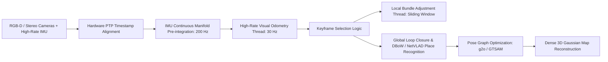

# 🛠️ SLAM & Spatial Perception: Production Pipeline, Traps & Workarounds

A practitioner's guide to engineering, stabilizing, and deploying robust visual and LiDAR SLAM systems for mobile robots, drones, and autonomous vehicles.

Related notes: [[topics/slam-and-spatial-perception/00-slam-and-spatial-perception-moc|SLAM MOC]], [[topics/real-time-systems/00-real-time-systems-moc|Real-Time Systems MOC]].

---

## 1. End-to-End Production Pipeline Architecture

---

## 2. Common Traps, Edge Cases & Hardware Bottlenecks

### Trap 1: Monocular Scale Drift
- **Problem**: A single monocular camera has scale ambiguity: a small object close up produces the exact same pixel projection as a massive object far away. Over long trajectories, the metric scale drifts continuously, causing estimated path lengths to deviate by 20–50%.

### Trap 2: Sudden Degenerate Geometric Environments
- **Problem**: Driving down a long, uniform featureless corridor or a featureless highway provides zero geometric constraints along the direction of motion. Standard point-to-plane ICP or visual tracking slips, incorrectly reporting zero forward motion.

### Trap 3: False-Positive Loop Closures
- **Problem**: Visually repetitive architectural patterns (e.g. identical office doors or highway toll booths) trigger a false loop closure match. The global pose graph optimizer warps the entire 3D map catastrophically.

---

## 3. Battle-Tested Engineering Workarounds

### Workaround 1: Visual-Inertial Fusion with Online Metric Scale Recovery
Never run pure monocular visual SLAM in production robotics. Fuse camera frames with an **Inertial Measurement Unit (IMU)**:
- High-rate accelerometer readings ($>200\text{ Hz}$) provide metric gravity vectors and absolute physical scale.
- Solves scale drift within the first 1–2 seconds of robot acceleration.

### Workaround 2: Degeneracy Detection via Eigenvalue Analysis
Before accepting an optimization step in ICP or Bundle Adjustment, compute the Hessian matrix $H = J^T J$.
- If the smallest eigenvalue $\lambda_{\min}(H) < \tau_{\text{threshold}}$, the environment is geometrically degenerate along that direction.
- Lock that degree of freedom and rely exclusively on wheel odometry or IMU dead reckoning.

### Workaround 3: Geometric Consistency Verification for Loop Closures
Never accept a bag-of-words (DBoW / NetVLAD) image retrieval match directly into the global pose graph:
1. Candidate loop frames must pass a strict 3D geometric RANSAC check (requiring $\ge 30$ inlier correspondences).
2. The loop must form a geometrically consistent closed loop with neighboring keyframes before triggering full graph relaxation in GTSAM.
