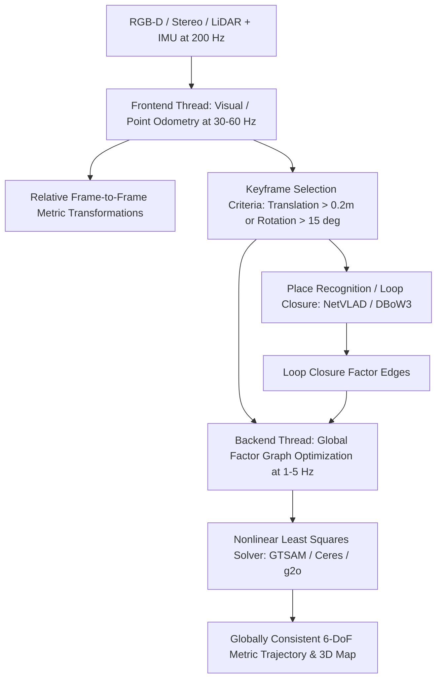

# ⚙️ SLAM & Spatial Perception: Frontends, Backends & Degeneracy Frontiers

An in-depth systems examination of visual/LiDAR odometry frontends, nonlinear least-squares factor graph optimization backends, geometric degeneracy failure modes, and unsolved challenges in dense spatial perception.

Related notes: [[topics/slam-and-spatial-perception/00-slam-and-spatial-perception-moc|SLAM MOC]], [[architectures/spatial-radiance-and-slam/3dgs-slam-and-monogs|3DGS SLAM & MonoGS Deep-Dive]].

---

## 1. Modern SLAM System Architecture: Frontend vs. Backend

Real-time SLAM decouples high-rate local motion estimation from global trajectory consistency:



### Frontend vs. Backend Decomposition
| Component | Operational Rate | Computational Complexity | Primary Failure Mode | Standard Libraries |
| :--- | :--- | :--- | :--- | :--- |
| **Tracking Frontend** | High-Rate ($30-100\text{ Hz}$) | Low ($O(N_{\text{local}})$ points)| Rapid camera motion blur, feature starvation | OpenCV, DBoW2, ik-d tree |
| **Optimization Backend**| Low-Rate ($1-5\text{ Hz}$) | Moderate to High ($O(K^3)$ factors) | Gauge freedom drift, local minima in rotation space | **GTSAM**, **Ceres Solver**, **g2o** |
| **Dense Radiance Mapping** | Asynchronous ($10-30\text{ Hz}$)| High ($O(N_{\text{gaussians}})$ rasterization)| Memory footprint growth ($>5\text{ GB}$ VRAM) | **3DGS (MonoGS / SplaTAM)** |

---

## 2. Factor Graph Formulation & Nonlinear Least Squares

In modern SLAM backends, trajectory estimation is formulated as finding the Maximum A Posteriori (MAP) configuration of states $X = \{x_0, x_1, \dots, x_T\}$ over a factor graph:
$$X^* = \arg\min_X \sum_{i} \| r_{\text{prior}}(x_0) \|_{\Sigma_0}^2 + \sum_{k} \| r_{\text{imu}}(x_k, x_{k+1}, b_k) \|_{\Sigma_{\text{imu}}}^2 + \sum_{j} \| r_{\text{visual}}(x_k, l_j) \|_{\Sigma_{\text{vis}}}^2$$
Where states $x_k \in SE(3) \times \mathbb{R}^3 \times \mathbb{R}^6$ contain camera pose $T_{wb}$, linear velocity $v_w$, and IMU accelerometer/gyroscope bias vectors $b = [b_a, b_g]$.

### Production Factor Graph Construction with GTSAM (C++ / Python)
```python
import gtsam
import numpy as np

# Instantiate factor graph and initial estimate
graph = gtsam.NonlinearFactorGraph()
initial_estimate = gtsam.Values()

# Add Prior Factor on first pose to anchor global origin
prior_noise = gtsam.noiseModel.Diagonal.Sigmas(np.array([1e-4, 1e-4, 1e-4, 1e-3, 1e-3, 1e-3]))
graph.add(gtsam.PriorFactorPose3(0, gtsam.Pose3(), prior_noise))
initial_estimate.insert(0, gtsam.Pose3())

# Optimize using Levenberg-Marquardt or iSAM2 (Incremental Smoothing and Mapping)
isam_params = gtsam.ISAM2Params()
isam_params.setRelinearizeThreshold(0.1)
isam = gtsam.ISAM2(isam_params)
isam.update(graph, initial_estimate)
current_estimate = isam.calculateEstimate()
```

---

## 3. Current Open Problems & Unsolved Frontiers in SLAM

### 🔴 Problem 1: Ill-Conditioned Geometric Degeneracy (The Tunnel / Open Ocean Trap)
- **The Failure Mode**: When an autonomous vehicle or drone enters a long uniform concrete tunnel, smooth featureless highway, or flies over calm open water, visual features and 3D LiDAR point clouds provide zero constraints along the longitudinal axis of travel.
- **Why Standard SLAM Fails**: The Jacobian matrix $J$ loses rank. The normal equations in Gauss-Newton ($J^T J \Delta x = -J^T r$) become singular. Standard optimizers output erratic, exploding updates along the unconstrained direction, causing the robot to drift by hundreds of meters.
- **Recent Frontier Solutions (2024–2026)**:
  - **Online SVD / Eigenvalue Rank Analysis**: Dynamically computing the condition number $\kappa(J^T J) = \lambda_{\max} / \lambda_{\min}$. If $\lambda_{\min} < \epsilon$, project updates only onto the well-conditioned subspace of the orthogonal eigenvectors, letting high-rate wheel encoders or radar Doppler velocity constrain the degenerate axis.

---

### 🔴 Problem 2: Dynamic Object Corruptions & Ephemeral Contaminants
- **The Failure Mode**: Standard SLAM assumes a **static world**. When moving vehicles, walking pedestrians, or swaying branches populate the field of view, tracking algorithms match features across moving objects.
- **Consequence**: The camera incorrectly assumes the moving object is stationary, calculating false camera ego-motion in the opposite direction.
- **Recent Frontier Solutions**:
  - **Semantic Masking (SAM 2 / Mask2Former Integration)**: Filtering out features falling within dynamic object classes prior to tracking.
  - **Robust M-Estimator Kernels (Huber / Tukey / DCS)**: Dynamically down-weighting residual errors of outlier points during optimization.

---

### 🔴 Problem 3: Memory Exhaustion in Long-Term 3D Gaussian Splatting SLAM
- **The Failure Mode**: While 3DGS SLAM (MonoGS, SplaTAM) produces photorealistic dense maps, the number of 3D Gaussians scales linearly with exploration area and trajectory duration. A 10-minute exploration of a building can instantiate over **15 million Gaussians**, consuming $>12\text{ GB}$ of VRAM and dropping frame rates from 30 FPS to $<3\text{ FPS}$.
- **Active Research Direction**:
  - **Hierarchical Gaussian Voxel Clustering**: Subdividing the world into spatial chunks; paging distant Gaussians out of GPU VRAM into host RAM or SSD storage until loop closure revisits the location.
  - **Pruning via Radiance Contribution Entropy**: Continuously deleting invisible or redundant interior Gaussians.
