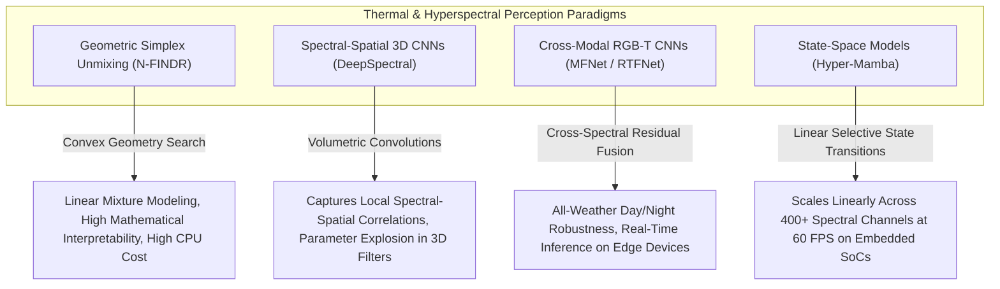

# 📜 Thermal & Hyperspectral Vision: Historical Evolution & Paradigms

## 1. Physical Foundations: Planck's Radiation Law & Radiometry

All matter above absolute zero ($T > 0\text{ K}$) continuously emits electromagnetic radiation according to **Planck's Law**, which gives the spectral radiance $B(\lambda, T)$ (power per unit area per unit solid angle per unit wavelength) emitted by an ideal blackbody:

$$B(\lambda, T) = \frac{2 h c^2}{\lambda^5} \cdot \frac{1}{\exp\!\left(\dfrac{h c}{\lambda k_B T}\right) - 1}$$

where:
- $h = 6.626 \times 10^{-34}\text{ J·s}$ is Planck's constant
- $c = 2.998 \times 10^8\text{ m/s}$ is the speed of light
- $k_B = 1.381 \times 10^{-23}\text{ J/K}$ is Boltzmann's constant
- $\lambda$ is wavelength in meters, $T$ is absolute temperature in Kelvin

At ambient terrestrial temperatures ($T \approx 300\text{ K}$, $27^\circ\text{C}$), **Wien's Displacement Law** proves that peak thermal emission occurs at:

$$\lambda_{\max} = \frac{b}{T} = \frac{2.898 \times 10^{-3}\text{ m·K}}{300\text{ K}} \approx 9.66\,\mu\text{m}$$

This places human, vehicle, and animal thermal signatures squarely in the **Long-Wave Infrared (LWIR: 8–14 µm)** band—far beyond what silicon-based RGB sensors can detect.

### 1.1 Integrating Planck's Law: The Stefan-Boltzmann Relation

Integrating $B(\lambda, T)$ over all wavelengths and over the upper hemisphere gives the total emissive power per unit area:

$$M = \varepsilon \sigma T^4$$

where $\sigma = 5.6704 \times 10^{-8}\text{ W m}^{-2}\text{ K}^{-4}$ is the Stefan-Boltzmann constant and $\varepsilon \in [0,1]$ is surface emissivity. The $T^4$ dependence means a 10 K temperature differential at 300 K generates a radiant power difference of:

$$\Delta M = \varepsilon \sigma \left[(310)^4 - (300)^4\right] \approx 60.2\text{ W/m}^2$$

A 320×256 uncooled microbolometer pixel (pitch = 17 µm) subtends roughly $(17 \times 10^{-6})^2 = 289\text{ nm}^2$ solid area—sensitive enough to resolve this differential given a Noise Equivalent Temperature Difference (NETD) of 50 mK.

### 1.2 LWIR vs. MWIR Band Trade-offs

| Band | Wavelength | Peak Temperature | Detector Technology | NETD | Use Case |
|:-----|:-----------|:-----------------|:--------------------|:-----|:---------|
| **MWIR** | 3–5 µm | > 500 K (engines, flames) | InSb / HgCdTe (cooled, 77 K) | < 10 mK | Missile guidance, exhaust plume tracking, flare detection |
| **LWIR** | 8–14 µm | 250–350 K (humans, vehicles) | VOx / a-Si microbolometer (uncooled) | 30–80 mK | Automotive pedestrian detection, surveillance, UAV thermography |
| **SWIR** | 0.9–1.7 µm | > 2000 K (molten metal) | InGaAs (room temp) | N/A | Moisture mapping, solar cell inspection, ATM fraud |

MWIR sensors require cryogenic Stirling-cycle coolers (adding ~300 g weight, ~8 W power draw, ~$15,000 USD cost), making them unsuitable for mass-market automotive ADAS. The 2019–2026 commercialization of LWIR was driven by uncooled VOx focal plane arrays at price points below $500 USD at 640×512 resolution.

## 2. Sensor Architectural Evolution

### Generation 1 (1970s–1990s): Cryogenically Cooled Single-Point Detectors
- Mechanically scanned mirrors focused thermal radiation onto a single HgCdTe (Mercury Cadmium Telluride) photodetector.
- NETD: < 20 mK. Frame rate: 25–30 Hz via mechanical scanning.
- SWaP-C (Size, Weight, Power, Cost): Prohibitive for ground vehicles. Typical system: 40 kg, 200 W, $500,000 USD.
- Application: Military tank thermal sights (M1A1 Abrams FLIR), airborne surveillance (AN/AAQ-series).

### Generation 2 (2000s–2018): Uncooled VOx Focal Plane Arrays
- 2D Vanadium Oxide (VOx) microbolometer arrays replaced scanning mechanisms. VOx resistance changes ~2% per Kelvin, enabling resistive-readout FPAs at room temperature.
- Shutter-based two-point calibration: A mechanical solenoid shutter closes every 30–60 seconds, occluding the scene with a uniform-temperature blackbody plate to recalibrate fixed-pattern noise. This causes a **$500\text{ ms}$ scene blackout**—a critical safety hazard in automotive applications.
- Resolution evolution: 160×120 (2002) → 320×240 (2010) → 640×512 (2016).

### Generation 3 (2019–2026 SOTA): Shutterless Digital NUC & Miniaturized HSI
- **Shutterless Scene-Based NUC**: FPGA-implemented algorithms track temporal pixel statistics over non-moving background regions, updating gain/offset matrices continuously without mechanical shuttering (detailed in [[topics/thermal-and-hyperspectral-vision/03-sensor-physics-and-open-problems|Sensor Physics & Open Problems]]).
- **Hyperspectral Miniaturization**: Fabry-Pérot tunable filter arrays integrated directly on CMOS sensors enable per-pixel spectral acquisition across 200+ bands at 1 fps on UAV platforms (<500 g).
- **Physics-Informed Deep Models**: UniCD (CVPR 2025) optimizes NUC parameters end-to-end via downstream detection loss. TherA jointly infers surface material class and true thermodynamic temperature from raw pixel values.

## 3. Hyperspectral Imaging: From Laboratory to Embedded Edge

Hyperspectral imaging (HSI) extends the spectral dimension from RGB's 3 channels to **200–400 contiguous narrow spectral bands** (typically 5–10 nm bandwidth each), covering visible through SWIR or LWIR ranges.

### 3.1 Spectral Signature as Material Fingerprint

Each material reflects and absorbs radiation in a characteristic spectral pattern. The **spectral reflectance curve** $\rho(\lambda)$ uniquely identifies:
- Vegetation health (chlorophyll absorption at 670 nm, near-IR reflectance at 800 nm — the NDVI basis)
- Mineral composition (iron oxide absorption at 900 nm, clay at 2200 nm)
- Plastic polymer type (CH stretch bonds at 1700–1740 nm)
- Explosives residue detection (2% reflectance anomaly at 1490 nm in RDX)

### 3.2 N-FINDR Endmember Extraction for Spectral Unmixing

Real HSI pixels typically represent a **linear mixture** of $p$ pure endmember spectra $\{e_1, \dots, e_p\}$ (the spectral signatures of pure materials in the scene):

$$r_i = \sum_{k=1}^p a_{ik} \cdot e_k + \eta_i, \quad \sum_k a_{ik} = 1,\; a_{ik} \ge 0$$

**N-FINDR** (Winter 1999) finds the endmembers as the vertices of the maximum-volume simplex inscribed in the data point cloud in spectral space. The algorithm iterates:

1. Initialize $p$ random pixels as candidate endmembers.
2. For each pixel $r_i$, compute the simplex volume when substituting $r_i$ for each current endmember:
$$V = \frac{1}{(p-1)!} \left|\det\!\left([e_1 - e_p, \; e_2 - e_p, \; \dots, \; e_{p-1} - e_p]\right)\right|$$
3. If any substitution increases $V$, replace the corresponding endmember and repeat.
4. Convergence: typically 3–10 iterations over a 200-band, 512×512 scene.

After endmember extraction, **Fully Constrained Least Squares (FCLS)** solves for abundance maps $a_{ik}$ per pixel. Production throughput on a Jetson AGX Orin: ~2 fps for a 256-band 640×512 scene using CUDA-accelerated matrix factorization.

## 4. RGB-Thermal Cross-Spectral Alignment

RGB and thermal cameras are physically offset by typically 3–8 cm (the baseline between lens centers), causing **parallax misalignment** that worsens for near-field objects.

### 4.1 Homographic and Depth-Aware Registration

Static homography $H \in \mathbb{R}^{3\times3}$ (estimated via planar calibration board) corrects alignment only at the plane distance used during calibration. For general scenes, depth-aware reprojection is required:

$$x_{\text{thermal}} = K_{\text{thermal}} \left( R \cdot \left(Z(x,y) \cdot K_{\text{rgb}}^{-1} \begin{bmatrix}u\\v\\1\end{bmatrix}\right) + t \right)$$

where $Z(x,y)$ is per-pixel metric depth estimated from RGB via Depth Anything V2, $K_{\text{rgb}}$, $K_{\text{thermal}}$ are intrinsic calibration matrices, and $(R, t)$ is the extrinsic rigid transform between camera frames.

### 4.2 Cross-Spectral Calibration with Heated Checkerboard

Standard optical calibration boards are invisible in LWIR (glass blocks IR). The production solution: a **PLA-printed or aluminum checkerboard heated to 50–60°C**, which appears as a high-contrast alternating pattern in both RGB (via paint contrast) and thermal (via emissivity/temperature contrast). Reprojection error after optimization: typically < 0.5 px RMS across both modalities.

---

## 5. Intensive Architectural Taxonomy: Convolutional vs Transformer vs Hybrid Sub-Modules

Thermal infrared (LWIR/MWIR) and Hyperspectral Imaging (HSI) perception architectures have transitioned from classical geometric simplex unmixing (N-FINDR) and spectral-spatial 3D convolutional networks to dual-stream cross-modal attention networks, spectral vision transformers, and continuous state-space models (Mamba).

### Comparative Sub-Module Architectural Matrix

| Model / System Name & Year | Architectural Paradigm | Backbone Sub-Module | Neck / Feature Aggregator | Encoder Sub-Module | Decoder / Head Sub-Module | Primary Bottleneck & Edge Suitability |
| :--- | :--- | :--- | :--- | :--- | :--- | :--- |
| **N-FINDR + FCLS Unmixing** (Winter, 1999–2018) | Geometric Convex Optimization | Contiguous Spectral Radiance Vector ($B=200\text{--}400$ bands) | Maximum-Volume Simplex Inscription Neck | Fully Constrained Non-Negative Least Squares (FCLS) Solver | Per-Pixel Fractional Material Abundance Maps ($a_k(x,y)$) | **Simplex Inversion Latency**: Sensitive to non-linear scattering and atmospheric absorption; compute-intensive for real-time edge processing. |
| **DeepSpectral-3DCNN** (2018–2022) | Spectral-Spatial 3D ConvNet | 3D Convolutional Spectral-Spatial Backbone ($K_h \times K_w \times K_\lambda$) | 3D-to-2D Dimensionality Reduction & Feature Pyramid Neck | 3D Convolutional Residual Stages with BatchNorm | Dense Pixel-Level Material Classification & Anomaly Detection Head | **3D Convolution Parameter Explosion**: Computing 3D convolutions across hundreds of spectral channels consumes massive memory bandwidth on edge GPUs. |
| **MFNet / RTFNet** (2019–2023) | Dual-Stream RGB-Thermal ConvNet | Two-Branch Backbone: ResNet-152 (RGB) + Dedicated 14-bit Thermal ResNet | Spatial Attention Fusion & Cross-Spectral Residual Neck | Fused Multi-Scale Convolutional Feature Stages | Real-Time Day/Night 2D Semantic Segmentation Head | **Parallax & Dynamic Range Bound**: Fast edge inference (~40 FPS on Jetson Xavier); sensitive to uncalibrated spatial parallax between optical and thermal lenses. |
| **SpectralFormer (HSI-ViT)** (2022–2024) | Pure Vision Transformer | Pixel-Wise Spectral Patch Embedding & Tokenizer ($1\times1$ & $3\times3$ tokens) | Spectral-Spatial Self-Attention (SSA) Neck | Multi-Layer Transformer Blocks with Cross-Spectral Attention | Fine-Grained Material Identification & Sub-Pixel Target Head | **Quadratic Token Memory Complexity**: Cross-spectral attention across hundreds of bands causes high VRAM memory footprint; requires patch token pruning on edge SoCs. |
| **TherA / UniCD** (2024–2026) | Physics-Informed Foundation | Dual-Stream ConvNeXt-Large / DINOv2 Backbone (14-bit Radiometric Flux + RGB) | Differentiable Scene-Based NUC & Emissivity Separation Neck | Physics-Guided Cross-Attention Spatial-Thermal Encoder | Dual Head: Thermodynamic Temperature ($T \in \mathbb{R}^+$ in Kelvin) + 2D Detection Head | **DRAM Bandwidth & Radiometric Calibration**: Preserves absolute radiometry; eliminates mechanical calibration blackouts; runs at 30 FPS on Jetson Orin. |
| **Hyper-Mamba (SS-HSI)** (2025–2026) | State-Space Mamba Hybrid | Continuous Spectral Band Sequence 1D+2D Selective Scan Backbone | Bi-directional Spectral-Spatial Cross-Scan Aggregator | Linear Selective State-Space ($SSM$) Hidden Parameter Blocks | Real-Time 60 FPS Hyperspectral Unmixing & Target Recognition Head | **SRAM Cache Friendly**: $\mathcal{O}(B \cdot H \cdot W)$ linear complexity scales seamlessly to 400+ spectral channels; fits easily into edge mobile platform budgets. |

### Didactic Architectural Trade-Off Analysis

#### 1. Spectral Correlation Continuity vs. Spatial Locality Inductive Biases
Standard vision models operate on discrete 3-channel RGB representations. In contrast, Hyperspectral Imaging (HSI) provides continuous spectral reflectance curves $\rho(\lambda)$ across hundreds of narrow contiguous channels (e.g. $400\text{--}1000\,\text{nm}$).

2D CNNs treat spectral channels as unstructured feature depth, failing to exploit the continuous physical correlation of electromagnetic absorption bands. While 3D CNNs model spectral continuity via $K_\lambda \times K_h \times K_w$ convolutional filters:

$$(I * W)_{x,y,\lambda} = \sum_{i,j,k} I(x-i, y-j, \lambda-k) W(i,j,k)$$

they suffer from parameter explosion and high computational cost $\mathcal{O}(H \times W \times B \times K_h \times K_w \times K_\lambda \times C_{\text{in}} \times C_{\text{out}})$.

State-space architectures (**Hyper-Mamba**) treat the spectral dimension as a continuous 1D physical system traversed via selective state-space scans, maintaining an evolving hidden state $h_\lambda \in \mathbb{R}^N$ that captures long-range chemical absorption signatures with linear computational complexity $\mathcal{O}(B \cdot H \cdot W)$.

#### 2. Radiometric Dynamic Range: 14-Bit Raw Sensor ADC vs. 8-Bit Quantization
- **Preserving Thermal Gradients**: Uncooled VOx microbolometers capture 14-bit or 16-bit raw digital data representing radiometric flux. A standard 8-bit quantization compresses a $100\,\text{K}$ scene range into 256 bins ($\sim 0.4\,\text{K/bin}$), completely washing out subtle human skin temperature differentials ($\Delta T < 50\,\text{mK}$).
- **Custom Non-Linear Radiometric Scaling**: Modern thermal backbones ingest raw 14-bit data directly, applying a learned or histogram-equalized non-linear tone mapping function:

  $$\tilde{I}(x,y) = \frac{\log(1 + \gamma \cdot I_{14\text{-bit}}(x,y))}{\log(1 + \gamma \cdot I_{\max})}$$

  Intermediate layers maintain FP16 or custom per-channel INT8 scales to preserve fine thermal edges around cold background obstacles.

#### 3. Real-Time Ingestion Friction on Edge Systems
- **Hyperspectral Datacube Throughput**: A 256-band HSI sensor operating at $1024 \times 1024$ resolution at 30 FPS generates **$1.5\,\text{GB/s}$** of raw streaming data. Processing this volume on embedded platforms (Jetson AGX Orin) requires zero-copy DMA buffers mapped directly from FPGA acquisition boards to GPU memory.
- **Parallax Compensation in RGB-T Fusion**: Due to the physical baseline offset between RGB and thermal lenses ($3\text{--}8\,\text{cm}$), rigid homography projection fails for near-field objects. State-of-the-art networks integrate dense depth-guided warping modules to align cross-spectral features before spatial attention fusion.

---

Related notes: [[topics/thermal-and-hyperspectral-vision/00-thermal-and-hyperspectral-vision-moc|Thermal Vision MOC]], [[topics/thermal-and-hyperspectral-vision/02-production-pipeline-and-workarounds|Production Pipeline & Workarounds]], [[topics/sensor-fusion/04-classical-and-hybrid-methods|Sensor Fusion Classical Foundations]].
