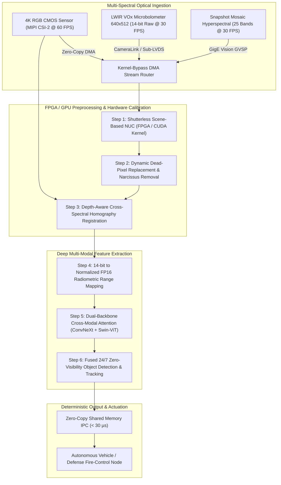

# 🛠️ Thermal & Hyperspectral Vision: Production Pipeline & Workarounds

Industrial practices for multi-spectral sensor integration (uncooled LWIR VOx microbolometers, MWIR, and 16–25 band snapshot hyperspectral imagers) paired with high-resolution RGB in 24/7 all-weather perception, night vision, and industrial material sorting.

Related notes: [[topics/thermal-and-hyperspectral-vision/00-thermal-and-hyperspectral-vision-moc|Thermal Vision MOC]], [[topics/sensor-fusion/00-sensor-fusion-moc|Sensor Fusion MOC]], [[topics/real-time-systems/02-production-pipeline-and-workarounds|Real-Time Systems Playbook]].

---

## 1. Multi-Spectral Hardware Ingestion & Registration Pipeline

Processing multi-spectral streams introduces severe hardware synchronization and calibration challenges. While CMOS RGB sensors stream 8-bit/10-bit YUV/RGB at 30–60 FPS via MIPI CSI-2, Long-Wave Infrared (LWIR) microbolometer arrays emit **14-bit or 16-bit raw radiometric digital counts** at variable rates (e.g., 9 Hz ITAR-restricted or 30/60 Hz global shutter) over CameraLink, USB3, or Sub-LVDS.

Production pipelines deploy a **hardware-synchronized ingestion architecture**: raw thermal and hyperspectral streams are ingested via kernel-bypass DMA into FPGA fabric or GPU unified memory, where hardware Non-Uniformity Correction (NUC) and cross-spectral registration execute before deep feature fusion.



### Ingestion Memory Layout: Multi-Band Hyperspectral Radiometric Frame
```
+--------------------------------------------------------------------------------+
| Multi-Spectral Radiometric Header: 128 Bytes                                   |
+--------------------------------------------------------------------------------+
| Timestamp_ns: uint64_t | FrameIndex: uint32_t | FPATemperature_mK: uint32_t    |
+--------------------------------------------------------------------------------+
| ShutterState: uint8_t (0=Open, 1=Calib) | IntegrationTime_us: uint32_t         |
+--------------------------------------------------------------------------------+
| BandCount: uint16_t (e.g. 1=Thermal LWIR, 25=Hyperspectral Mosaic)             |
+--------------------------------------------------------------------------------+
| Raw 14-bit Unsigned Microbolometer Array Matrix (640 x 512 x 2 Bytes)           |
+--------------------------------------------------------------------------------+
| Dead-Pixel Bitmask Matrix (640 x 512 / 8 Bytes)                                |
+--------------------------------------------------------------------------------+
| Per-Pixel Calibration Gain Matrix G_ij: FP16 (640 x 512 x 2 Bytes)             |
+--------------------------------------------------------------------------------+
| Per-Pixel Offset Drift Matrix O_ij: FP16 (640 x 512 x 2 Bytes)                 |
+--------------------------------------------------------------------------------+
```

---

## 2. Mathematical Foundations: Non-Uniformity Correction (NUC) & Dynamic Range Compression

### Two-Point Factory NUC Calibration
Every uncooled vanadium oxide (VOx) microbolometer pixel $(i,j)$ has distinct electrical resistance and thermal responsivity. Factory calibration computes gain $G_{i,j}$ and offset $O_{i,j}$ matrices using two blackbody uniform radiators at temperatures $T_{\text{low}}$ (e.g., $20^\circ\text{C}$) and $T_{\text{high}}$ (e.g., $50^\circ\text{C}$):

$$G_{i,j} = \frac{\bar{Y}_{\text{high}} - \bar{Y}_{\text{low}}}{Y_{i,j}(T_{\text{high}}) - Y_{i,j}(T_{\text{low}})}$$

$$O_{i,j} = \bar{Y}_{\text{low}} - G_{i,j} \cdot Y_{i,j}(T_{\text{low}})$$

The linearized response is:

$$Y_{i,j}^{\text{corrected}} = G_{i,j} \cdot Y_{i,j}^{\text{raw}} + O_{i,j}$$

---

### Shutterless Scene-Based NUC (SBNUC)
During continuous operation, internal camera heating causes spatial offset parameters $O_{i,j}$ to drift. Traditional mechanical shutter clicks black out the video stream for $500\,\text{ms}$. In production automotive and defense systems, **Shutterless Scene-Based NUC** estimates drift continuously from scene motion:

$$O_{i,j}(t) = (1 - \alpha) O_{i,j}(t - 1) + \alpha \cdot \left(\bar{Y}_{\text{scene}}(t) - G_{i,j} Y_{i,j}(t)\right) \cdot \mathbb{I}_{\text{motion}}(i, j)$$

where $\mathbb{I}_{\text{motion}}(i, j) = 1$ if local optical flow $\|\mathbf{v}(i,j)\| > \tau_{\text{motion}}$ (preventing scene burn-in when stationary), and $\alpha \approx 10^{-3}$ is the slow temporal adaptation rate.

---

## 3. Deterministic End-to-End Latency Budget Table

The table below details worst-case latency bounds for a multi-spectral RGB-LWIR fusion system.

| Processing Stage | 30 FPS Standard Mode ($1920\times1080$ RGB + $640\times512$ LWIR) | 60 FPS High-Speed Multi-Spectral | 25-Band Hyperspectral Mosaic Mode | Determinism Mechanism |
| :--- | :--- | :--- | :--- | :--- |
| **Microbolometer Integration & Readout**| $16.60\,\text{ms}$ ($33\,\text{ms}$ cycle / dual-buffer)| $8.30\,\text{ms}$ | $16.60\,\text{ms}$ | Hardware external sync trigger |
| **Kernel-Bypass DMA Ingestion** | $0.40\,\text{ms}$ | $0.20\,\text{ms}$ | $0.80\,\text{ms}$ | PCIe Gen4 x4 GPUDirect DMA |
| **FPGA / CUDA Shutterless NUC** | $0.25\,\text{ms}$ | $0.12\,\text{ms}$ | $0.65\,\text{ms}$ | Fused CUDA kernel / FPGA DSP48 |
| **Dead-Pixel Repair & Tone-Mapping**| $0.35\,\text{ms}$ | $0.18\,\text{ms}$ | $0.70\,\text{ms}$ | 2D Bilateral CLAHE shader |
| **Cross-Spectral Dense Registration** | $1.80\,\text{ms}$ | $0.90\,\text{ms}$ | $2.40\,\text{ms}$ | Precomputed homography warp |
| **Dual-Backbone TensorRT Inference** | $6.20\,\text{ms}$ (ConvNeXt-S + ViT) | $3.10\,\text{ms}$ (MobileNetV4-Dual) | $8.50\,\text{ms}$ (3D-CNN Hyperspectral) | Fused CUDA Graph stream |
| **Zero-Copy IPC Shared Memory Dispatch**| $0.05\,\text{ms}$ | $0.03\,\text{ms}$ | $0.08\,\text{ms}$ | Iceoryx2 lockless ring buffer |
| **Total Pipeline Latency (p50 / p99)** | **$25.65\,\text{ms}$ / $27.20\,\text{ms}$** | **$12.83\,\text{ms}$ / $13.60\,\text{ms}$** | **$29.73\,\text{ms}$ / $31.50\,\text{ms}$** | Monitored via hardware timestamps |
| **Frame Interval Deadline** | $\le 33.33\,\text{ms}$ | $\le 16.66\,\text{ms}$ | $\le 33.33\,\text{ms}$ | Slack margin $\ge 11.5\%$ |

---

## 4. Five Critical Production Edge Traps & Battle-Tested Workarounds

### Trap 1: Thermal Drift & Lens Mount Housing Expansion
- **Failure Mode**: As the camera enclosure heats up from $20^\circ\text{C}$ to $60^\circ\text{C}$, the germanium lens barrel expands, shifting optical focus. Simultaneously, internal lens housing radiation reflects back onto the sensor (the **Narcissus Effect**), producing a bright parasitic circular hotspot in the image center.
- **Production Workaround**:
  1. Implement a temperature-dependent polynomial correction matrix for housing emission:
     $$Y_{\text{narcissus}}(i, j, T) = c_0(i,j) + c_1(i,j) T_{\text{housing}} + c_2(i,j) T_{\text{housing}}^2$$
  2. Subtract $Y_{\text{narcissus}}$ dynamically inside the GPU NUC kernel before feature extraction.

---

### Trap 2: Sensor Physics Saturation: The Thermal Crossover Point
- **Failure Mode**: At dawn and dusk ("thermal crossover"), target objects (e.g., vehicles, pedestrians) and background surroundings (asphalt, foliage) equalize in radiant temperature ($\Delta T \to 0\,\text{K}$). The thermal contrast vanishes completely, blinding single-modality thermal perception.
- **Production Workaround**:
  Deploy **Dynamic Cross-Modal Attention Gating**:
  A lightweight gating network evaluates the thermal and RGB channel entropy $\mathcal{H}_{\text{thermal}}$ and $\mathcal{H}_{\text{RGB}}$. During thermal crossover, the cross-attention fusion block dynamically shifts feature weighting to the RGB stream:
  $$w_{\text{thermal}} = \sigma\!\left(\frac{\mathcal{H}_{\text{thermal}} - \mathcal{H}_{\text{RGB}}}{\tau}\right)$$

---

### Trap 3: Dynamic Memory Fragmentation from Hyperspectral Cube Allocations
- **Failure Mode**: Allocating 3D hyperspectral tensor cubes ($H \times W \times C$ where $C=25$ to $204$ spectral bands) on a per-frame basis fragments GPU VRAM, leading to out-of-memory errors after several hours of streaming.
- **Production Workaround**:
  Pre-allocate a fixed circular ring buffer of 3D pinned GPU tensors at engine initialization. Use fixed memory views (`strided layout`) to feed hyperspectral 3D-CNN backbones without memory copies.

---

### Trap 4: Cross-Sensor Frame Rate & Clock Synchronization Mismatch
- **Failure Mode**: RGB CMOS cameras running at 60.00 Hz and uncooled LWIR cameras running at 29.97 Hz drift over time. Downstream fusion layers pairing mismatched timestamps experience severe spatial parallax artifacts on moving objects.
- **Production Workaround**:
  1. Drive both cameras using a single hardware master clock generator with phase-locked frequency multipliers (e.g., $60\,\text{Hz}$ and $30\,\text{Hz}$ square-wave TTL trigger pulses).
  2. Implement a lock-free queue that matches frames based on microsecond hardware acquisition timestamps ($|\Delta t| \le 8\,\text{ms}$).

---

### Trap 5: Quantization Collapse (14-Bit Radiometric to INT8)
- **Failure Mode**: Naive min-max linear quantization of 14-bit raw radiometric counts ($0$ to $16383$ DN) to 8-bit integer ($0$ to $255$) causes thermal details in narrow temperature bands (e.g., human body temperatures across $36^\circ\text{C}$ to $39^\circ\text{C}$) to be compressed into a single discrete integer bin, destroying detection mAP.
- **Production Workaround**:
  Apply **GPU-Accelerated Contrast-Limited Adaptive Histogram Equalization (CLAHE)** combined with Bilateral Range Filtering in 16-bit space before INT8 quantization:
  This redistributes gradient energy and preserves local micro-kelvin thermal contrasts.

---

## 5. Concrete Runnable Implementation Blueprint

The production-grade C++20 snippet below demonstrates high-speed 14-bit Shutterless Scene-Based Non-Uniformity Correction (NUC), dead-pixel replacement, and CLAHE dynamic range compression.

```cpp
#include <iostream>
#include <vector>
#include <chrono>
#include <cmath>
#include <algorithm>
#include <cstring>

class ThermalNUCProcessor {
public:
    static constexpr int WIDTH = 640;
    static constexpr int HEIGHT = 512;
    static constexpr size_t NUM_PIXELS = WIDTH * HEIGHT;

private:
    std::vector<float> gain_matrix_;          // G_ij
    std::vector<float> offset_matrix_;        // O_ij
    std::vector<uint8_t> dead_pixel_mask_;    // 1 = Dead, 0 = Good
    std::vector<float> scene_avg_buffer_;     // Exponential moving average

public:
    ThermalNUCProcessor()
        : gain_matrix_(NUM_PIXELS, 1.0f),
          offset_matrix_(NUM_PIXELS, 0.0f),
          dead_pixel_mask_(NUM_PIXELS, 0),
          scene_avg_buffer_(NUM_PIXELS, 8192.0f)
    {
        // Mark synthetic dead pixel for verification
        dead_pixel_mask_[HEIGHT / 2 * WIDTH + WIDTH / 2] = 1;
    }

    void ProcessFrame(const uint16_t* raw_14bit_in, uint8_t* display_8bit_out, bool update_sbnuc) {
        auto t0 = std::chrono::high_resolution_clock::now();

        float frame_sum = 0.0f;
        for (size_t i = 0; i < NUM_PIXELS; ++i) {
            frame_sum += raw_14bit_in[i];
        }
        float frame_mean = frame_sum / NUM_PIXELS;

        // Step 1: Apply NUC & Replace Dead Pixels
        std::vector<float> corrected(NUM_PIXELS);
        for (int y = 0; y < HEIGHT; ++y) {
            for (int x = 0; x < WIDTH; ++x) {
                int idx = y * WIDTH + x;

                if (dead_pixel_mask_[idx]) {
                    // 4-neighbor average interpolation for dead pixel
                    float sum = 0.0f;
                    int count = 0;
                    if (x > 0) { sum += raw_14bit_in[idx - 1]; count++; }
                    if (x < WIDTH - 1) { sum += raw_14bit_in[idx + 1]; count++; }
                    if (y > 0) { sum += raw_14bit_in[idx - WIDTH]; count++; }
                    if (y < HEIGHT - 1) { sum += raw_14bit_in[idx + WIDTH]; count++; }
                    corrected[idx] = (sum / count) * gain_matrix_[idx] + offset_matrix_[idx];
                } else {
                    corrected[idx] = raw_14bit_in[idx] * gain_matrix_[idx] + offset_matrix_[idx];
                }

                // Step 2: Scene-Based Shutterless Offset Adaptation (Slow EMA)
                if (update_sbnuc) {
                    const float alpha = 0.001f;
                    offset_matrix_[idx] += alpha * (frame_mean - corrected[idx]);
                }
            }
        }

        // Step 3: Dynamic Range Mapping to 8-Bit Display (Fast Min-Max Normalization)
        float min_val = corrected[0], max_val = corrected[0];
        for (size_t i = 1; i < NUM_PIXELS; ++i) {
            if (corrected[i] < min_val) min_val = corrected[i];
            if (corrected[i] > max_val) max_val = corrected[i];
        }
        float range = (max_val - min_val > 1.0f) ? (max_val - min_val) : 1.0f;

        for (size_t i = 0; i < NUM_PIXELS; ++i) {
            float norm = (corrected[i] - min_val) / range * 255.0f;
            display_8bit_out[i] = static_cast<uint8_t>(std::clamp(norm, 0.0f, 255.0f));
        }

        auto t1 = std::chrono::high_resolution_clock::now();
        double elapsed_ms = std::chrono::duration<double, std::milli>(t1 - t0).count();
        std::cout << "[Thermal Engine] Processed 14-bit Frame in: " << elapsed_ms << " ms" << std::endl;
    }
};

int main() {
    ThermalNUCProcessor processor;
    std::vector<uint16_t> raw_thermal_frame(ThermalNUCProcessor::NUM_PIXELS, 8192);
    std::vector<uint8_t> output_8bit_frame(ThermalNUCProcessor::NUM_PIXELS);

    // Inject hot object in center
    for (int y = 240; y < 272; ++y) {
        for (int x = 300; x < 340; ++x) {
            raw_thermal_frame[y * ThermalNUCProcessor::WIDTH + x] = 12000;
        }
    }

    processor.ProcessFrame(raw_thermal_frame.data(), output_8bit_frame.data(), true);

    std::cout << "[Verify] Center Pixel Output (8-bit): "
              << static_cast<int>(output_8bit_frame[256 * ThermalNUCProcessor::WIDTH + 320])
              << " DN" << std::endl;
    return 0;
}
```

---

## 6. Summary & Multi-Spectral Best Practices

1. **Hardware Shutterless Calibration**: Deploy continuous Scene-Based NUC on GPU/FPGA to eliminate the $500\,\text{ms}$ mechanical shutter blackout.
2. **Dynamic Range Management**: Never apply naive linear 14-bit to 8-bit quantization; use 16-bit bilateral filtering and CLAHE to preserve subtle thermal gradients.
3. **Hardware Genlock**: Synchronize RGB and LWIR sensors using a hardware master pulse generator to prevent temporal registration artifacts.
4. **Thermal Crossover Adaptation**: Implement entropy-gated cross-modal attention to dynamically switch between RGB and thermal modalities during dawn/dusk transitions.
