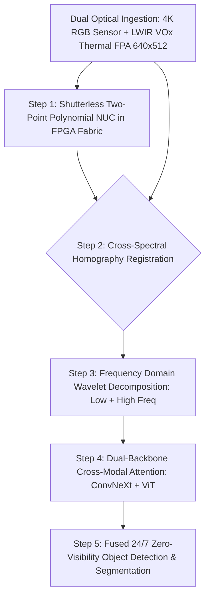

# 🛠️ Thermal & Hyperspectral Vision: Production Pipeline & Workarounds

## 1. Multi-Spectral Ingestion & Alignment Architecture

## 2. Production Engineering Traps & Battle-Tested Workarounds

### Trap 1: Fixed-Pattern Noise (FPN) & Shutter Freezing
- **The Issue**: Uncooled microbolometers drift significantly as internal electronics warm up. Standard cameras fire a mechanical solenoid shutter every 30 seconds to recalculate baseline offsets, causing a **$500\text{ ms}$ black-screen freeze** that blinds autonomous vehicles at 100 km/h.
- **Battle-Tested Workaround**:
  - Implement a **Scene-Based Shutterless Non-Uniformity Correction (NUC)** in FPGA:
    - Track high-speed motion between frames using optical flow.
    - Accumulate temporal pixel variance over non-moving backgrounds to continuously update the gain matrix $G_{i,j}$ and offset matrix $O_{i,j}$ without closing a physical mechanical shutter.

### Trap 2: Parallax Misalignment Between Optical Centers
- **The Issue**: Thermal optics (Germanium glass) and RGB lenses (Silica glass) are physically separated by several centimeters. Aligning RGB with Thermal via a static 2D affine transform causes massive boundary mismatch on close-range objects ($<5\text{ meters}$).
- **Battle-Tested Workaround**:
  - Run depth-aware dynamic homography warping: Use monocular metric depth (via **Depth Anything V2**) on the RGB image to dynamically re-project pixels onto the thermal camera plane:
    $$x_{\text{thermal}} = K_{\text{thermal}} \left( R \cdot (Z(x, y) \cdot K_{\text{rgb}}^{-1} x_{\text{rgb}}) + t \right)$$
    completely eliminating near-field parallax ghosting.
