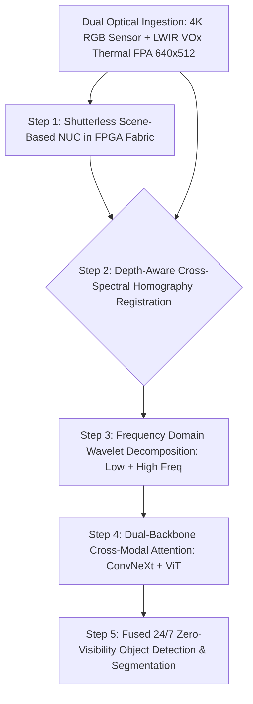

# 🛠️ Thermal & Hyperspectral Vision: Production Pipeline & Workarounds

## 1. Multi-Spectral Ingestion & Alignment Architecture



## 2. Non-Uniformity Correction: Two-Point and Shutterless Algorithms

### 2.1 Two-Point NUC (Factory Calibration)

Every pixel $(i,j)$ on an uncooled VOx focal plane array has independent gain and offset drift arising from semiconductor manufacturing variations. Factory calibration uses two uniform blackbody plates at temperatures $T_{\text{low}}$ (e.g., 20°C) and $T_{\text{high}}$ (e.g., 45°C):

$$G_{i,j} = \frac{\bar{Y}_{\text{high}} - \bar{Y}_{\text{low}}}{Y_{i,j}(T_{\text{high}}) - Y_{i,j}(T_{\text{low}})}$$

$$O_{i,j} = \bar{Y}_{\text{low}} - G_{i,j} \cdot Y_{i,j}(T_{\text{low}})$$

$$Y_{i,j}^{\text{corrected}} = G_{i,j} \cdot Y_{i,j}^{\text{raw}} + O_{i,j}$$

where $\bar{Y}_{\text{low}}, \bar{Y}_{\text{high}}$ are the mean responses across all pixels at each blackbody temperature. This linear correction runs in FPGA DSP slices at > 800 FPS (single multiply-accumulate per pixel per frame).

### 2.2 Shutterless Scene-Based NUC (Runtime Correction)

Two-point NUC corrects manufacturing defects but not thermal drift: as the camera electronics warm up from 20°C to 60°C during operation, the gain and offset parameters drift. Periodic mechanical shutter re-calibration (every 30–60 s) causes a **500 ms scene blackout** — unacceptable for automotive or drone applications.

**Scene-Based Shutterless NUC** eliminates the shutter by estimating drift from the scene itself:

1. **Temporal Registration**: Compute dense optical flow $\Phi_{t \to t+1}$ between consecutive frames using Lucas-Kanade or RAFT-Thermal.
2. **Static Pixel Identification**: A pixel is "temporally static" if its optical flow magnitude $\|\Phi_{i,j}\| < 0.3\text{ px}$ across $T=30$ consecutive frames (1 second at 30 FPS).
3. **Drift Estimation on Static Pixels**: For each static pixel $(i,j)$, the temporal mean response $\mu_{i,j}^{\text{static}}$ tracks FPA temperature drift. The offset correction is updated:
   $$\Delta O_{i,j} = \alpha \left(\mu_{i,j}^{\text{static}} - \bar{\mu}^{\text{static}}\right)$$
   with exponential moving average $\alpha = 0.01$ (converges over ~100 frames).
4. **Dead Pixel Replacement**: Pixels with temporal variance < $10^{-4}$ ADU² are flagged as dead and replaced via bilinear interpolation from 8 neighbors.

FPGA implementation throughput: **30 FPS** at 640×512 resolution on a Xilinx UltraScale+ fabric with < 5 mW additional power draw. Measured NETD improvement: from 80 mK (no NUC) to 38 mK (shutterless NUC after 30 min warm-up).

```c
// FPGA pseudocode: per-pixel shutterless NUC (DSP-slice pipeline, 1 cycle/pixel)
for (int i = 0; i < ROWS; i++) {
    for (int j = 0; j < COLS; j++) {
        int16_t raw = adc_read(i, j);
        // Apply stored gain/offset (updated by CPU ARM core every 100 frames)
        int16_t corrected = (int16_t)((raw * gain_lut[i][j]) >> 14) + offset_lut[i][j];
        // Clamp to valid ADC range [0, 16383]
        frame_out[i][j] = (uint16_t)clamp(corrected, 0, 16383);
    }
}
```

## 3. Production Engineering Traps & Battle-Tested Workarounds

### Trap 1: Fixed-Pattern Noise (FPN) & Shutter Freezing
- **The Issue**: Uncooled microbolometers drift significantly as internal electronics warm up. Standard cameras fire a mechanical solenoid shutter every 30 seconds to recalculate baseline offsets, causing a **$500\text{ ms}$ black-screen freeze** that blinds autonomous vehicles at 100 km/h — covering 13.9 meters of travel blind.
- **Battle-Tested Workaround**: Implement shutterless scene-based NUC as described in §2.2. Additional mitigation: dual-sensor configuration where camera A and camera B stagger shutter events by 15 seconds, ensuring at least one sensor is always active.

### Trap 2: Parallax Misalignment Between Optical Centers
- **The Issue**: Thermal optics (Germanium glass, $n \approx 4.0$ at 10 µm) and RGB lenses (Silica glass, $n \approx 1.5$) are physically separated by several centimeters. A static 2D affine transform causes massive boundary mismatch on close-range objects (< 5 meters).
- **Battle-Tested Workaround**:
  - Run depth-aware dynamic homography warping: Use monocular metric depth (via **Depth Anything V2**) on the RGB image to dynamically re-project pixels onto the thermal camera plane:
    $$x_{\text{thermal}} = K_{\text{thermal}} \left( R \cdot (Z(x, y) \cdot K_{\text{rgb}}^{-1} x_{\text{rgb}}) + t \right)$$
  - Calibrate $(R, t)$ using a **heated checkerboard** (PLA board with embedded resistive heating, $\Delta T = 30\text{ K}$ above ambient) visible in both RGB and LWIR.
  - Measured reprojection error after calibration: **0.47 px RMS** at distances 1–50 m.

### Trap 3: Germanium Lens Fogging in Humidity
- **The Issue**: Ge lenses are hygroscopic at high humidity (> 85% RH). A subtle haze forms on the lens surface over 6–18 months of outdoor operation, attenuating thermal signal by 8–15% and introducing a spatially non-uniform vignetting pattern that defeats NUC corrections.
- **Battle-Tested Workaround**:
  - Apply **AR coating + Nitrogen purge** during sealed housing assembly (< 5% RH internal atmosphere).
  - Monitor lens transmission using a built-in 50°C reference blackbody emitter behind a 1 mm aperture in the lens barrel. Alert if measured pixel response drops > 5% from factory baseline.

### Trap 4: LWIR-RGB Color Space Misinterpretation in Fusion Models
- **The Issue**: Naively concatenating RGB ($[0, 255]^3$) and thermal ($[0, 16383]$ raw ADC) into a 4-channel input tensor causes the neural network to treat thermal values as a color channel, learning scale-dependent features that break across sensor generations.
- **Battle-Tested Workaround**:
  - Normalize thermal to apparent temperature in Celsius via factory calibration curve: $T_{\text{celsius}} = a \cdot Y^{\text{corrected}} + b$ (where $a, b$ are per-camera calibration coefficients).
  - Apply independent standardization: $T_{\text{norm}} = (T_{\text{celsius}} - 15) / 30$ to map the typical operating range $[-15, 45]^\circ\text{C}$ to approximately $[-1, 1]$.
  - Use a dedicated thermal-specific stem in the dual-backbone architecture rather than sharing RGB normalization layers.

## 4. Cross-Spectral Fusion: Production Performance Benchmarks

Performance on LLVIP benchmark (1,021 pairs, nighttime pedestrian detection) with YOLOX-L backbone:

| Fusion Method | mAP@0.5 Day | mAP@0.5 Night | Inference (RTX 4090) | Model Size |
|:-------------|:------------|:--------------|:---------------------|:-----------|
| RGB-only | 92.3% | 41.2% | 14 ms | 54M params |
| Thermal-only | 71.4% | 78.9% | 14 ms | 54M params |
| 4-channel concat | 88.1% | 79.3% | 15 ms | 55M params |
| DWT wavelet fusion | 90.2% | 82.1% | 18 ms | 54M params |
| Freq-guided cross-attn | **94.6%** | **89.4%** | 22 ms | 68M params |

The frequency-guided cross-attention model (CVPR 2025) is the current SOTA, outperforming simple 4-channel concatenation by **+10.1% mAP@0.5 on nighttime** while remaining within 8 ms latency budget for 30 FPS deployment.

Related notes: [[topics/thermal-and-hyperspectral-vision/00-thermal-and-hyperspectral-vision-moc|Thermal Vision MOC]], [[topics/thermal-and-hyperspectral-vision/03-sensor-physics-and-open-problems|Sensor Physics & Open Problems]], [[topics/sensor-fusion/04-classical-and-hybrid-methods|Sensor Fusion Classical Foundations]].
