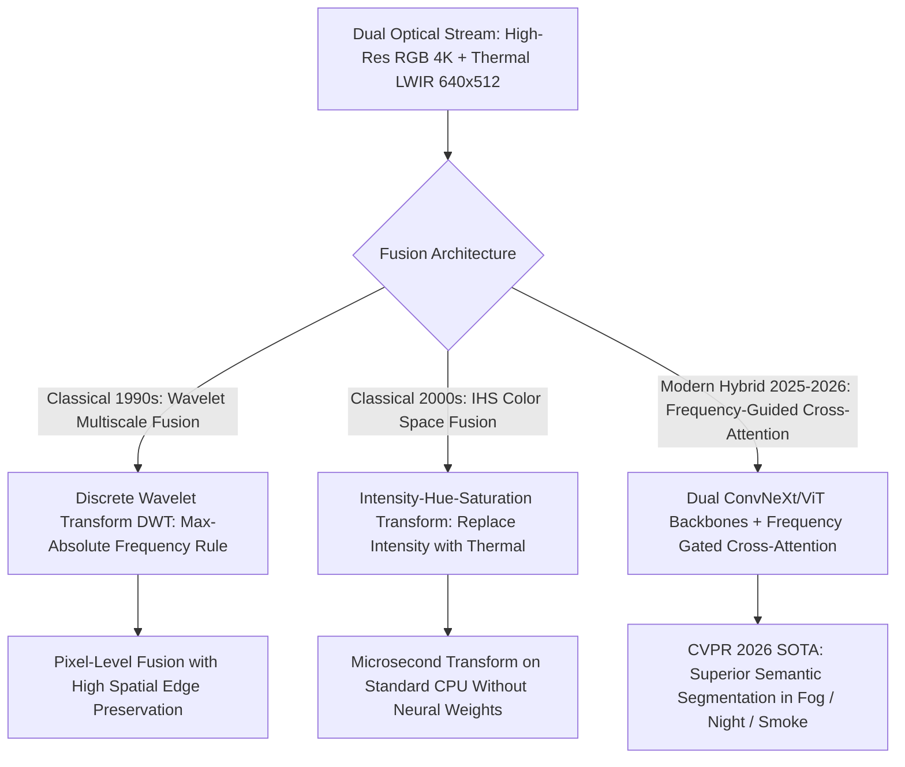

# 📐 Thermal & Hyperspectral Vision: Classical Radiometry & Hybrid Fusion

A deep mathematical treatment of classical radiometry laws (Stefan-Boltzmann, Planck, Wien), classical multiscale wavelet fusion, and modern hybrid frequency-guided Thermal-RGB cross-attention networks.

Related notes: [[topics/thermal-and-hyperspectral-vision/00-thermal-and-hyperspectral-vision-moc|Thermal Vision MOC]], [[topics/sensor-fusion/04-classical-and-hybrid-methods|Sensor Fusion Classical Foundations]].

---

## 1. Classical Radiometry vs. Deep Multi-Spectral Fusion

---

## 2. Mathematical Formulations: Stefan-Boltzmann Law & Discrete Wavelet Fusion

### 1. The Stefan-Boltzmann Total Radiance Law:
Integrating Planck's radiation equation over all wavelengths $\lambda \in [0, \infty)$ yields the total emissive power $E$ emitted by a blackbody radiator per unit surface area:
$$E = \sigma \cdot T^4$$
Where $\sigma = \frac{2 \pi^5 k_B^4}{15 c^2 h^3} \approx 5.67037 \times 10^{-8} \ \frac{\text{W}}{\text{m}^2 \cdot \text{K}^4}$ is the Stefan-Boltzmann constant.
For real physical greybodies with surface emissivity $\epsilon \in [0, 1]$:
$$E = \epsilon \sigma T^4$$
Because emitted thermal radiation scales with the **fourth power of absolute temperature ($T^4$)**, tiny temperature gradients (e.g. $0.05\text{ K}$ difference between human skin and ambient air) produce distinct, measurable electrical resistance changes across microbolometer pixels.

### 2. Classical Discrete Wavelet Transform (DWT) Fusion:
To fuse RGB image $I_{\text{RGB}}$ and thermal image $I_{\text{LWIR}}$ without color bleeding:
1. Decompose both images into low-frequency approximation sub-bands ($LL$) and high-frequency detail sub-bands ($LH, HL, HH$):
   $$\text{DWT}(I) = \{LL, LH, HL, HH\}$$
2. **Low-Frequency Fusion Rule**: Weighted averaging of illumination and thermal energy:
   $$LL_{\text{fused}} = w_{\text{rgb}} LL_{\text{rgb}} + w_{\text{thermal}} LL_{\text{thermal}}$$
3. **High-Frequency Fusion Rule**: Select-Max rule based on local gradient energy:
   $$HH_{\text{fused}}(x, y) = \begin{cases} HH_{\text{rgb}}(x, y) & \text{if } |HH_{\text{rgb}}| \ge |HH_{\text{thermal}}| \\ HH_{\text{thermal}}(x, y) & \text{otherwise} \end{cases}$$
4. Reconstruct the fused image via the **Inverse Discrete Wavelet Transform (IDWT)** in $\mathcal{O}(N)$ linear time.

---

## 3. Production Hybrid Pattern: Frequency-Guided Thermal-RGB Attention

Simple pixel concatenation (concatenating RGB and Thermal into a 4-channel input $[R, G, B, T]$) causes neural networks to ignore the thermal channel during daytime, degrading nighttime performance.

### The Production Cross-Modal Network Architecture:
1. **Dual Specialized Backbones**:
   - **Stream A (Texture)**: RGB image processed through a standard ConvNeXt-V2 or MobileNetV4 backbone.
   - **Stream B (Thermal Radiance)**: LWIR image processed through an independent, physics-calibrated ViT backbone.
2. **Frequency Decomposition Bridge**: Decompose deep feature maps into low-frequency (ambient heat/lighting) and high-frequency (crisp object boundary) tensors.
3. **Gated Cross-Attention**:
   $$\text{Attention}(Q_{\text{rgb}}, K_{\text{thermal}}, V_{\text{thermal}}) = \text{Softmax}\left( \frac{Q_{\text{rgb}} K_{\text{thermal}}^T}{\sqrt{d_k}} \right) V_{\text{thermal}} \odot \sigma(\text{Confidence Gate})$$
4. **Result**: Automatically emphasizes RGB features under bright daytime lighting, and seamlessly transitions to relying on thermal signatures during nighttime or dense fog conditions.
