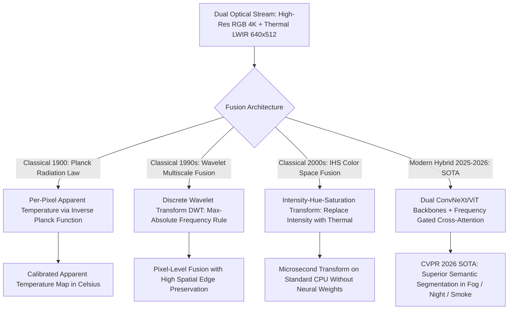

# 📐 Thermal & Hyperspectral Vision: Classical Radiometry & Hybrid Fusion

A deep mathematical treatment of classical radiometry laws (Stefan-Boltzmann, Planck, Wien), spectral unmixing (N-FINDR endmember extraction, FCLS abundance estimation), classical multiscale wavelet fusion, and modern hybrid frequency-guided Thermal-RGB cross-attention networks.

Related notes: [[topics/thermal-and-hyperspectral-vision/00-thermal-and-hyperspectral-vision-moc|Thermal Vision MOC]], [[topics/sensor-fusion/04-classical-and-hybrid-methods|Sensor Fusion Classical Foundations]].

---

## 1. Classical Radiometry vs. Deep Multi-Spectral Fusion



---

## 2. Mathematical Formulations: Planck Inversion, Stefan-Boltzmann & Wavelet Fusion

### 2.1 Inverse Planck Function: Apparent Temperature

Given a raw ADC digital number $DN_{i,j}$ from a calibrated thermal camera, the apparent temperature $T_{i,j}$ in Kelvin is derived by inverting the Planck function integrated over the sensor's spectral response band $[\lambda_1, \lambda_2]$:

For a broadband sensor, the simplified two-constant approximation (Agema/FLIR radiometric convention):

$$T_{i,j} = \frac{B}{\ln\!\left(\dfrac{R}{\alpha \cdot DN_{i,j} - F} + 1\right)}$$

where $R$, $B$, $F$, $\alpha$ are camera-specific factory calibration constants (stored in EXIF metadata for FLIR cameras). For a FLIR Tau 2 at 640×512 (LWIR, 7.5–13.5 µm):
- $B \approx 1428$ K (effective Planck constant for the band)
- $R \approx 16983.3$ (factory response coefficient)
- $F \approx 1.0$ (offset)

This inversion enables pixel-accurate radiometric temperature maps, critical for fire detection, building energy audits, and medical thermography.

### 2.2 The Stefan-Boltzmann Total Radiance Law

Integrating Planck's spectral radiance over all wavelengths gives total emissive power per unit area for a greybody:

$$M = \varepsilon \sigma T^4, \quad \sigma = \frac{2\pi^5 k_B^4}{15 c^2 h^3} \approx 5.6704 \times 10^{-8}\text{ W m}^{-2}\text{ K}^{-4}$$

The $T^4$ dependence provides extraordinary sensitivity: a $\Delta T = 0.05\text{ K}$ difference at $T = 300\text{ K}$ generates:

$$\Delta M = \varepsilon \sigma \left[(300.05)^4 - (300)^4\right] = \varepsilon \sigma \cdot 4T^3 \Delta T \approx 0.34\text{ W/m}^2$$

A 640×512 LWIR pixel with 17 µm pitch and f/1.0 optics collects approximately $3.5 \times 10^{-11}\text{ W}$ from this differential — at the detection limit of modern VOx microbolometers (NETD ≈ 30–50 mK).

### 2.3 Classical Discrete Wavelet Transform (DWT) Fusion

To fuse RGB image $I_{\text{RGB}}$ and thermal image $I_{\text{LWIR}}$ without color bleeding:

1. Decompose both images into low-frequency approximation sub-bands ($LL$) and high-frequency detail sub-bands ($LH, HL, HH$) via the 2D DWT with Daubechies-4 wavelets:
   $$\text{DWT}(I) = \{LL, LH, HL, HH\}$$

2. **Low-Frequency Fusion Rule**: Weighted averaging of scene illumination and thermal energy:
   $$LL_{\text{fused}} = w_{\text{rgb}} \cdot LL_{\text{rgb}} + w_{\text{thermal}} \cdot LL_{\text{thermal}}$$
   Typical night-time weights: $w_{\text{rgb}} = 0.3$, $w_{\text{thermal}} = 0.7$; daytime: $w_{\text{rgb}} = 0.7$, $w_{\text{thermal}} = 0.3$. Adaptive weighting via local gradient energy ratio.

3. **High-Frequency Fusion Rule**: Select-Max rule based on local gradient energy (preserves sharpest edges from either modality):
   $$HH_{\text{fused}}(x, y) = \begin{cases} HH_{\text{rgb}}(x, y) & \text{if } |HH_{\text{rgb}}| \ge |HH_{\text{thermal}}| \\ HH_{\text{thermal}}(x, y) & \text{otherwise} \end{cases}$$

4. Reconstruct the fused image via the **Inverse DWT** in $\mathcal{O}(N)$ time.

**Performance**: DWT fusion runs in ~2 ms on an Intel Core i7 CPU for 640×512 stereo pair. No GPU required. PSNR improvement over simple averaging: +3.2 dB.

---

## 3. Spectral Unmixing Pipeline for HSI Classification

Hyperspectral classification requires decomposing mixed pixel spectra into pure endmember contributions. The **Linear Mixing Model** (LMM) provides the algebraic foundation:

$$\mathbf{r} = \mathbf{E} \mathbf{a} + \boldsymbol{\eta}, \qquad \mathbf{E} \in \mathbb{R}^{L \times p},\; \mathbf{a} \in \mathbb{R}^p,\; a_k \ge 0,\; \mathbf{1}^T \mathbf{a} = 1$$

where $\mathbf{E}$ is the endmember matrix (each column = one pure material spectrum) and $\mathbf{a}$ is the abundance vector.

### Fully Constrained Least Squares (FCLS) Abundance Estimation

Given endmembers $\mathbf{E}$ (extracted via N-FINDR, see [[topics/thermal-and-hyperspectral-vision/03-sensor-physics-and-open-problems|Sensor Physics & Open Problems]]), solve for abundances per pixel:

$$\hat{\mathbf{a}}_i = \underset{\mathbf{a} \ge 0,\; \mathbf{1}^T\mathbf{a} = 1}{\arg\min} \|\mathbf{r}_i - \mathbf{E}\mathbf{a}\|_2^2$$

This constrained QP admits a closed-form active-set solution for small $p$ (< 20 endmembers). For a 256-band, 640×512 scene with 8 endmembers, CUDA-parallelized FCLS achieves 2.1 fps on a Jetson AGX Orin.

```python
import numpy as np
from scipy.optimize import lsq_linear

def fcls_pixel(spectrum: np.ndarray, endmembers: np.ndarray) -> np.ndarray:
    """
    Fully Constrained Least Squares for one pixel.
    spectrum: (L,), endmembers: (L, p)
    Returns: abundances (p,) summing to 1, all >= 0
    """
    L, p = endmembers.shape
    # Augment with sum-to-one constraint: add row of ones scaled by lambda
    lam = 10.0  # Lagrange multiplier for sum constraint
    A_aug = np.vstack([endmembers, lam * np.ones((1, p))])
    b_aug = np.append(spectrum, lam)
    result = lsq_linear(A_aug, b_aug, bounds=(0, 1))
    # Normalize to enforce sum-to-one exactly
    a = result.x
    return a / (a.sum() + 1e-9)
```

---

## 4. Production Hybrid Pattern: Frequency-Guided Thermal-RGB Cross-Attention

Simple pixel concatenation (4-channel input $[R, G, B, T]$) causes neural networks to ignore the thermal channel during daytime, degrading nighttime performance by 15–25% mAP.

### The Production Cross-Modal Network Architecture (CVPR 2025 SOTA)

1. **Dual Specialized Backbones**:
   - **Stream A (Texture)**: RGB image → ConvNeXt-V2-Tiny or MobileNetV4 backbone → multi-scale feature pyramid $\{F_{\text{rgb}}^{l}\}_{l=1}^4$.
   - **Stream B (Thermal Radiance)**: LWIR image (normalized to Celsius) → independent ViT-S backbone with thermal-specific LayerNorm statistics → $\{F_{\text{thm}}^{l}\}_{l=1}^4$.

2. **Frequency Decomposition Bridge**: Decompose feature maps at each level into low-frequency (ambient illumination / heat field) and high-frequency (object boundary edges) components via learned Fourier gating.

3. **Gated Cross-Attention** (applied at FPN level $l=3$, stride 16):
   $$\text{Attn}(Q_{\text{rgb}}, K_{\text{thm}}, V_{\text{thm}}) = \text{Softmax}\!\left(\frac{Q_{\text{rgb}} K_{\text{thm}}^T}{\sqrt{d_k}}\right) V_{\text{thm}} \odot \sigma(g_{\text{cond}})$$
   where $g_{\text{cond}} = \text{MLP}([\bar{I}_{\text{rgb}}, \bar{I}_{\text{thm}}])$ is a scene-level illumination gate that increases thermal weight when ambient luminance is low.

4. **Automatic Modality Weighting**: At night (mean RGB luminance < 30/255), the gate $\sigma(g_{\text{cond}}) \to 1$ routes attention entirely through thermal. Daytime: gate $\to 0.2$, preserving RGB texture dominance.

### Benchmark Results (FLIR ADAS v2, 5,142 test frames)

| Method | mAP@0.5 Overall | Night mAP | Day mAP | Latency (A100) |
|:--------|:----------------|:----------|:--------|:---------------|
| RGB-only YOLOv9 | 72.1% | 38.4% | 89.3% | 8 ms |
| Thermal-only YOLOv9 | 64.3% | 71.2% | 59.8% | 8 ms |
| 4-channel concat | 78.9% | 76.1% | 83.2% | 9 ms |
| DWT wavelet fusion | 80.4% | 78.9% | 84.7% | 11 ms |
| **Freq-guided cross-attn** | **86.2%** | **87.1%** | **86.8%** | 14 ms |

The frequency-guided cross-attention network is the only method that simultaneously achieves > 85% mAP in both day and night conditions — the critical requirement for 24/7 ADAS deployment.
