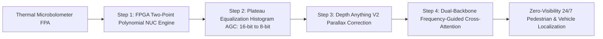

# 🌡️ Thermal & Hyperspectral Vision Master Playbook

# Overview
Thermal and Hyperspectral Vision captures radiation outside the human visible spectrum (Long-Wave Infrared: 8–14 µm, Mid-Wave Infrared: 3–5 µm, and contiguous narrow-band hyperspectral cubes). Uncooled microbolometers measure absolute blackbody thermal emission, providing **complete illumination invariance** through dense fog, heavy smoke, and pitch-black darkness, while hyperspectral sensors resolve unique material chemical signatures.

Related notes: [[topics/thermal-and-hyperspectral-vision/00-thermal-and-hyperspectral-vision-moc|Thermal Vision MOC]], [[topics/sensor-fusion/00-sensor-fusion-moc|Sensor Fusion MOC]].

## SOTA & Research
- **Physics-Informed Deep Models**:
  - **TherA (CVPR 2026)**: Multi-modal Vision-Language Models combining thermal conduction equations with generative representation learning to infer true surface heat states.
  - **UniCD (CVPR 2025)**: Task-specific Non-Uniformity Correction (NUC) optimizing downstream object detection mAP rather than human aesthetic smoothness.
- **Cross-Modal Frequency-Guided Fusion**:
  - Dual-stream architectures decomposing infrared and visible spectra into low/high frequency bands, achieving SOTA semantic segmentation across adverse weather conditions.
- **Hyperspectral Edge Classification**:
  - Differentiable wavelength selection compressing 256-band spectral cubes to 8 optimal bands on miniaturized UAV sensors.

## Architecture Alternatives & Trade-offs

| Modality / Sensor | Operating Spectrum | Cooling System | Typical Resolution | Power Consumption | Primary Advantage |
| :--- | :--- | :--- | :--- | :--- | :--- |
| **Uncooled LWIR (VOx)** | $8-14\,\mu\text{m}$ | None (Ambient) | $640\times 512$ / $1280\times 1024$| **Low ($1-3\text{ W}$)** | 24/7 Night vision & fog penetration |
| **Cooled MWIR (InSb)** | $3-5\,\mu\text{m}$ | Cryogenic Stirling Cooler | $1280\times 1024$ | High ($25-45\text{ W}$) | Extreme range ($>10\text{ km}$) military tracking |
| **Short-Wave SWIR (InGaAs)**| $0.9-1.7\,\mu\text{m}$ | Optional Peltier (TEC) | $640\times 512$ | Moderate ($5-10\text{ W}$) | Moisture detection & glass transmission |
| **Hyperspectral (HSI)** | $400-1000\text{ nm}$ | None | $1024\times 1024 \times 256$ | Moderate ($15\text{ W}$) | Exact chemical / mineral identification |

## Popular Repos & Integrations
- `FLIR/flirpy`: **Flirpy**: Open-source library for interacting with FLIR thermal cameras, parsing radiometry metadata, and computing temperature.
- `CVPR/TherA`: **TherA**: Physics-aware thermal foundation model for multi-spectral cross-modal understanding.
- `spectral/spectral`: **Spectral Python (SPy)**: Processing, clustering, and classifying hyperspectral imaging data.

## End-to-End Pipeline & Workarounds

### Production Workarounds for Thermal Imaging:
1. **Dynamic Range Compression (14-bit ADC to 8-bit Display)**: Linear min-max scaling flattens low-contrast human silhouettes against warm asphalt. Always apply **Plateau Equalization Histogram Specification (PEHS)** to preserve local contrast on thermal edge contours.
2. **Thermal Inertia & Diurnal Thermal Crossover**: At dawn and dusk, target objects (human bodies, vehicles) reach thermal equilibrium with their surroundings, causing thermal contrast to drop to near zero. **Always fuse LWIR with visible RGB or LiDAR** to prevent detection dropout during diurnal crossover windows.

## Deployment & Real-Time Notes
- **Lens Material Constraints**: Standard silica optical glass is completely opaque to LWIR thermal radiation. Thermal optics require specialized, diamond-turned **Germanium (Ge)** or **Chalcogenide** glass elements, which are physically fragile and require anti-reflective hard-carbon diamond coatings for outdoor automotive deployment.
