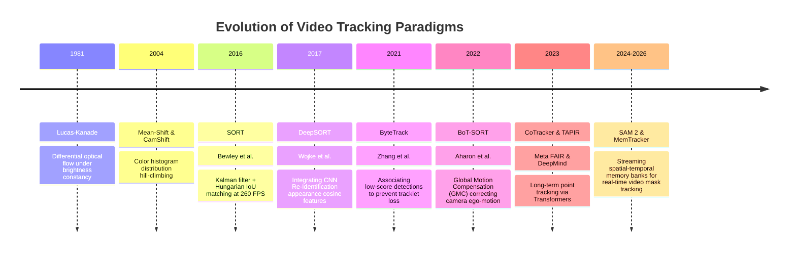
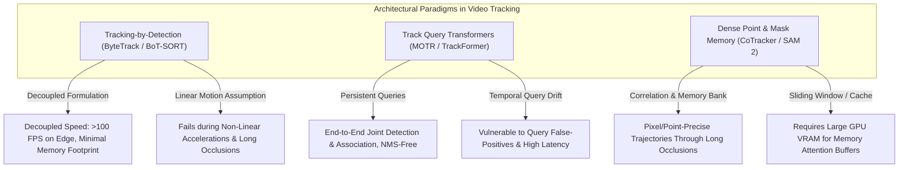

# 📜 Video Tracking: Historical Evolution & Paradigms

A comprehensive guide analyzing how visual tracking evolved from pixel-level optical flow differential equations to statistical Kalman filters, deep appearance embeddings, dense point transformers, and streaming foundation memory banks.

Related notes: [[topics/video-tracking/00-video-tracking-moc|Video Tracking MOC]], [[topics/real-time-systems/00-real-time-systems-moc|Real-Time Systems MOC]].

---

## 1. Evolution Timeline: From Lucas-Kanade to Spatial-Temporal Foundation Models

---

## 2. Core Paradigm Breakthroughs Explained

### Breakthrough A: SORT and the Separation of Detection and Tracking (2016)
Bewley et al. challenged the assumption that visual trackers needed complex internal motion appearance models. **Simple Online and Realtime Tracking (SORT)** proved that with high-quality bounding box detections, tracking could be framed purely as a linear Kalman state prediction paired with the Hungarian algorithm on 2D Bounding Box IoU:

- **Limitation**: Failed completely during severe occlusions or sudden camera pans because IoU dropped to zero.

---

### Breakthrough B: ByteTrack and the Retention of Low-Score Detections (2021)
Standard MOT pipelines discarded detection bounding boxes below a confidence threshold (e.g. $<0.6$). However, an object undergoing occlusion or motion blur still produces a valid bounding box, but with a degraded score (e.g. $0.2$). 

ByteTrack split detections into two tiers ($D_{\text{high}}$ and $D_{\text{low}}$). It first associates $D_{\text{high}}$ to confident tracks, and then performs a second Hungarian pass matching the remaining unmatched tracks against $D_{\text{low}}$. This single conceptual insight reduced identity switches (ID-switches) by over 60% with zero computational overhead.

---

### Breakthrough C: Camera Ego-Motion Correction (BoT-SORT, 2022)
When the camera rotates or accelerates on a drone, vehicle, or PTZ camera, stationary objects appear to accelerate in image coordinates. BoT-SORT introduced **Global Motion Compensation (GMC)**:
1. Detect FAST corner features across the image background.
2. Estimate the affine/homography transformation matrix $H_t^{t-1}$.
3. Warp the previous Kalman state coordinates into the current frame coordinate system before updating the velocity covariance matrix.

---

### Breakthrough D: From Boxes to Physical Trajectories & Foundation Masks (CoTracker & SAM 2, 2023–2026)
- **CoTracker**: Rather than tracking boxes, tracks up to 70,000 dense surface points. By passing multi-scale correlation volumes through sliding-window Transformers, surface points attentionally inform each other's trajectories across temporal occlusions.
- **SAM 2**: Replaces rigid boxes with dense segmentation masks streaming across video frames using a spatial-temporal memory bank, executing at 44 FPS on GPUs.

---

## 3. Intensive Architectural Taxonomy: Convolutional vs Transformer vs Hybrid Sub-Modules

Video tracking systems range from decoupled tracking-by-detection heuristics with constant-velocity Kalman filters to end-to-end multi-object query transformers and dense spatial-temporal memory models.

### Comparative Sub-Module Architectural Matrix

| Model Name & Year | Architectural Paradigm | Backbone Sub-Module | Neck / Feature Aggregator | Encoder Sub-Module | Decoder / Head Sub-Module | Primary Bottleneck & Edge Suitability |
| :--- | :--- | :--- | :--- | :--- | :--- | :--- |
| **SORT / DeepSORT** (2016–2017) | Pure ConvNet + Kinematic Heuristic | External Detector (Faster R-CNN / YOLO) + Lightweight 8-layer ResNet ReID CNN | Global Average Pooling on cropped bounding box patches | Standard Convolutional Residual Blocks | Linear ReID Embedding ($128\text{-dim}$) + External Kalman Filter & Hungarian Cost Matcher | **CPU / Latency Bound**: Tracking overhead is minimal (<2 ms on CPU); latency is dominated by the upstream 2D object detector; fails during non-linear camera ego-motion. |
| **SiamRPN++ / SiamBAN** (2019–2020) | Pure ConvNet | Modified ResNet-50 (Spatio-temporal Siamese branch with modified stride) | Depthwise Cross-Correlation (DW-XCorr) fusing template and search regions | Multi-Scale Convolutional Feature Fusion across stages 3, 4, 5 | Dense 2D Convolutional Anchor-Free / RPN Classification & Box Regression Heads | **Memory Bandwidth Bound**: Real-time single object tracking (>60 FPS); requires full-image search region feature caching; single-target limitation. |
| **TransT / Stark** (2021) | Hybrid CNN-Transformer | ResNet-50 / ResNet-101 convolutional backbone | None (Direct spatial flattening and token concatenation) | Feature Fusion Transformer: Ego-Context Self-Attention + Cross-Attention between Template and Search | Fully Convolutional Corner Prediction Head / MLP Bounding Box Regressor | **Compute Bound**: High single-object tracking precision; self-attention over search tokens increases FLOPs; deployable on Jetson Orin at ~35–45 FPS. |
| **ByteTrack / BoT-SORT** (2021–2022) | Pure ConvNet + Kinematic Motion | YOLOv5 / YOLOv8 / YOLOX CSPDarknet Backbone | PANet / RepPAN multi-scale neck | Standard Convolutional Residual Stages with SiLU | Decoupled Anchor-Free Detection Head + FAST Camera Ego-Motion Warping + Two-Stage Hungarian Bipartite Matcher | **Compute & Edge Friendly**: The global gold standard for embedded real-time MOT; runs at >60 FPS on edge NPUs; tracking logic has near-zero computational overhead. |
| **TrackFormer / MOTR** (2021–2022) | Hybrid CNN-Transformer | ResNet-50 / Deformable DETR Convolutional Backbone | Multi-Scale Deformable Level Feature Projection | Multi-Scale Deformable Self-Attention Encoder | Temporal Track Query Decoder: Reuses persistent track queries from frame $t-1$ concatenated with newborn detection queries | **Memory & Query Life-Cycle Bound**: Eliminates heuristic data association; high training complexity; track query management under occlusions can lead to query explosion and memory drift. |
| **CoTracker / CoTracker3** (2023–2024) | Hybrid CNN-Transformer | 2D CNN Multi-Scale Feature Extractor (Stride 4 and 8 residual blocks) | Multi-Scale 4D Correlation Volume Construction across sliding temporal window | Sliding-Window Point Transformer: Self-Attention across $N$ tracked points + Cross-Attention along time $T$ | MLP Trajectory Update Head predicting per-point offset $(\Delta x, \Delta y)$ and visibility logits | **Memory Bandwidth & Correlation Bound**: Tracks 70,000+ dense physical points simultaneously; correlation volume caching across time window $T=8$ requires substantial GPU VRAM. |
| **TAPIR / TAP-Vid** (2023–2024) | Hybrid Conv-Transformer | Shared ResNet Conv Encoder for query and target video frames | Multi-Scale Cost Volume Pyramids | Recurrent Point Transformer Block refining point locations | Lightweight Linear / MLP Trajectory Refinement and Occlusion Classifier | **Compute & Memory Balanced**: Tracks points through long occlusions; lower memory footprint than full 4D correlation volumes; runs at ~15–20 FPS on edge workstations. |
| **SAM 2 (Video Tracking)** (2024–2025) | Hierarchical ViT + Streaming Memory | Hierarchical Hiera Vision Transformer (Multi-scale windowed attention) | FPN-style Multi-Scale Feature Neck | Multi-Scale Self-Attention Backbone with high-throughput spatial feature output | Two-Way Mask Decoder + Memory Encoder (Compresses mask features into Memory Bank) + Spatial-Temporal Cross-Attention | **VRAM & KV-Cache Footprint**: Real-time streaming mask tracking at 44 FPS; memory bank requires dynamic eviction policies to prevent VRAM exhaustion during multi-hour video streams. |

### Didactic Architectural Trade-Off Analysis

#### 1. Decoupled Tracking-by-Detection vs. End-to-End Track Query Propagation
- **Tracking-by-Detection (ByteTrack, BoT-SORT)** divides tracking into two entirely independent phases: (1) extracting bounding boxes via an off-the-shelf detector (YOLOv8/YOLO11), and (2) associating detections across time using linear Kalman filter state projections and Hungarian bipartite matching. Because the tracking logic is purely kinematic and executes on CPU in $<1\,\text{ms}$, this approach remains the dominant industry standard for high-throughput edge embedded systems.
- **Track-Query Transformers (MOTR, TrackFormer)** reformulate tracking as continuous query evolution. A set of persistent **track queries** $Q_{\text{track}}^{(t-1)}$ representing actively tracked objects from frame $t-1$ are fed directly into the Transformer decoder at frame $t$, along with newborn **detection queries** $Q_{\text{detect}}$. Through cross-attention against the new image features, track queries directly update their bounding box coordinates, eliminating external Kalman filters and Hungarian association.

#### 2. Query Persistence, Identity Switches, and Occlusion Drift
- In query-based tracking, managing query life cycles is the primary architectural challenge:
  $$\mathbf{Q}_i^{(t)} = \text{TransformerDecoder}\left(\mathbf{Q}_i^{(t-1)}, \text{Features}(I_t)\right)$$
  If an object is temporarily occluded, its corresponding query can easily suffer from **feature drift**, causing false positive hallucinated detections or identity switches upon reappearance. Modern models mitigate this by introducing temporal contrastive query losses and auxiliary appearance momentum buffers.

#### 3. Streaming Video Constraints: Correlation Volumes vs. Spatial-Temporal Memory Banks
- **Point-Tracking Correlation Volumes (CoTracker)** build 4D cost volumes across sliding temporal windows ($T$ frames). While this allows tracking through complete occlusions via global spatial-temporal attention, the memory complexity scales as $\mathcal{O}(T \cdot N \cdot H W)$, requiring high-bandwidth GPU memory.
- **Streaming Memory Banks (SAM 2)** compress past frame features and predicted masks into a compact FIFO memory buffer. During inference on frame $t$, the decoder performs cross-attention *only* against the active memory bank tokens, enabling constant-time $\mathcal{O}(M)$ inference per frame and sustaining 44 FPS execution.

