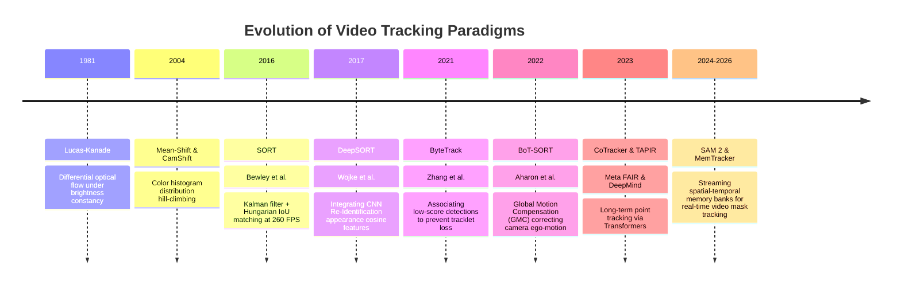

# 📜 Video Tracking: Historical Evolution & Paradigms

A comprehensive guide analyzing how visual tracking evolved from pixel-level optical flow differential equations to statistical Kalman filters, deep appearance embeddings, dense point transformers, and streaming foundation memory banks.

Related notes: [[topics/video-tracking/00-video-tracking-moc|Video Tracking MOC]], [[topics/real-time-systems/00-real-time-systems-moc|Real-Time Systems MOC]].

---

## 1. Evolution Timeline: From Lucas-Kanade to Spatial-Temporal Foundation Models

---

## 2. Core Paradigm Breakthroughs Explained

### Breakthrough A: SORT and the Separation of Detection and Tracking (2016)
Bewley et al. challenged the assumption that visual trackers needed complex internal motion appearance models. **Simple Online and Realtime Tracking (SORT)** proved that with high-quality bounding box detections, tracking could be framed purely as a linear Kalman state prediction paired with the Hungarian algorithm on 2D Bounding Box IoU:

- **Limitation**: Failed completely during severe occlusions or sudden camera pans because IoU dropped to zero.

---

### Breakthrough B: ByteTrack and the Retention of Low-Score Detections (2021)
Standard MOT pipelines discarded detection bounding boxes below a confidence threshold (e.g. $<0.6$). However, an object undergoing occlusion or motion blur still produces a valid bounding box, but with a degraded score (e.g. $0.2$). 

ByteTrack split detections into two tiers ($D_{\text{high}}$ and $D_{\text{low}}$). It first associates $D_{\text{high}}$ to confident tracks, and then performs a second Hungarian pass matching the remaining unmatched tracks against $D_{\text{low}}$. This single conceptual insight reduced identity switches (ID-switches) by over 60% with zero computational overhead.

---

### Breakthrough C: Camera Ego-Motion Correction (BoT-SORT, 2022)
When the camera rotates or accelerates on a drone, vehicle, or PTZ camera, stationary objects appear to accelerate in image coordinates. BoT-SORT introduced **Global Motion Compensation (GMC)**:
1. Detect FAST corner features across the image background.
2. Estimate the affine/homography transformation matrix $H_t^{t-1}$.
3. Warp the previous Kalman state coordinates into the current frame coordinate system before updating the velocity covariance matrix.

---

### Breakthrough D: From Boxes to Physical Trajectories & Foundation Masks (CoTracker & SAM 2, 2023–2026)
- **CoTracker**: Rather than tracking boxes, tracks up to 70,000 dense surface points. By passing multi-scale correlation volumes through sliding-window Transformers, surface points attentionally inform each other's trajectories across temporal occlusions.
- **SAM 2**: Replaces rigid boxes with dense segmentation masks streaming across video frames using a spatial-temporal memory bank, executing at 44 FPS on GPUs.
