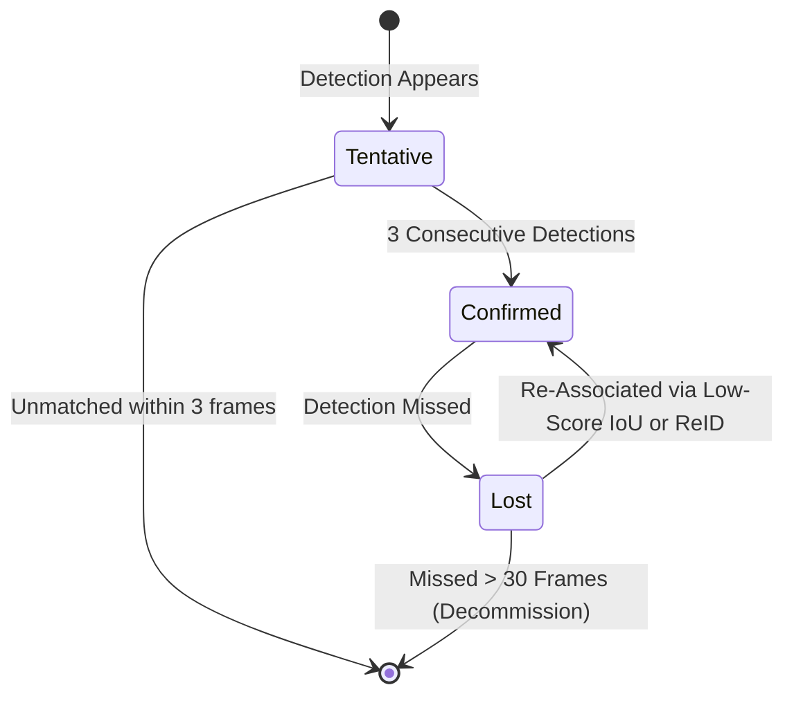

# 🛠️ Video Tracking: Production Pipeline, Traps & Workarounds

A practitioner's guide to engineering, stabilizing, and deploying real-time multi-object tracking (MOT) and dense point tracking in production surveillance, robotics, and edge systems.

Related notes: [[topics/video-tracking/00-video-tracking-moc|Video Tracking MOC]], [[topics/real-time-systems/00-real-time-systems-moc|Real-Time Systems MOC]].

---

## 1. End-to-End Production Pipeline Architecture


---

## 2. Common Traps, Edge Cases & Hardware Bottlenecks

### Trap 1: Catastrophic Identity Switching during Dense Crossings
- **Problem**: When two targets cross paths (e.g. two pedestrians walking past each other), their 2D bounding boxes overlap with IoU $>0.7$. Standard IoU Hungarian matching swaps their identity IDs permanently.

### Trap 2: Track Fragmentation from Lighting Flares or Temporary Blindness
- **Problem**: Sudden glare, sensor exposure changes, or temporary occlusion causes a detector to drop an object for 5–10 frames. Standard SORT kills the track after 1–2 missed frames, creating a brand new ID upon re-detection.

### Trap 3: Heap Fragmentation from Dynamic Track Allocations
- **Problem**: Allocating and deallocating dynamic C++ `Track` objects on the heap every time an object enters or leaves the camera view causes severe memory fragmentation and unpredictable frame drop spikes over 24/7 continuous operation.

---

## 3. Battle-Tested Engineering Workarounds

### Workaround 1: Fused Re-ID Appearance Verification with Spatial Gates
Never allow ReID appearance embeddings to match across the entire screen. Gate appearance matching using **Mahalanobis Spatial Distance**:

```python
import numpy as np

def gated_reid_distance(track_embedding, det_embedding, kalman_dist, max_kalman_dist=9.48):
    """
    Computes Cosine appearance distance, but gates out pairs whose Kalman distance
    violates physical motion constraints (Chi-square threshold at 95% confidence).
    """
    if kalman_dist > max_kalman_dist:
        return 1e5  # Infinite cost: physically impossible match
    
    # Cosine distance
    norm_track = track_embedding / np.linalg.norm(track_embedding)
    norm_det = det_embedding / np.linalg.norm(det_embedding)
    cosine_dist = 1.0 - np.dot(norm_track, norm_det)
    return cosine_dist
```

### Workaround 2: Hysteresis Lifecycle State Machine
Implement a three-tier state machine (`Tentative` $\to$ `Confirmed` $\to$ `Lost`):
1. **Tentative**: Requires 3 consecutive positive detections to confirm a real track (filters out false-positive detector flickers).
2. **Confirmed**: Actively published downstream to controllers.
3. **Lost**: Retained in memory for up to 30 frames (1 second). If re-detected within 30 frames, retains its original ID without spawning a duplicate.



### Workaround 3: Zero-Allocation Object Pools
Pre-allocate a fixed contiguous array of track state structures (e.g. `MAX_TRACKS = 256`) during application startup:

```python
class PreallocatedTrackPool:
    def __init__(self, max_tracks=256):
        self.active_mask = np.zeros(max_tracks, dtype=bool)
        self.state_xywh = np.zeros((max_tracks, 4), dtype=np.float32)
        self.velocities = np.zeros((max_tracks, 4), dtype=np.float32)
        self.track_ids = np.zeros(max_tracks, dtype=np.int32)
        self.next_id = 1

    def spawn_track(self, initial_box):
        free_indices = np.where(~self.active_mask)[0]
        if len(free_indices) == 0:
            return -1  # Pool saturated: drop gracefully rather than crashing
        idx = free_indices[0]
        self.active_mask[idx] = True
        self.state_xywh[idx] = initial_box
        self.track_ids[idx] = self.next_id
        self.next_id += 1
        return idx
```
