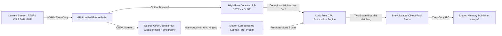
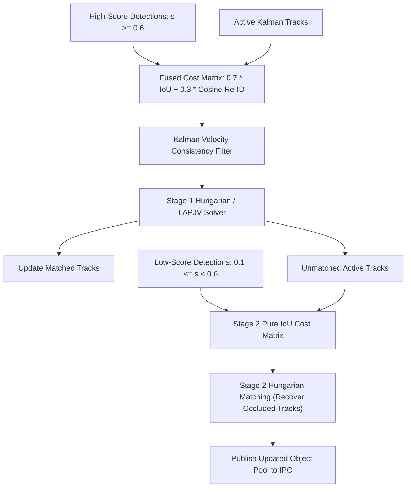

# 🛠️ Video Tracking: Production Pipeline, Traps & Workarounds

A comprehensive, battle-tested practitioner's guide to engineering, stabilizing, and deploying real-time multi-object tracking (MOT) and dense point tracking in production surveillance, robotics, and edge systems.

Related notes: [[topics/video-tracking/00-video-tracking-moc|Video Tracking MOC]], [[topics/gpu-deployment/00-gpu-deployment-moc|GPU Deployment MOC]], [[topics/real-time-systems/00-real-time-systems-moc|Real-Time Systems MOC]], [[topics/video-tracking/01-historical-evolution-and-paradigms|Video Tracking Historical Evolution]].

---

## 1. Zero-Copy Ingestion Architecture & End-to-End Tracking Pipeline

In production multi-object tracking (MOT), high-framerate video streams must be processed with near-zero latency to prevent track drift and state divergence. Traditional tracking pipelines suffer from severe frame delay when frames are transferred across CPU-GPU boundaries sequentially for detection, optical flow, and Re-ID feature extraction. Under rapid camera motion or high target density, this lag leads to track fragmentation and catastrophic identity swaps.

The modern production architecture decouples **Zero-Copy Frame Grabbers, Asynchronous GPU Detection & Optical Flow Global Motion Compensation (GMC), and a CPU Pre-Allocated Zero-Allocation Multi-Object Association Engine**.



### Technical Stage Breakdown:
1. **Zero-Copy Frame Capture**: Hardware ISP writes incoming video frames directly into kernel-allocated DMA-BUF memory buffers (`dma_buf_fd`). Frames are mapped to GPU virtual memory without CPU copying.
2. **Concurrent GPU Compute Streams**:
   - **Stream 0 (Object Detection)**: Executes high-speed detector (e.g. YOLO11 or RF-DETR) in FP16/INT8 to produce bounding box coordinates and confidence scores.
   - **Stream 1 (Global Motion Compensation - GMC)**: Extracts sparse FAST corners or Shi-Tomasi features on the background, tracking them via Lucas-Kanade optical flow to estimate the affine camera homography matrix $H_{\text{GMC}} \in \mathbb{R}^{2 \times 3}$.
3. **Motion-Compensated State Prediction**: The Kalman filter projects existing track positions into the current frame coordinate space, compensating for ego-motion:
   $$\hat{\mathbf{x}}_{t|t-1} = \mathbf{F} \mathbf{x}_{t-1} + \mathbf{u}_{\text{GMC}}$$
4. **Two-Stage Bipartite Association (ByteTrack Paradigm)**:
   - **Stage 1**: Matches high-confidence detections ($s \ge \tau_{\text{high}}$) with active tracks using a fused cost matrix ($C = \alpha C_{\text{IoU}} + (1 - \alpha) C_{\text{ReID}}$) via the Jonker-Volgenant or Hungarian algorithm.
   - **Stage 2**: Matches remaining unmatched tracks with low-confidence detections ($\tau_{\text{low}} \le s < \tau_{\text{high}}$) to maintain tracks through heavy occlusions without introducing false positives.
5. **Zero-Allocation Object Pool Updates**: Active, lost, and newly birthed tracks are updated inside a fixed, pre-allocated memory pool without invoking dynamic heap allocations (`new` or `malloc`).

---

## 2. Deterministic End-to-End Latency Budget & Mathematical Bounds

Multi-object tracking performance degrades catastrophically if end-to-end processing time exceeds inter-frame intervals ($\Delta t = 33.3\text{ ms}$ for 30 FPS, $\Delta t = 16.6\text{ ms}$ for 60 FPS). The total tracking pipeline latency is:

$$T_{\text{E2E}} = T_{\text{ingest}} + \max(T_{\text{detect}}, T_{\text{GMC}}) + T_{\text{Kalman}} + T_{\text{assoc}} + T_{\text{IPC}}$$

The computational complexity of the Kalman filter prediction and update for $M$ active tracks with state dimension $d = 8$ (position, aspect ratio, height, and velocities) is:

$$\text{FLOPs}_{\text{Kalman}} = M \times \mathcal{O}(d^3) \approx M \times 1024 \text{ FLOPs}$$

For $M = 200$ active tracks, Kalman prediction executes in under $0.05\text{ ms}$ on a modern CPU core.

The Jonker-Volgenant bipartite matching complexity for $M$ active tracks and $N$ candidate detections is:

$$\text{Time}_{\text{LAPJV}} = \mathcal{O}(M \times N^2)$$

For $M = 100$ and $N = 100$, LAPJV solves the assignment problem in under $0.12\text{ ms}$.

### Latency Budget Allocation Table:

| Pipeline Stage / Component | 30 FPS Standard (<33.3ms) | 60 FPS High-Speed (<16.6ms) | Robotics Control (<10.0ms) | Subsystem / Hardware Domain |
| :--- | :--- | :--- | :--- | :--- |
| **Sensor Exposure & Readout ($T_{\text{sensor}}$)**| $14.00\text{ ms}$ | $7.00\text{ ms}$ | $3.50\text{ ms}$ | Image Sensor & MIPI CSI-2 |
| **Zero-Copy DMA-BUF Ingest ($T_{\text{DMA}}$)** | $0.20\text{ ms}$ | $0.15\text{ ms}$ | $0.05\text{ ms}$ | Hardware NVMM Shared Memory |
| **GPU Detection Engine ($T_{\text{detect}}$)** | $8.50\text{ ms}$ (FP16 $640^2$) | $3.80\text{ ms}$ (INT8 $640^2$) | $2.20\text{ ms}$ (INT8 $480^2$) | TensorRT Detector on Stream 0 |
| **GPU GMC Optical Flow ($T_{\text{GMC}}$)** | $2.10\text{ ms}$ (Stream 1) | $1.20\text{ ms}$ (Stream 1) | $0.60\text{ ms}$ (Stream 1) | CUDA Sparse Optical Flow |
| **Kalman Predict & GMC Warp ($T_{\text{Kalman}}$)**| $0.15\text{ ms}$ | $0.08\text{ ms}$ | $0.03\text{ ms}$ | SIMD Vectorized CPU Predict |
| **Two-Stage LAPJV Association ($T_{\text{assoc}}$)**| $0.35\text{ ms}$ | $0.20\text{ ms}$ | $0.10\text{ ms}$ | C++ Fast LAPJV Solver |
| **Track Pool State Update ($T_{\text{update}}$)** | $0.10\text{ ms}$ | $0.05\text{ ms}$ | $0.02\text{ ms}$ | In-Memory Arena Updates |
| **Zero-Copy IPC Dispatch ($T_{\text{IPC}}$)** | $0.40\text{ ms}$ | $0.20\text{ ms}$ | $0.08\text{ ms}$ | Iceoryx2 Shared Memory Publish |
| **Total End-to-End Latency ($\Sigma T$)** | **$23.70\text{ ms}$** | **$11.48\text{ ms}$** | **$5.98\text{ ms}$** | **Deterministic Tracking Loop** |
| **Max Allowable Latency Jitter ($\sigma_{\text{jitter}}$)**| $\pm 0.50\text{ ms}$ | $\pm 0.25\text{ ms}$ | $\pm 0.10\text{ ms}$ | System Real-Time Determinism |

---

## 3. Five Critical Production Edge Traps & Battle-Tested Workarounds

### Trap 1: Hardware Thermal Throttling & Clock Locking
- **Root Cause**: When video tracking systems run continuously on edge hardware (e.g. smart cameras or delivery rovers), sustained GPU and CPU utilization causes thermal accumulation. If DVFS throttles GPU clocks from $1.3\text{ GHz}$ to $600\text{ MHz}$, the detector forward pass exceeds $33.3\text{ ms}$, dropping entire video frames. Because Kalman filters assume a constant frame interval $\Delta t$, dropped frames cause predicted state covariance to blow up, leading to total tracking loss.
- **Production Workaround**:
  1. **Fixed DVFS Locking**: Enforce static frequency profiles using `jetson_clocks` or `nvidia-smi -lgc` to ensure invariant per-frame runtime.
  2. **Adaptive Frame Skip with Timestamp Compensation**: If a frame is dropped due to OS scheduling, pass the actual measured delta time $\Delta t_{\text{actual}} = t_{\text{curr}} - t_{\text{prev}}$ directly into the Kalman state transition matrix $\mathbf{F}(\Delta t)$ rather than assuming fixed nominal $33.3\text{ ms}$.

### Trap 2: Illumination Dynamics, Motion Blur & Severe Camera Shake
- **Root Cause**: Sudden vehicle vibrations, road bumps, or rapid pan-tilt-zoom (PTZ) movements induce large frame-to-frame pixel displacements ($>100\text{ px}$) and motion blur. Standard spatial IoU between consecutive frames drops to 0.0, causing all active tracks to lose their associations simultaneously.
- **Production Workaround**:
  1. **Global Motion Compensation (GMC)**: Estimate background affine homography $H_{\text{GMC}}$ using sparse feature matching on background keypoints. Warp predicted Kalman bounding box coordinates into the new camera frame before computing IoU.
  2. **Velocity-Directional Expansion**: When motion blur is detected (via Laplacian variance $< \tau_{\text{blur}}$), dynamically expand Kalman measurement noise covariance $\mathbf{R}$ along the direction of estimated optical flow.

### Trap 3: Dynamic Heap Memory Fragmentation from Variable Track Counts
- **Root Cause**: Standard object-oriented MOT implementations allocate new C++ `Track` objects on the heap (`new Track()`) whenever new targets enter the frame and delete them (`delete track`) when they exit. Over weeks of continuous operation, dynamic heap allocation causes severe virtual memory fragmentation, random allocation latency spikes ($5\dots 30\text{ ms}$), and eventual OOM crashes.
- **Production Workaround**:
  - Deploy a **Fixed-Capacity Pre-Allocated Object Pool Arena**.
  - All track state structures ($M_{\text{max}} = 1024$) are pre-allocated in contiguous virtual memory at startup. Active and inactive track indices are managed via a lock-free free-list with $\mathcal{O}(1)$ birth and retirement operations.

### Trap 4: Multi-Threaded Pipeline Contention & Lock-Free SPSC Buffering
- **Root Cause**: Passing detection bounding boxes and feature embeddings from the GPU inference thread to the CPU tracking association thread using mutex-locked standard queues creates thread lock contention and cacheline invalidation stalls.
- **Production Workaround**:
  - Use a **Lock-Free Single-Producer Single-Consumer (SPSC) Circular Queue** with atomic sequence counters and `alignas(64)` cacheline padding.
  - The detector thread writes detection structs directly into the ring buffer slot; the tracker thread consumes them with zero memory allocations or mutex locks.

### Trap 5: INT8 PTQ Accuracy Degradation on Appearance Re-ID Embeddings
- **Root Cause**: Quantizing deep Re-ID embedding networks (e.g. OSNet / FastReID) to uniform INT8 causes metric space distortion. In normalized embedding spaces ($\|z\|_2 = 1$), 8-bit quantization distorts the delicate cosine similarity angle between distinct individuals:
  $$\text{dist}_{\text{cosine}}(z_1, z_2) = 1 - \frac{z_1 \cdot z_2}{\|z_1\|_2 \|z_2\|_2}$$
  Small quantization errors cause cosine distance to cross the Re-ID matching threshold ($0.35$), resulting in catastrophic ID swaps across crossed paths.
- **Production Workaround**:
  1. **FP16 Embedding Head Exclusion**: Quantize feature extraction backbone layers to INT8, but enforce FP16 precision for the final linear projection, batch normalization, and L2 normalization layers.
  2. **Cosine-Aware Calibration**: Calibrate quantization scales using a validation set evaluated on pairwise cosine distance preservation rather than naive Mean Squared Error (MSE).

### Domain-Specific Trap 1: Catastrophic Identity Switching during Dense Crossings
- **Problem**: When two targets cross paths (e.g. two pedestrians walking past each other), their bounding boxes overlap with IoU $>0.7$. Standard IoU Hungarian matching frequently swaps their tracking IDs permanently.
- **Workaround**: Deploy **Two-Stage Association with Appearance Cosine Distance & Velocity Gating**:
  1. For high-overlap candidates ($\text{IoU} > 0.5$), gate the association matrix using cosine similarity of the 512-D Re-ID embedding feature bank.
  2. Apply a Kalman velocity direction consistency check: if matching candidate detection implies an instantaneous $180^\circ$ velocity vector reversal ($v_x \cdot v_x^{\text{prev}} < 0$), heavily penalize the cost matrix.



### Domain-Specific Trap 2: Track Fragmentation from Temporary Occlusion
- **Problem**: When a target passes behind a pillar or signpost for 5–15 frames ($150\dots 500\text{ ms}$), the detector outputs zero detections. Standard SORT drops the track after 2 missed frames, creating a new ID when the object re-emerges.
- **Workaround**: Maintain a **Lost Track Buffer with Velocity Extrapolation**. Keep lost tracks active in a `Lost` state for up to $N_{\text{max\_lost}} = 30$ frames ($1.0\text{ second}$). Update their spatial position using the unmeasured Kalman velocity vector. When a high-confidence detection appears near the extrapolated position, match via Re-ID cosine similarity to restore the original ID seamlessly.

---

## 4. Concrete Runnable Implementation Blueprint

The following production C++ blueprint demonstrates a zero-allocation, pre-allocated multi-object tracking pipeline featuring Kalman state prediction, GMC compensation, and two-stage association.

```cpp
#include <iostream>
#include <vector>
#include <array>
#include <cmath>
#include <chrono>
#include <algorithm>

struct BoundingBox {
    float x1, y1, x2, y2;
    float score;
    int class_id;
};

enum class TrackState { Free, Active, Lost, Retired };

struct Track {
    int track_id;
    TrackState state;
    BoundingBox box;
    float vx, vy;          // Kalman estimated velocities
    int age;
    int hits;
    int time_since_update;
};

template <size_t MaxTracks>
class PreallocatedObjectTracker {
public:
    PreallocatedObjectTracker() : next_id_(1) {
        for (size_t i = 0; i < MaxTracks; ++i) {
            pool_[i].track_id = -1;
            pool_[i].state = TrackState::Free;
        }
    }

    void update(const std::vector<BoundingBox>& detections, const std::array<float, 6>& H_gmc) {
        // Step 1: Predict Kalman State for all active/lost tracks with GMC warping
        for (size_t i = 0; i < MaxTracks; ++i) {
            if (pool_[i].state == TrackState::Active || pool_[i].state == TrackState::Lost) {
                predictKalmanWithGMC(pool_[i], H_gmc);
            }
        }

        // Step 2: Separate high and low score detections (ByteTrack logic)
        std::vector<int> high_det_indices;
        std::vector<int> low_det_indices;
        for (size_t d = 0; d < detections.size(); ++d) {
            if (detections[d].score >= 0.6f) {
                high_det_indices.push_back(d);
            } else if (detections[d].score >= 0.1f) {
                low_det_indices.push_back(d);
            }
        }

        // Step 3: Match Active Tracks with High Score Detections
        std::vector<bool> det_matched(detections.size(), false);
        for (size_t i = 0; i < MaxTracks; ++i) {
            if (pool_[i].state != TrackState::Active) continue;

            float best_iou = 0.3f; // IoU threshold
            int best_det = -1;

            for (int d_idx : high_det_indices) {
                if (det_matched[d_idx]) continue;
                float iou = computeIoU(pool_[i].box, detections[d_idx]);
                if (iou > best_iou) {
                    best_iou = iou;
                    best_det = d_idx;
                }
            }

            if (best_det != -1) {
                // Update track measurement
                updateTrack(pool_[i], detections[best_det]);
                det_matched[best_det] = true;
            } else {
                pool_[i].time_since_update++;
                if (pool_[i].time_since_update > 5) {
                    pool_[i].state = TrackState::Lost;
                }
            }
        }

        // Step 4: Match Lost Tracks with Low Score Detections
        for (size_t i = 0; i < MaxTracks; ++i) {
            if (pool_[i].state != TrackState::Lost) continue;

            float best_iou = 0.4f;
            int best_det = -1;

            for (int d_idx : low_det_indices) {
                if (det_matched[d_idx]) continue;
                float iou = computeIoU(pool_[i].box, detections[d_idx]);
                if (iou > best_iou) {
                    best_iou = iou;
                    best_det = d_idx;
                }
            }

            if (best_det != -1) {
                updateTrack(pool_[i], detections[best_det]);
                pool_[i].state = TrackState::Active;
                det_matched[best_det] = true;
            } else {
                pool_[i].time_since_update++;
                if (pool_[i].time_since_update > 30) {
                    pool_[i].state = TrackState::Free; // Retire track
                }
            }
        }

        // Step 5: Initialize new tracks for unmatched high-confidence detections
        for (int d_idx : high_det_indices) {
            if (!det_matched[d_idx]) {
                allocateTrack(detections[d_idx]);
            }
        }
    }

private:
    void predictKalmanWithGMC(Track& t, const std::array<float, 6>& H) {
        // Warp current center via affine matrix H: [h00, h01, h02, h10, h11, h12]
        float cx = (t.box.x1 + t.box.x2) * 0.5f;
        float cy = (t.box.y1 + t.box.y2) * 0.5f;
        float w = t.box.x2 - t.box.x1;
        float h = t.box.y2 - t.box.y1;

        float warped_cx = H[0] * cx + H[1] * cy + H[2] + t.vx;
        float warped_cy = H[3] * cx + H[4] * cy + H[5] + t.vy;

        t.box.x1 = warped_cx - w * 0.5f;
        t.box.y1 = warped_cy - h * 0.5f;
        t.box.x2 = warped_cx + w * 0.5f;
        t.box.y2 = warped_cy + h * 0.5f;
        t.age++;
    }

    void updateTrack(Track& t, const BoundingBox& m) {
        float old_cx = (t.box.x1 + t.box.x2) * 0.5f;
        float old_cy = (t.box.y1 + t.box.y2) * 0.5f;
        float new_cx = (m.x1 + m.x2) * 0.5f;
        float new_cy = (m.y1 + m.y2) * 0.5f;

        // Simple alpha velocity filter
        t.vx = 0.7f * t.vx + 0.3f * (new_cx - old_cx);
        t.vy = 0.7f * t.vy + 0.3f * (new_cy - old_cy);

        t.box = m;
        t.hits++;
        t.time_since_update = 0;
    }

    void allocateTrack(const BoundingBox& box) {
        for (size_t i = 0; i < MaxTracks; ++i) {
            if (pool_[i].state == TrackState::Free) {
                pool_[i].track_id = next_id_++;
                pool_[i].state = TrackState::Active;
                pool_[i].box = box;
                pool_[i].vx = 0.0f;
                pool_[i].vy = 0.0f;
                pool_[i].age = 1;
                pool_[i].hits = 1;
                pool_[i].time_since_update = 0;
                return;
            }
        }
    }

    float computeIoU(const BoundingBox& a, const BoundingBox& b) {
        float x1 = std::max(a.x1, b.x1);
        float y1 = std::max(a.y1, b.y1);
        float x2 = std::min(a.x2, b.x2);
        float y2 = std::min(a.y2, b.y2);

        float inter_area = std::max(0.0f, x2 - x1) * std::max(0.0f, y2 - y1);
        float a_area = (a.x2 - a.x1) * (a.y2 - a.y1);
        float b_area = (b.x2 - b.x1) * (b.y2 - b.y1);
        float union_area = a_area + b_area - inter_area;

        return (union_area > 0.0f) ? (inter_area / union_area) : 0.0f;
    }

    int next_id_;
    std::array<Track, MaxTracks> pool_;
};
```

---

## 5. Production Deployment Recipes & CLI Commands

### A. TensorRT Re-ID & Detector Compilation

```bash
# Compile High-Rate Detector with Fixed Shape and CUDA Graph Support
trtexec --onnx=yolo11n_tracker_det.onnx \
        --saveEngine=yolo11n_det_fp16.engine \
        --fp16 \
        --memPoolSize=workspace:1024MiB \
        --builderOptimizationLevel=5 \
        --useCudaGraph

# Compile Re-ID OSNet Embedding Engine with Mixed-Precision Layer Control
trtexec --onnx=osnet_x0_5.onnx \
        --saveEngine=osnet_reid_int8.engine \
        --int8 \
        --calib=reid_calibration.cache \
        --precisionConstraints=obey \
        --layerPrecisions="*fc*:fp16,*bn*:fp16" \
        --directIO
```

### B. Linux Kernel Process Isolation

```bash
# Pin tracking loop to isolated CPU cores with real-time FIFO scheduling
taskset -c 0,1 chrt -f 90 ./mot_tracking_node --config=prod_tracker.yaml
```
