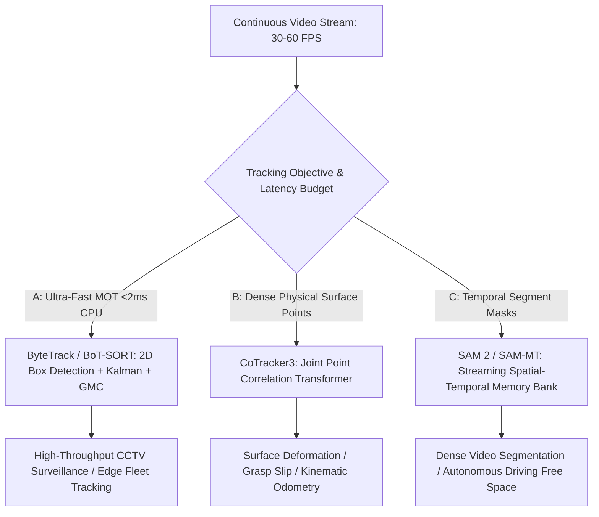

# ⚙️ Video Tracking: Re-ID Association, Long-Term Memory & Open Frontiers

A deep systems analysis of Multi-Object Tracking (MOT) association heuristics, dense point tracking scalability, long-term cross-camera re-identification (Re-ID), and unsolved research frontiers in visual tracking.

Related notes: [[topics/video-tracking/00-video-tracking-moc|Video Tracking MOC]], [[architectures/transformer-detectors/cotracker|CoTracker3 Deep-Dive]], [[architectures/real-time-unified/botsort-and-bytetrack|BoT-SORT & ByteTrack]].

---

## 1. Tracking Paradigms Compared (2024–2026)

Video tracking has structured into three complementary operational tiers:

### Deep Tracker Evaluation Matrix
| Paradigm | SOTA Representative | Granularity | Edge Deployment Suitability | Occlusion Resilience | Association Algorithm |
| :--- | :--- | :--- | :--- | :--- | :--- |
| **Tracking-by-Detection (TBD)**| **BoT-SORT / ByteTrack** | 2D Bounding Box | **Highest** ($<2\text{ ms}$ on CPU) | Moderate ($5-15$ frames) | Two-stage Hungarian / Jonker-Volgenant |
| **Joint Point Tracking** | **CoTracker3** | $N$ Point Trajectories | Moderate ($28\text{ ms}$ on GPU) | **Highest** ($>60$ frames)| Spatial-temporal sliding attention |
| **Foundation Mask Tracking** | **SAM 2.1 / SAM-MT** | 2D Pixel Masks | Moderate ($22\text{ ms}$ on A100)| High (via memory bank) | Memory query cosine cross-attention |

---

## 2. Multi-Stage Cost Matrix Fusion (IoU, ReID & Motion)

In production tracking (e.g. BoT-SORT), matching candidate detections $D_j$ to active tracks $T_i$ involves computing a fused cost matrix $C_{i, j} \in [0, 1]$:
$$C_{i, j} = \lambda_{\text{iou}} \cdot (1 - \text{IoU}(T_i, D_j)) + \lambda_{\text{reid}} \cdot D_{\text{cosine}}(f_i, f_j) + \lambda_{\text{kalman}} \cdot D_{\text{mahalanobis}}(p_i, p_j)$$

### The Appearance Feature Corruption Trap:
When an object is partially occluded by a tree or another pedestrian, passing the bounding box crop into a deep ReID feature extractor extracts an appearance embedding $f_j$ contaminated by the occluder. Updating the track's internal appearance representation with this noisy embedding causes the tracker to permanently follow the occluding object.

### Production Solution: Confidence-Weighted Moving Average (EMA)
Update the stored track embedding $f_i$ only when the detection confidence score $s_j > 0.85$ and spatial IoU with the Kalman prediction is high:
$$f_i^{(t)} = \alpha \cdot f_i^{(t-1)} + (1 - \alpha) \cdot f_j^{(t)}, \quad \text{where } \alpha = \begin{cases} 0.9, & \text{if } s_j > 0.85 \text{ and IoU} > 0.6 \\ 1.0, & \text{otherwise (Freeze memory)} \end{cases}$$

---

## 3. Current Open Problems in Video Tracking

### 🔴 Problem 1: Long-Term Re-Identification (Out-of-Frame Re-Entry)
- **The Failure Mode**: A pedestrian leaves the camera view for 3 minutes and re-enters from another door, or turns $180^\circ$ displaying an entirely different back profile. Standard Kalman filters predict unbounded uncertainty ellipses ($\Sigma \to \infty$) and drop the track ID after 30 frames.
- **Why Standard Re-ID Fails**: Deep Re-ID models suffer from camera viewpoint sensitivity, drastic lighting changes, and clothing similarity in crowded scenes.
- **Recent Frontier Solutions (2024–2026)**:
  - **Graph-Based Spatial-Temporal Topology Constrained Matching**: Integrating fixed physical transit-time bounds between cameras into the matching cost matrix.
  - **Vision-Language Re-ID Retrieval**: Combining visual embeddings with zero-shot multimodal descriptions (e.g. "man wearing red jacket carrying black duffel bag").

---

### 🔴 Problem 2: Scalability in Multi-Target Foundation Tracking (SAM-MT)
- **The Failure Mode**: While SAM 2 provides state-of-the-art mask tracking, running individual memory bank queries for $N = 50$ simultaneous objects drops frame rates from 44 FPS down to $<2\text{ FPS}$, exceeding edge GPU memory.
- **Recent Frontier Solutions**:
  - **SAM-MT (Multi-Target Unified Memory)**: Batching all instance queries into a single shared attention pass over the spatial-temporal memory bank, recovering 30+ FPS multi-instance video segmentation.

---

### 🔴 Problem 3: Point-Drift Accumulation in Textureless Dynamic Media
- **The Failure Mode**: In dense point tracking (CoTracker3 / TAPIR), points seeded on low-contrast deformable surfaces (e.g. white surgical tissue or liquid surfaces) accumulate sub-pixel drift over thousands of frames.
- **Active Research Direction**:
  - **Closed-Loop Cycle-Consistency Verification**: Tracking points forward in time ($t \to t+T$) and backward in time ($t+T \to t$); discarding or re-anchoring points whose forward-backward distance exceeds 2 pixels.
