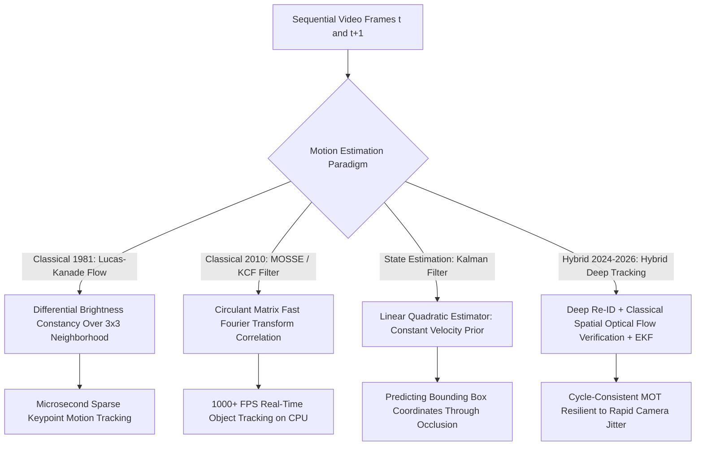

# 📐 Video Tracking: Classical Correlation, Flow & Hybrid Trackers

A deep technical exploration of classical motion estimation (Lucas-Kanade, Horn-Schunck), Fourier-domain correlation tracking (KCF, MOSSE), state-space estimation (Kalman / EKF), and modern hybrid tracking pipelines.

Related notes: [[topics/video-tracking/00-video-tracking-moc|Video Tracking MOC]], [[topics/video-tracking/03-association-and-open-problems|Association & Open Problems]].

---

## 1. Classical Motion Tracking vs. Deep Point Trackers

### Motion Tracking Comparison Matrix
| Algorithm | Mechanism | Compute Overhead | Frame Rate | Failure Mode | Best Production Role |
| :--- | :--- | :--- | :--- | :--- | :--- |
| **Lucas-Kanade (LK)** | Differential spatial-temporal gradients | Minimal ($<0.1\text{ ms}$) | $>500\text{ FPS}$ | Large motion ($>5\text{ px}$ displacement) | Camera ego-motion compensation, visual odometry |
| **Kernelized Correlation Filter (KCF)**| Ridge regression in Fourier domain ($\mathcal{F}$) | Minimal ($0.5\text{ ms}$) | $>200\text{ FPS}$ | Out-of-plane rotation, scale collapse | Ultra-low-power UAV gimbal tracking |
| **Kalman Filter (KF / EKF)** | Dynamic state-space covariance update | Negligible ($<5\mu\text{s}$) | $>10,000\text{ FPS}$ | Highly non-linear maneuvers | Bounding box trajectory smoothing and coasting |
| **CoTracker3 / RAFT** | Recurrent spatial-temporal transformer | High ($15-35\text{ ms}$) | $30-45\text{ FPS}$ | Memory consumption on long video clips | Dense physics analysis, fine manipulation tracking |

---

## 2. Mathematical Formulations: Lucas-Kanade and KCF

### 1. The Lucas-Kanade Optical Flow Constraint:
Assumes local brightness constancy: $I(x + \delta x, y + \delta y, t + \delta t) = I(x, y, t)$. First-order Taylor expansion yields the optical flow equation:
$$I_x u + I_y v + I_t = 0$$
Assuming a constant velocity vector $v = [u, v]^T$ across a local $n \times n$ window $\Omega$, LK sets up an overdetermined system $A v = -b$:
$$A = \begin{bmatrix} I_x(p_1) & I_y(p_1) \\ \vdots & \vdots \\ I_x(p_n) & I_y(p_n) \end{bmatrix}, \quad b = \begin{bmatrix} I_t(p_1) \\ \vdots \\ I_t(p_n) \end{bmatrix}$$
Solved in closed form via the classical pseudo-inverse:
$$v = (A^T A)^{-1} A^T (-b) = \begin{bmatrix} \sum I_x^2 & \sum I_x I_y \\ \sum I_x I_y & \sum I_y^2 \end{bmatrix}^{-1} \begin{bmatrix} -\sum I_x I_t \\ -\sum I_y I_t \end{bmatrix}$$
Where $A^T A$ is identical to the **Harris Corner Matrix**, proving that optical flow can only be reliably tracked at distinct corner locations (the Aperture Problem).

### 2. Kernelized Correlation Filters (KCF) Fast Fourier Diagonalization:
KCF circulates image patches to generate training samples, transforming the expensive $N\times N$ matrix inversion into an elementwise frequency domain calculation via the **Discrete Fourier Transform (DFT)**:
$$\hat{\alpha} = \frac{\hat{y}}{\hat{k}^{xx} + \lambda}$$
Inference across an entire new search window executes via elementwise multiplication in the frequency domain:
$$\hat{f}(z) = \hat{k}^{xz} \odot \hat{\alpha} \implies \text{Response } y = \mathcal{F}^{-1}(\hat{f}(z))$$
This achieves **$>200\text{ FPS}$ single-threaded CPU tracking**.

---

## 3. Production Hybrid Pattern: BoT-SORT Camera Motion Compensation (CMC)

In moving camera platforms (drones, bodycams, autonomous vehicles), naive Kalman filters fail because ego-motion distorts object velocity vectors.

### The Hybrid Solution:
1. **Classical Feature Extraction**: Extract sparse ORB / FAST keypoints across the background of frames $t$ and $t+1$.
2. **Classical Geometric RANSAC**: Compute a rigid affine homography matrix $H_t^{t+1}$ using RANSAC.
3. **State Correction**: Warp the Kalman filter state prior using $H_t^{t+1}$ before updating with deep detections:
   $$\hat{x}_{k|k-1} = H_t^{t+1} \cdot F x_{k-1}$$
This eliminates tracking drift caused by rapid camera pan/tilt without requiring heavy deep motion models.
