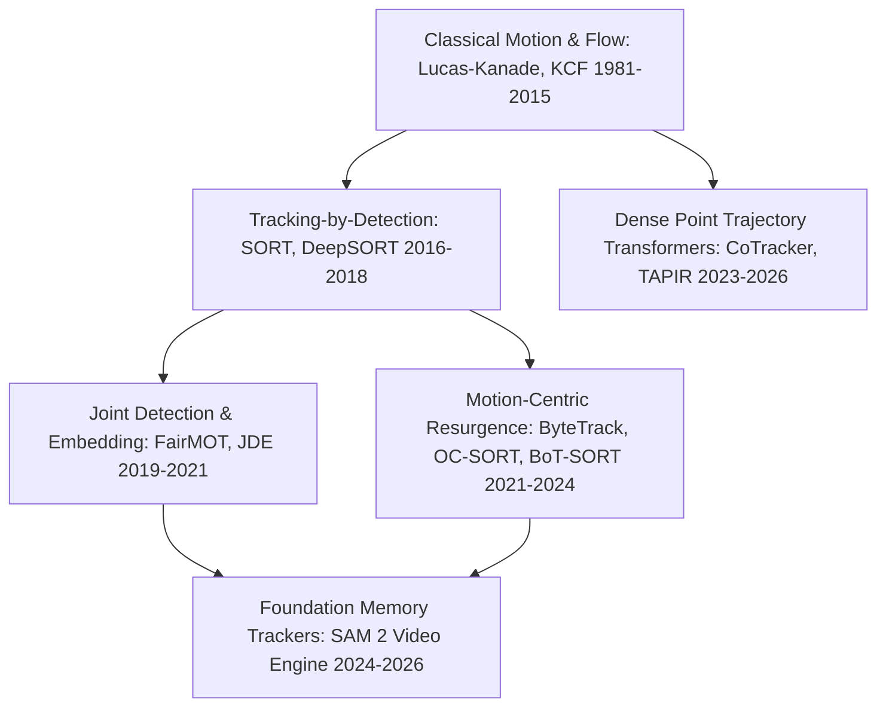
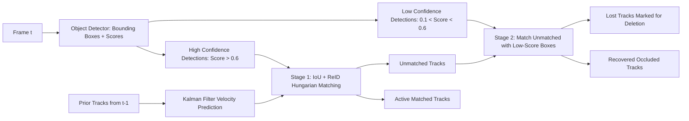
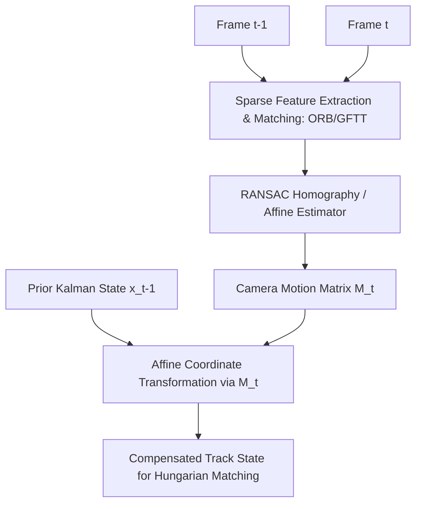

# Video Tracking: Historical Evolution & Association Paradigms

A didactic deep-dive examining the progression of object and point tracking in video: from classical optical flow and correlation filters to Tracking-by-Detection (SORT to BoT-SORT), joint detection-and-embedding networks, and modern long-range transformer point trackers (CoTracker3).

Related notes: [[topics/video-tracking/README|Video Tracking Playbook]], [[topics/real-time-systems/README|Real-Time Systems]].

---

## 1. The Core Paradigm Shift

---

## 2. Tracking-by-Detection Architecture & The ByteTrack Breakthrough

The dominant paradigm in Multi-Object Tracking (MOT) decouples spatial detection from temporal association across sequential frames.

### The ByteTrack Innovation (Zhang et al., 2022)
Prior tracking algorithms discarded all bounding box detections below a strict confidence threshold (e.g. $score < 0.5$).
- **The Problem**: When an object becomes partially occluded by a tree, pillar, or another person, its detection confidence naturally dips from $0.9$ down to $0.2$. Discarding these low-score boxes creates fragmented trajectories and frequent **ID switches**.
- **The ByteTrack Solution**: Keep *all* detections.
  1. Match high-confidence boxes first ($score > 0.6$).
  2. For the tracks that failed to match, perform a second Hungarian association pass using the low-confidence detections ($0.1 < score < 0.6$).
  3. This simple two-stage matching recovers true occluded objects while filtering out background false positives (since random background noise rarely exhibits continuous spatial motion alignment).

---

## 3. Camera Motion Compensation (CMC) in BoT-SORT

In moving cameras (drones, autonomous vehicles, bodycams), ego-motion violates the standard constant-velocity assumption of the linear Kalman filter.

By warping the prior state into the current frame coordinate system before running the Kalman prediction, **BoT-SORT** prevents track divergence during rapid camera panning or vehicle turning.

---

## 4. The Point Tracking Revolution: CoTracker3 and TAPIR

While MOT tracks bounding box centroids, dense point tracking follows exact physical surface coordinates through non-rigid deformations and multiple seconds of complete occlusion.

- **Classical Optical Flow (Farneback, RAFT)**: Computes displacement vectors only between adjacent consecutive frames ($t$ and $t+1$). Errors accumulate rapidly across long sequences, causing catastrophic drift.
- **CoTracker3 (Meta FAIR, 2024–2026)**:
  - Tracks up to 70,000 points simultaneously using sliding-window spatial-temporal Transformers.
  - Allows points to share trajectory context (e.g. if one point on an arm is occluded, surrounding visible points on the forearm inform the attention layers of the occluded point's physical location).
  - Explicitly predicts a continuous **visibility flag** $v \in [0, 1]$ alongside coordinate offsets $(\Delta x, \Delta y)$.
