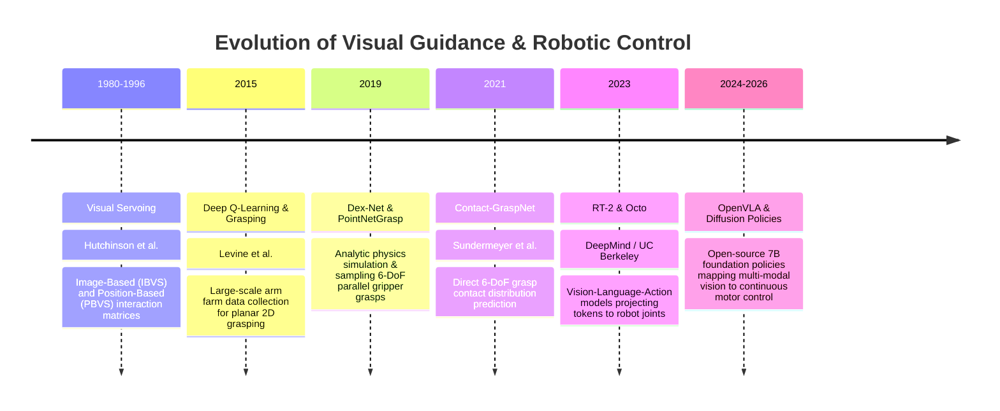

# 📜 Visual Guidance & Robotics: Historical Evolution & Paradigms

A didactic review charting the journey of visual motor control: from classical feature Jacobian visual servoing (IBVS/PBVS) and geometric inverse kinematics to deep 6-DoF grasp synthesis, diffusion policies, and multi-modal Vision-Language-Action (VLA) foundation models.

Related notes: [[topics/visual-guidance-and-robotics/00-visual-guidance-and-robotics-moc|Visual Guidance MOC]], [[topics/6dof-pose-estimation/00-6dof-pose-estimation-moc|6-DoF Pose MOC]].

---

## 1. Evolution Timeline: From Visual Servoing to Foundation Action Models

---

## 2. Core Paradigm Breakthroughs Explained

### Breakthrough A: Classical Visual Servoing (PBVS vs. IBVS)
- **Position-Based Visual Servoing (PBVS)**: Estimates the metric 3D pose of the target object $[R \mid T]$ relative to the camera, then computes Cartesian error in SE(3) space. Highly sensitive to camera calibration errors.
- **Image-Based Visual Servoing (IBVS)**: Defines error directly in 2D image coordinates:
  $$e = s - s^*$$
  Robot joint velocities are controlled using the **Image Jacobian (Interaction Matrix) $L_s$**:
  $$\dot{s} = L_s v_c \implies v_c = -\lambda L_s^+ (s - s^*)$$
  Immune to camera calibration drift, but susceptible to local image Jacobian singularities.

---

### Breakthrough B: Dense 6-DoF Grasp Synthesis (AnyGrasp / Contact-GraspNet)
Instead of matching objects to pre-programmed CAD templates, dense grasp networks treat robotic grasping as a continuous spatial affordance problem:
- Ingests raw 3D point clouds without segmentation.
- Evaluates billions of candidate parallel-jaw gripper grasps.
- Predicts grasp center point, approach orientation vector, gripper opening width, and collision likelihood in a single forward pass.

---

### Breakthrough C: The Vision-Language-Action (VLA) Revolution (OpenVLA)
OpenVLA unifies visual perception, language understanding, and physical motor execution:
- Replaces handcrafted task trees, planners, and state machines.
- Converts 2D/3D camera image patches into visual tokens (via DINOv2 and SigLIP).
- Generates 7-DoF robot arm action tokens directly via autoregressive generation.
