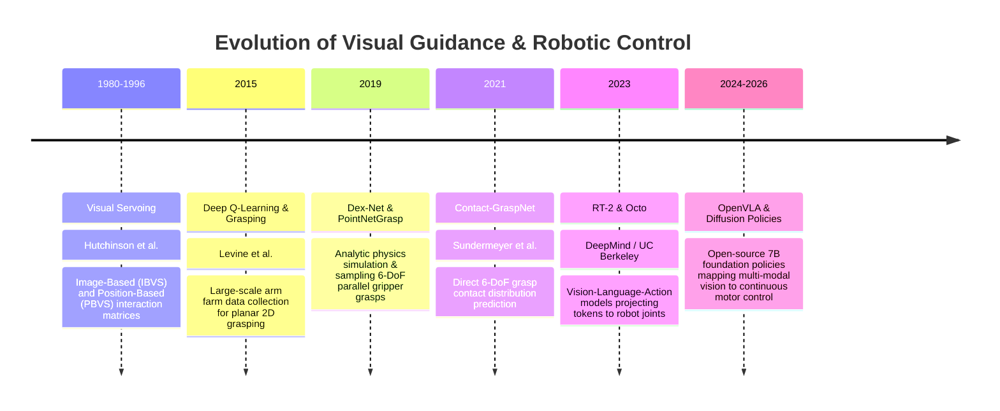
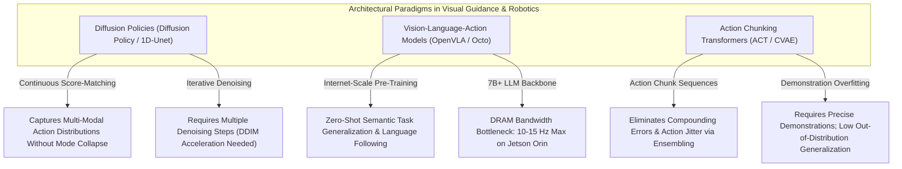

# 📜 Visual Guidance & Robotics: Historical Evolution & Paradigms

A didactic review charting the journey of visual motor control: from classical feature Jacobian visual servoing (IBVS/PBVS) and geometric inverse kinematics to deep 6-DoF grasp synthesis, diffusion policies, and multi-modal Vision-Language-Action (VLA) foundation models.

Related notes: [[topics/visual-guidance-and-robotics/00-visual-guidance-and-robotics-moc|Visual Guidance MOC]], [[topics/6dof-pose-estimation/00-6dof-pose-estimation-moc|6-DoF Pose MOC]].

---

## 1. Evolution Timeline: From Visual Servoing to Foundation Action Models

---

## 2. Core Paradigm Breakthroughs Explained

### Breakthrough A: Classical Visual Servoing (PBVS vs. IBVS)
- **Position-Based Visual Servoing (PBVS)**: Estimates the metric 3D pose of the target object $[R \mid T]$ relative to the camera, then computes Cartesian error in SE(3) space. Highly sensitive to camera calibration errors.
- **Image-Based Visual Servoing (IBVS)**: Defines error directly in 2D image coordinates:
  $$e = s - s^*$$
  Robot joint velocities are controlled using the **Image Jacobian (Interaction Matrix) $L_s$**:
  $$\dot{s} = L_s v_c \implies v_c = -\lambda L_s^+ (s - s^*)$$
  Immune to camera calibration drift, but susceptible to local image Jacobian singularities.

---

### Breakthrough B: Dense 6-DoF Grasp Synthesis (AnyGrasp / Contact-GraspNet)
Instead of matching objects to pre-programmed CAD templates, dense grasp networks treat robotic grasping as a continuous spatial affordance problem:
- Ingests raw 3D point clouds without segmentation.
- Evaluates billions of candidate parallel-jaw gripper grasps.
- Predicts grasp center point, approach orientation vector, gripper opening width, and collision likelihood in a single forward pass.

---

### Breakthrough C: The Vision-Language-Action (VLA) Revolution (OpenVLA)
OpenVLA unifies visual perception, language understanding, and physical motor execution:
- Replaces handcrafted task trees, planners, and state machines.
- Converts 2D/3D camera image patches into visual tokens (via DINOv2 and SigLIP).
- Generates 7-DoF robot arm action tokens directly via autoregressive generation.

---

## 3. Intensive Architectural Taxonomy: Convolutional vs Transformer vs Hybrid Sub-Modules

Visual guidance and robot learning have transitioned from classical analytic visual servoing matrices to dense point-cloud grasp affordance networks, diffusion policy action chunking, and multi-modal Vision-Language-Action (VLA) foundation models.

### Comparative Sub-Module Architectural Matrix

| Model Name & Year | Architectural Paradigm | Backbone Sub-Module | Neck / Feature Aggregator | Encoder Sub-Module | Decoder / Head Sub-Module | Primary Bottleneck & Edge Suitability |
| :--- | :--- | :--- | :--- | :--- | :--- | :--- |
| **Classical IBVS / PBVS** (1980–1996) | Classical Analytic Matrix Control | Camera Image Feature Extractor (Manual 2D point/line extraction) | Handcrafted Image Jacobian Interaction Matrix $L_s \in \mathbb{R}^{2k \times 6}$ | None (Direct kinematic matrix inversion) | Proportional-Derivative (PD) Cartesian / Joint Velocity Controller ($v_c = -\lambda L_s^+ e$) | **Singularity & Calibration Bound**: Zero neural network latency (>500 Hz on microcontrollers); vulnerable to interaction matrix singularities and camera calibration drift. |
| **Dex-Net (GQ-CNN)** (2017–2019) | Pure ConvNet | ResNet-style Convolutional Stages over depth image crops ($96\times96$) | Spatial Pooling + Concatenation with Gripper Depth $z$ | Standard Convolutional Residual Blocks with ReLU | 3-Layer Fully Connected Grasp Robustness Evaluator (Predicts grasp success probability $Q \in [0, 1]$) | **Compute & Edge Friendly**: Extremely fast (~10–20 ms on edge GPU); evaluates pre-sampled grasp candidates; limited to top-down 2.5D planar bin-picking. |
| **Contact-GraspNet / AnyGrasp** (2021–2023) | Point Cloud Conv / MLP | PointNet++ / 3D Sparse Convolutional (SpConv) Point Cloud Backbone | Multi-Scale Point Feature Aggregator | Hierarchical Set Abstraction / Sparse 3D Convolutions | Multi-Task Dense Output Head (Predicts per-point 6-DoF grasp contact point, orientation vector, opening width, and collision likelihood) | **Memory Bandwidth Bound**: Generates continuous 6-DoF grasps in 6-dimensional SE(3) space in ~100–180 ms; bottlenecked by 3D point cloud grouping on edge robots. |
| **Diffusion Policy** (2023) | Hybrid Conv / Transformer Diffusion | Visual Feature Extractor: ResNet-18 / ResNet-50 or ViT-B (Processing multi-camera streams) | Spatial Softmax Pooling Layer (Extracting low-dimensional spatial keypoints) | 1D-Unet Temporal Convolutions or Multi-Head Self-Attention Transformer | Denoising Diffusion Head (DDPM / DDIM predicting continuous action chunk trajectories $\mathbf{A} \in \mathbb{R}^{T_a \times D_a}$) | **Iterative Denoising Bound**: Exceptional multi-modal trajectory modeling; inference latency depends on denoising steps $K$ ($K=10\text{--}100$ steps $\approx 30\text{--}80\,\text{ms}$); highly edge-deployable with DDIM acceleration. |
| **RT-1 (Robotics Transformer 1)** (2022) | Hybrid Conv-Transformer | EfficientNet-B3 Image Backbone (Processing 6 historical video frames) | TokenLearner (Compresses 81 visual tokens down to 8 compact tokens) | Standard Multi-Head Self-Attention Transformer Encoder over joint Vision-Language-Action tokens | Autoregressive Transformer Decoder outputting discretized 7-DoF robot arm action tokens ($11\text{ bins per dimension}$) | **Compute Bound**: Robust cross-task robot manipulation; TokenLearner reduces compute by 7x; executes at ~3 Hz on robot on-board computers. |
| **RT-2 / Octo** (2023) | Foundation VLA Transformer | Large Vision-Language Foundation Encoder (PaLI-X / ViT-L with Patch14 embedding) | Multi-Modal Cross-Attention Projector | Large Language-Vision Transformer Backbone (12B–55B params) | Direct Autoregressive Action Token Generator (Actions represented as string tokens within LLM vocabulary) | **DRAM Bandwidth & KV-Cache Bound**: High semantic reasoning and open-world generalization; massive parameter footprint prohibits on-robot edge inference without cloud streaming. |
| **OpenVLA** (2024–2026) | Open Foundation VLA | Prismatic Dual Vision Encoder: DINOv2 (Geometric features) + SigLIP (Semantic features) | Dual-Vision Concatenation & Linear Projection Adapter | Llama-2 7B Autoregressive Transformer Backbone with FlashAttention-2 | Quantized Autoregressive 7-DoF Motor Action Token Head | **VRAM & Memory Bandwidth Bound**: World's leading open-source 7B VLA; requires INT4/W8A8 quantization to achieve ~10–15 Hz inference on Nvidia Jetson AGX Orin (64GB). |
| **ACT (Action Chunking Transformer)** (2023) | Conditional VAE Transformer | Dual ResNet-18 / DINOv2 Feature Extractor on multiple camera viewpoints | Multi-Camera Token Concatenation Neck | CVAE Transformer Encoder (Compresses demonstrations into latent style variable $z$) | Transformer Decoder predicting $k$-step continuous action chunks with Temporal Ensembling | **Compute & Edge Friendly**: SOTA precision on fine bimanual manipulation (e.g. threading needle, slotting battery); runs at >40–50 Hz on edge GPUs. |

### Didactic Architectural Trade-Off Analysis

#### 1. Closed-Loop Visual Servoing vs. Action Chunking Policies
- **Closed-Loop Servoing ($500\,\text{Hz}$)** updates motor velocities per frame ($v_c = -\lambda L_s^+ e$). While responsive to external physical perturbations, it is fundamentally reactive and cannot execute long-horizon multistep manipulation plans (e.g. opening a drawer, picking a tool, and placing it inside).
- **Action Chunking (ACT, Diffusion Policy)** models motor control as predicting a continuous sequence of future actions over a receding horizon:
  $$\mathbf{A}_t = [a_t, a_{t+1}, \dots, a_{t+k}] \in \mathbb{R}^{k \times D_a}$$
  By executing action chunks open-loop across $k$ timesteps ($k \approx 30\text{--}50$) with **Temporal Ensembling** (exponential weighting across overlapping chunk predictions), the robot eliminates high-frequency motor jitter and overcomes visual model inference latency ($50\text{--}100\,\text{ms}$).

#### 2. Continuous Diffusion Denoising vs. Autoregressive Action Tokenization
- **Autoregressive Action Tokenization (RT-1, RT-2, OpenVLA)** discretizes each continuous joint dimension into $N$ discrete bins (e.g. $N=256$). This frames robot action generation as standard next-token language prediction. However, discretization introduces quantization errors into fine robotic tolerances and increases autoregressive decoding latency ($7\times$ sequential forward passes per 7-DoF action).
- **Diffusion Policies** treat action generation as continuous score-based denoising:
  $$a^{k-1} = \frac{1}{\sqrt{\alpha_k}}\left(a^k - \frac{1 - \alpha_k}{\sqrt{1 - \bar{\alpha}_k}} \boldsymbol{\epsilon}_\theta(a^k, k, \mathbf{O})\right) + \sigma_k \mathbf{z}$$
  This models complex, non-Gaussian multi-modal action distributions (e.g. deciding to navigate around an obstacle via the left path or right path) without suffering from the **mode collapse** that plagues standard MSE regression networks.

#### 3. Edge Inference Constraints: 7B VLA Foundation Models vs. Lightweight Policies
- **VLA Foundation Models (OpenVLA 7B)** require massive memory bandwidth. Even under 4-bit quantization (INT4), generating action tokens requires reading ~4 GB of weights from VRAM per action step, capping inference speed at ~12 Hz on a Jetson AGX Orin ($60\text{W}$ budget).
- **Lightweight Diffusion / ACT Policies** use lightweight vision backbones (ResNet-18 or DINOv2-Small) paired with small 1D convolutional or transformer decoders (<50M parameters). They execute at >50 Hz on embedded edge robot compute modules while drawing less than $15\text{W}$, making them suitable for mobile manipulators and battery-powered quadrupeds.

