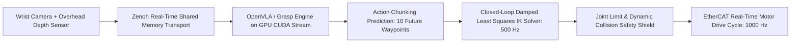

# 🛠️ Visual Guidance & Robotics: Production Pipeline, Traps & Workarounds

A practitioner's guide to closing the loop between visual perception, trajectory generation, and physical motor actuation in real-time robotic systems.

Related notes: [[topics/visual-guidance-and-robotics/00-visual-guidance-and-robotics-moc|Visual Guidance MOC]], [[topics/real-time-systems/00-real-time-systems-moc|Real-Time Systems MOC]].

---

## 1. End-to-End Production Pipeline Architecture

---

## 2. Common Traps, Edge Cases & Hardware Bottlenecks

### Trap 1: Perception Latency Phase Lag (System Instability)
- **Problem**: If a visual model takes 100 ms to compute a target position, but the robot arm moves at $1\text{ m/s}$, the command sent to the motors represents where the object was **10 centimeters ago**. Direct feedback loops become violently unstable (oscillations).

### Trap 2: Kinematic Singularities & Velocity Explosion
- **Problem**: When a robot arm reaches full extension or aligns joint axes, the Jacobian determinant drops to zero ($\det(J) \to 0$). Inverting the Jacobian ($J^{-1}$) commands infinite joint velocities, triggering hardware safety overcurrent faults.

### Trap 3: Autoregressive Action Drifting in VLA Models
- **Problem**: When a 7B VLA model generates actions token-by-token at high rates, small prediction errors compound over time, causing the robot to freeze or drift into table collisions.

---

## 3. Battle-Tested Engineering Workarounds

### Workaround 1: Action Chunking & Temporal Smoothing
Never query an expensive neural policy (100–200 ms latency) at 1000 Hz for single joint steps:
- The policy predicts an **Action Chunk** of $H = 10$ future metric trajectory waypoints at 10 Hz.
- A deterministic, lightweight spline interpolator runs at **500–1000 Hz** on an isolated PREEMPT_RT CPU thread to smoothly feed motor controllers.

### Workaround 2: Damped Least Squares (Levenberg-Marquardt) Inverse Kinematics
Prevent velocity spikes near kinematic singularities by damping the Jacobian inversion:
$$J^* = J^T (J J^T + \lambda^2 I)^{-1}$$
Where $\lambda$ is a damping factor dynamically scaled based on the minimum singular value of $J$.

### Workaround 3: Real-Time Safety Shield Barrier Functions
Wrap all neural policy actions inside a hardware-enforced **Control Barrier Function (CBF)**:
- Even if a VLA model hallucinates a path driving the arm directly into a table surface or human collaborator, the CBF override layer clamps motor torques to preserve safe distance boundaries.
