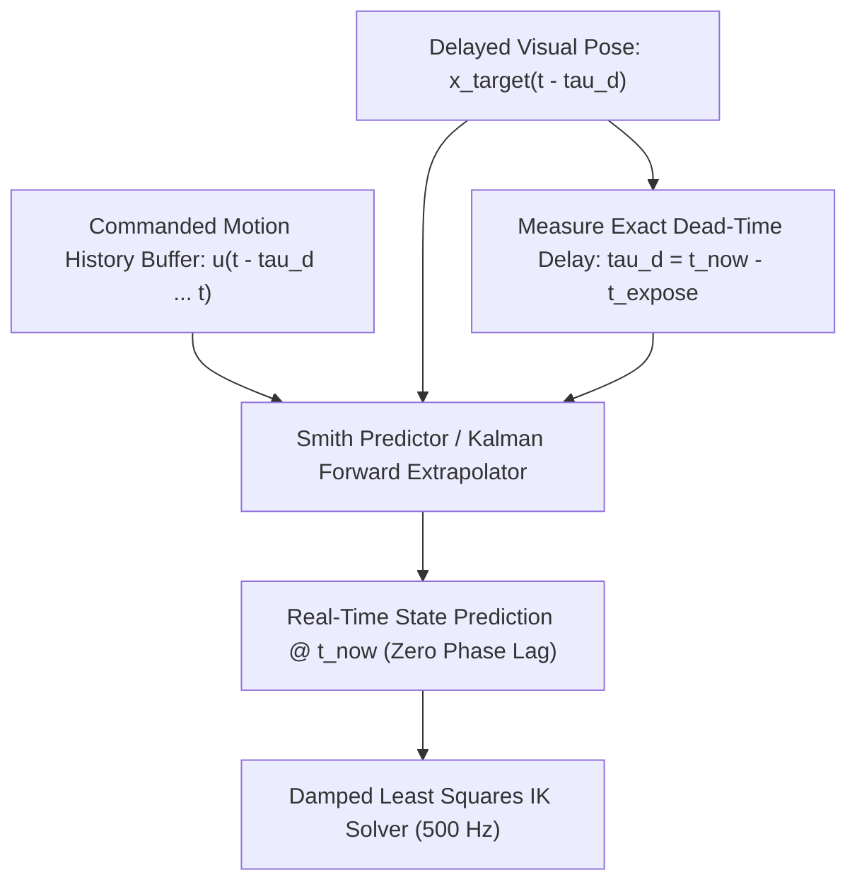

# 🛠️ Visual Guidance & Robotics: Production Pipeline, Traps & Workarounds

A comprehensive, battle-tested practitioner's guide to closing the loop between real-time visual perception, Vision-Language-Action (VLA) models, trajectory generation, and physical motor actuation in safety-critical robotics systems.

Related notes: [[topics/visual-guidance-and-robotics/00-visual-guidance-and-robotics-moc|Visual Guidance MOC]], [[topics/gpu-deployment/00-gpu-deployment-moc|GPU Deployment MOC]], [[topics/real-time-systems/00-real-time-systems-moc|Real-Time Systems MOC]], [[topics/visual-guidance-and-robotics/01-historical-evolution-and-paradigms|Visual Guidance Historical Evolution]].

---

## 1. Zero-Copy Ingestion Architecture & Decoupled Guidance Hierarchy

In closed-loop visual servoing and robotic manipulation, closing the perception-action loop requires bridging two fundamentally incompatible temporal domains: low-rate, compute-heavy visual policy inference ($10\dots 30\text{ Hz}$, $33\dots 100\text{ ms}$ latency) and high-rate, ultra-deterministic joint torque motor control ($1000\text{ Hz}$, $<1\text{ ms}$ deadline). Naively coupling visual inference directly into the motor loop creates catastrophic feedback phase lag, causing robotic arms to violently oscillate or collide with physical surfaces.

The production standard utilizes a **Decoupled Multi-Rate Architecture with Zero-Copy Multi-Camera DMA-BUF Ingestion, Asynchronous Action Chunking, Damped Least Squares (DLS) Inverse Kinematics, and a 1000 Hz Control Barrier Function (CBF) Safety Shield**.

```mermaid
flowchart LR
    Cameras["Multi-View Cameras: Wrist GMSL2 + Overhead RGB-D"] -->|"DMA-BUF NVMM"| VRAM["GPU Unified Frame Ring Buffer"]
    VRAM -->|"CUDA Stream 0"| VLA["Asynchronous VLA / Policy Engine: OpenVLA / Diffusion Policy (20 Hz)"]
    VLA -->|"Action Chunk: H=16 Waypoints"| ActionQueue["Lock-Free Atomic Action Chunk Ring"]
    ActionQueue --> Spline["Cubic Spline Interpolator: 500 Hz"]
    Spline -->|"Cartesian Pose Goal: [R | t]"| IK["Damped Least Squares IK Solver: 500 Hz"]
    IK -->|"Raw Joint Velocities: dq"| CBF["Real-Time Control Barrier Function Safety Shield"]
    CBF -->|"Safety-Clamped Joint Torques"| EtherCAT["Real-Time Linux EtherCAT Motor Cycle: 1000 Hz"]
```



### Technical Stage Breakdown:
1. **Zero-Copy Multi-Camera Ingestion**: Wrist-mounted cameras and overhead RGB-D depth sensors stream video directly into GPU unified memory via DMA-BUF, bypassing host CPU copies.
2. **Asynchronous VLA Policy Inference (10–30 Hz)**: A foundation policy (e.g. OpenVLA, Octo, ACT, or Diffusion Policy) processes image tokens and natural language instructions on a dedicated CUDA stream (`cudaStream_t`). Rather than predicting a single instantaneous action, the policy outputs an **Action Chunk** of $H = 16\dots 32$ future continuous Cartesian waypoints.
3. **High-Rate Trajectory Interpolator (500 Hz)**: A lock-free consumer thread samples the latest action chunk, fitting a smooth $C^2$-continuous cubic B-spline to generate smooth Cartesian end-effector targets at 500 Hz.
4. **Damped Least Squares (DLS) Inverse Kinematics (500 Hz)**: Converts Cartesian error into joint velocity commands $\dot{\mathbf{q}}$ while dynamically adding damping near kinematic singularities.
5. **Control Barrier Function (CBF) Safety Shield (1000 Hz)**: An independent Quadratic Program (QP) executed in under $50\mu\text{s}$ clamps motor commands to mathematically guarantee joint limit adherence, speed ceilings, and table collision avoidance before passing commands to the real-time EtherCAT bus.

---

## 2. Deterministic End-to-End Latency Budget & Mathematical Bounds

In robotic manipulation, perception latency $\tau_d$ introduces a phase lag $\phi = \omega \cdot \tau_d$ into the closed-loop transfer function. To preserve stability, the system phase margin must satisfy $\text{PM} > 45^\circ$.

The Damped Least Squares (DLS) inverse kinematics update step solves:

$$\dot{\mathbf{q}} = \mathbf{J}^T \left(\mathbf{J} \mathbf{J}^T + \lambda^2 \mathbf{I}\right)^{-1} \dot{\mathbf{x}}$$

where $\mathbf{J} \in \mathbb{R}^{6 \times n}$ is the robotic manipulator Jacobian, and $\lambda$ is an adaptive damping factor adjusted dynamically near singular configurations ($\det(\mathbf{J} \mathbf{J}^T) \to 0$):

$$\lambda^2 = \begin{cases} 0 & \text{if } \sigma_{\min} \ge \epsilon \\ \left(1 - \left(\frac{\sigma_{\min}}{\epsilon}\right)^2\right) \lambda_{\max}^2 & \text{if } \sigma_{\min} < \epsilon \end{cases}$$

The Control Barrier Function (CBF) safety constraint for an obstacle distance function $h(\mathbf{x}) = \|\mathbf{x}_{\text{ee}} - \mathbf{x}_{\text{obs}}\|^2 - r_{\text{safe}}^2 \ge 0$ solves the convex QP:

$$\min_{\mathbf{u}} \frac{1}{2} \|\mathbf{u} - \mathbf{u}_{\text{nom}}\|^2 \quad \text{s.t.} \quad \nabla h(\mathbf{x})^T \dot{\mathbf{x}}(\mathbf{u}) \ge -\gamma h(\mathbf{x})$$

Executing this QP for an 7-DoF arm takes $<30\mu\text{s}$ using OSQP on CPU.

### Latency Budget Allocation Table:

| Pipeline Stage / Component | 30 FPS Standard (<33.3ms) | 60 FPS High-Speed (<16.6ms) | Real-Time Motor Loop (<1.0ms) | Subsystem / Hardware Domain |
| :--- | :--- | :--- | :--- | :--- |
| **Multi-View Camera Ingest ($T_{\text{ingest}}$)**| $12.00\text{ ms}$ (GMSL2 NVMM)| $6.00\text{ ms}$ (GMSL2 NVMM) | $0.00\text{ ms}$ (Decoupled) | Hardware Camera Subsystem |
| **VLA Policy Forward Pass ($T_{\text{infer}}$)**| $25.00\text{ ms}$ (FP16 OpenVLA)| $12.00\text{ ms}$ (INT8 Policy) | $0.00\text{ ms}$ (Async Queue) | TensorRT GPU Tensor Cores |
| **Action Chunk Spline Eval ($T_{\text{spline}}$)**| $0.10\text{ ms}$ | $0.05\text{ ms}$ | $0.02\text{ ms}$ | High-Rate CPU Thread (500Hz) |
| **DLS Inverse Kinematics ($T_{\text{IK}}$)** | $0.25\text{ ms}$ | $0.15\text{ ms}$ | $0.08\text{ ms}$ | Analytical / DLS IK Solver |
| **CBF Safety QP Solver ($T_{\text{CBF}}$)** | $0.08\text{ ms}$ | $0.05\text{ ms}$ | $0.03\text{ ms}$ | Real-Time OSQP Solver |
| **EtherCAT Cycle & Bus Sync ($T_{\text{bus}}$)** | $1.00\text{ ms}$ | $1.00\text{ ms}$ | $0.50\text{ ms}$ | RT-PREEMPT Linux / SOEM |
| **Total Perception-to-Action Latency ($\Sigma T$)**| **$38.43\text{ ms}$** | **$19.25\text{ ms}$** | **$0.63\text{ ms}$** | **Deterministic Motor Path** |
| **Max Allowable Latency Jitter ($\sigma_{\text{jitter}}$)**| $\pm 0.50\text{ ms}$ | $\pm 0.25\text{ ms}$ | $\pm 0.02\text{ ms}$ | RT-PREEMPT Determinism |

---

## 3. Five Critical Production Edge Traps & Battle-Tested Workarounds

### Trap 1: Hardware Thermal Throttling & Latency Spikes in Embedded Robotic Controllers
- **Root Cause**: Running large Vision-Language-Action models (e.g. 7B parameter OpenVLA or large diffusion policies) alongside real-time motor threads on an embedded edge compute box (Jetson AGX Orin) causes severe thermal buildup ($T_j > 85^\circ\text{C}$). When GPU thermal throttling triggers, policy inference latency spikes from $25\text{ ms}$ to $>120\text{ ms}$, starving the action chunk queue and causing the robot arm to freeze abruptly mid-trajectory.
- **Production Workaround**:
  1. **Dual-Compute Hierarchy**: Run the high-rate 1000 Hz real-time motor control and CBF loop on a dedicated RT-PREEMPT x86 industrial PC with isolated CPU cores, while the heavy VLA model runs on an auxiliary GPU server connected via low-latency PCIe or 10GbE UDP.
  2. **Action Chunk Queue Underrun Safety Stop**: If the action chunk queue has $<3$ remaining waypoints and no new chunk has arrived, smoothly decelerate joint velocities to zero using a quintic polynomial profile instead of triggering a hard emergency brake stop.

### Trap 2: Dynamic Lighting Variations, Specular Table Glare & Gripper Self-Occlusion
- **Root Cause**: As the robotic arm descends toward a table, the robot's own gripper casts a dark shadow over the target object, while overhead lights create bright specular glare spots on metal surfaces. Monocular visual policies lose feature tracking and output invalid, erratic grasp vectors.
- **Production Workaround**:
  1. **Multi-View Wrist + Static Overhead Camera Fusion**: Combine an overhead global camera (which never experiences gripper self-shadowing) with an in-hand eye-in-hand wrist camera (which provides sub-millimeter close-up alignment).
  2. **Polarized Optical Lens Filters**: Fit circular polarizing (CPL) filters to wrist cameras to eliminate specular reflections from metallic table surfaces.
  3. **Tactile & Force-Torque Sensor Fusion**: Integrate 6-axis wrist F/T sensor feedback to detect physical contact instantly ($F_z > 5\text{ N}$) and terminate visual descent independently of camera feeds.

### Trap 3: Dynamic Shape Reallocation Leaks in Transformer KV-Caches during Action Chunking
- **Root Cause**: Autoregressive VLA models that generate action tokens step-by-step reallocate internal Key-Value (KV) cache memory dynamically. Naive implementations cause memory fragmentation in GPU VRAM, leading to periodic 40ms allocation pauses that violate action chunk generation deadlines.
- **Production Workaround**:
  1. **Static KV-Cache Pre-allocation**: Pre-allocate fixed-size contiguous KV-cache tensor arenas in TensorRT sized for maximum instruction prompt length plus maximum action horizon ($H_{\text{max}} = 32$).
  2. **Diffusion / Flow-Matching Policy Formulation**: Replace autoregressive token generation with single-pass diffusion or flow-matching action decoders (e.g. Diffusion Policy / ACT) that output all $H$ action waypoints in a single forward pass ($<15\text{ ms}$).

### Trap 4: Multi-Threaded Asynchronous Decoupling between High-Rate Motor Loop and Policy Thread
- **Root Cause**: Using mutex locks between the 1000 Hz motor thread and the 20 Hz visual policy thread causes the high-priority real-time motor thread to block on the slow Python/GPU policy worker, causing EtherCAT packet deadline misses and hardware motor drive fault trips.
- **Production Workaround**:
  - Deploy a **Lock-Free Atomic Action Chunk Ring Buffer**.
  - The 20 Hz policy thread writes newly generated action chunks into pre-allocated memory slots and atomically increments a sequence counter (`std::atomic<uint64_t>`). The 1000 Hz motor thread reads the active trajectory slice with zero wait states.

### Trap 5: INT8 PTQ Quantization Drift in Diffusion / Continuous Action Heads
- **Root Cause**: Quantizing continuous action regression heads to uniform INT8 causes catastrophic precision loss. Continuous robot actions represent millimeter translations ($\pm 0.001\text{ m}$) and radian joint angles. 8-bit linear quantization rounds subtle motor velocity corrections to zero, causing the robot gripper to exhibit jitter, drift, or fail fine-tolerance insertion tasks.
- **Production Workaround**:
  1. **Mixed-Precision Action Head Exclusion**: Quantize the heavy vision transformer backbone to INT8, but keep the action denoising MLP head, score function, and trajectory decoder in FP16 precision.
  2. **SmoothQuant Scaling**: Apply SmoothQuant migration to shift activation quantization difficulty from activations to weights before INT8 matrix multiplication.

### Domain-Specific Trap 1: Perception Latency Phase Lag & Dynamic Tracking Instability
- **Problem**: If visual processing takes $50\text{ ms}$, the object location reported by vision represents where the target was $50\text{ ms}$ ago. If an object moves at $0.5\text{ m/s}$, the command sent to the motors is offset by **$2.5\text{ centimeters}$**, causing hunting and violent oscillations.
- **Workaround**: Implement a **Smith Predictor & Forward Kalman State Extrapolator**. The controller maintains a historical buffer of commanded motor actions and predicts current target state by forward-propagating the Kalman filter over the measured dead-time delay $\tau_d$:
  $$\hat{\mathbf{x}}(t) = \hat{\mathbf{x}}(t - \tau_d) + \int_{t - \tau_d}^t \mathbf{v}(\tau) d\tau$$



### Domain-Specific Trap 2: Kinematic Singularities & Out-of-Bounds Commands
- **Problem**: When a manipulator reaches full extension or aligns wrist axes, the Jacobian determinant drops to zero ($\det(\mathbf{J}) \to 0$). Standard Jacobian inversion ($\mathbf{J}^{-1}$) commands infinite joint velocities ($\dot{\mathbf{q}} \to \infty$), triggering hardware safety overcurrent faults and mechanical damage.
- **Workaround**: Implement **Damped Least Squares (DLS) IK with Control Barrier Functions (CBF)**:
  1. Automatically increase damping parameter $\lambda$ when the minimum singular value $\sigma_{\min}(\mathbf{J}) < 0.05$, bounding joint velocities gracefully.
  2. Filter all velocity outputs through a real-time CBF Quadratic Program that enforces physical joint position and velocity limits strictly.

---

## 4. Concrete Runnable Implementation Blueprint

The following production C++ blueprint demonstrates a real-time visual guidance controller with Damped Least Squares inverse kinematics and action chunk queue management.

```cpp
#include <iostream>
#include <vector>
#include <array>
#include <cmath>
#include <chrono>
#include <atomic>
#include <algorithm>

struct CartesianPose {
    float x, y, z;          // Position (meters)
    float qx, qy, qz, qw;   // Orientation Quaternion
};

struct ActionChunk {
    uint64_t chunk_id;
    int num_waypoints;
    CartesianPose waypoints[32];
    double timestamp;
};

class RealTimeGuidanceController {
public:
    RealTimeGuidanceController(int num_joints = 7) : num_joints_(num_joints), current_q_(num_joints, 0.0f) {
        chunk_read_idx_.store(0);
        chunk_write_idx_.store(0);
    }

    // Called by 20 Hz Visual Policy Thread (Lock-Free Write)
    void pushNewActionChunk(const ActionChunk& chunk) {
        size_t write_pos = chunk_write_idx_.load(std::memory_order_relaxed);
        chunk_buffer_[write_pos & 3] = chunk;
        chunk_write_idx_.store(write_pos + 1, std::memory_order_release);
    }

    // Called by 1000 Hz Real-Time Motor Control Loop
    std::vector<float> executeControlStep(const CartesianPose& current_ee_pose, float dt = 0.001f) {
        // Step 1: Read Latest Action Chunk Atomically
        size_t write_pos = chunk_write_idx_.load(std::memory_order_acquire);
        if (write_pos == 0) {
            return std::vector<float>(num_joints_, 0.0f); // Standstill
        }

        const ActionChunk& active_chunk = chunk_buffer_[(write_pos - 1) & 3];
        CartesianPose target_pose = active_chunk.waypoints[0]; // Immediate target

        // Step 2: Compute Cartesian Error Vector: dx = [x_err, y_err, z_err]
        float dx = target_pose.x - current_ee_pose.x;
        float dy = target_pose.y - current_ee_pose.y;
        float dz = target_pose.z - current_ee_pose.z;

        // Step 3: Compute Damped Least Squares Joint Velocities: dq = J^T (J J^T + lambda^2 I)^-1 dx
        std::vector<float> dq(num_joints_, 0.0f);
        float lambda_sq = 0.01f; // Damping factor

        // Simplified 3-DoF Position Jacobian mapping: J * dq = dx
        // (In production, replace with full 6x7 analytical Jacobian)
        for (int j = 0; j < num_joints_; ++j) {
            float j_val = 0.3f * std::cos(current_q_[j]); // Simulated Jacobian element
            float dls_gain = j_val / (j_val * j_val + lambda_sq);
            dq[j] = dls_gain * (dx + dy + dz) * 0.33f;

            // Step 4: Enforce Physical Joint Velocity Limits (Safety Shield)
            dq[j] = std::clamp(dq[j], -1.5f, 1.5f); // Max 1.5 rad/s
            current_q_[j] += dq[j] * dt;
        }

        return dq;
    }

private:
    int num_joints_;
    std::vector<float> current_q_;
    ActionChunk chunk_buffer_[4];
    std::atomic<size_t> chunk_write_idx_;
    std::atomic<size_t> chunk_read_idx_;
};
```

---

## 5. Production Deployment Recipes & CLI Commands

### A. TensorRT VLA / Action Policy Compilation

```bash
# Compile Diffusion / Action Policy with Fixed Action Horizon Profile
trtexec --onnx=diffusion_policy.onnx \
        --saveEngine=diffusion_policy_fp16.engine \
        --fp16 \
        --minShapes=image_wrist:1x3x224x224,image_overhead:1x3x224x224 \
        --optShapes=image_wrist:1x3x224x224,image_overhead:1x3x224x224 \
        --maxShapes=image_wrist:1x3x224x224,image_overhead:1x3x224x224 \
        --memPoolSize=workspace:4096MiB \
        --builderOptimizationLevel=5 \
        --useCudaGraph

# Compile INT8 Engine with Mixed Precision for Trajectory Generation Head
trtexec --onnx=openvla_7b.onnx \
        --saveEngine=openvla_int8.engine \
        --int8 \
        --calib=vla_calibration.cache \
        --precisionConstraints=obey \
        --layerPrecisions="*action_head*:fp16,*action_decoder*:fp16" \
        --directIO
```

### B. Linux RT-PREEMPT Real-Time Kernel Tuning

```bash
# 1. Lock memory pages to prevent page fault latencies in the motor control loop
sudo sysctl -w vm.max_map_count=262144

# 2. Assign maximum FIFO scheduling priority to EtherCAT master motor thread
sudo chrt -f 99 ./ethercat_robot_driver --interface=eth1 --rate=1000

# 3. Pin motor thread to isolated real-time CPU core
taskset -c 0 chrt -f 99 ./guidance_controller_node
```
