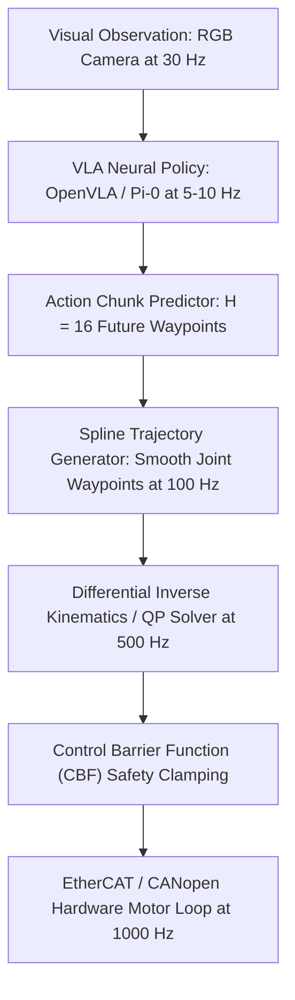

# ⚙️ Visual Guidance & Robotics: Low-Level Controllers, Latency & VLA Frontiers

A deep systems investigation into bridging high-latency vision foundation policies with high-rate motor controllers, addressing phase lag instabilities, kinematics singularities, and the unsolved frontiers of Vision-Language-Action (VLA) manipulation.

Related notes: [[topics/visual-guidance-and-robotics/00-visual-guidance-and-robotics-moc|Visual Guidance MOC]], [[architectures/multimodal-vlm-and-vla/pi0|π0 & Diffusion Policy Deep-Dive]].

---

## 1. Multi-Rate Perception-to-Actuation Architecture

Robotic manipulation spans three fundamentally incompatible clock frequencies:

### Frequency & Latency Mismatch Matrix
| Pipeline Tier | Clock Rate | Processing Latency | Jitter Tolerance | Operational Subsystem |
| :--- | :--- | :--- | :--- | :--- |
| **Visual Inference Tier** | $5-10\text{ Hz}$ | $100-200\text{ ms}$ | High (Asynchronous stream) | GPU (TensorRT / PyTorch FP8) |
| **Trajectory Generation Tier** | $50-100\text{ Hz}$ | $5-10\text{ ms}$ | Moderate ($<1\text{ ms}$) | CPU Thread (C++ / Rust) |
| **Motor Control Tier** | **$1000\text{ Hz}$ (1 ms)** | **$<100\mu\text{s}$** | **Zero Jitter ($<5\mu\text{s}$)** | **PREEMPT_RT Kernel / EtherCAT** |

---

## 2. Overcoming Perception Latency Phase Lag (System Instability)

### The Classical Phase Delay Problem:
If a visual policy takes $\tau = 150\text{ ms}$ to process an image and command a Cartesian velocity $v$, the robot acts on visual evidence delayed by $\tau$. In closed-loop feedback control:
$$x_{\text{command}}(t) = x_{\text{measured}}(t - \tau) + K_p \cdot e(t - \tau)$$
This time delay introduces a negative phase shift $\phi = -\omega \tau$ in the open-loop transfer function. Once $\phi \le -180^\circ$, negative feedback flips into positive feedback, causing violent, resonant physical oscillations that trigger hardware emergency stops.

### Production Solution: Receding-Horizon Action Chunking
Instead of predicting a single action $a_t$, models like **$\pi_0$** and **Diffusion Policy** predict an action chunk of $H$ future continuous states:
$$A_{t:t+H} = \{a_t, a_{t+1}, \dots, a_{t+H}\}$$
1. The robot immediately begins executing the smooth chunk via cubic Hermite splines at $1000\text{ Hz}$.
2. In parallel on an asynchronous thread, the visual policy computes the next chunk.
3. Upon completion, the new chunk blends smoothly with the current executing trajectory, reducing effective closed-loop latency to zero.

---

## 3. Current Open Problems in Robotic Visual Guidance & VLA Models

### 🔴 Problem 1: Generalization to Deformable, Transparent & Granular Objects
- **The Failure Mode**: While VLAs excel at picking rigid geometric objects (mugs, screwdrivers, boxes), they suffer catastrophic failure rates on:
  - **Deformable Media**: Towels, rubber tubes, wiring harnesses (where non-rigid deformations alter physics dynamics unpredictably).
  - **Specular / Transparent Objects**: Glass beakers, clear plastic bottles, polished chrome tools (where depth sensors return zero return points).
- **Recent Frontier Solutions (2024–2026)**:
  - Integrating dense optical trajectory tracking ([[architectures/visual-tracking-and-flow/cotracker|CoTracker3]]) directly into the policy observation space to track physical surface deformations in real time.

---

### 🔴 Problem 2: The Out-of-Distribution (OOD) Physical Hallucination Hazard
- **The Failure Mode**: When an autoregressive VLA model is placed in a visual environment unrepresented in its training data (e.g. unusual lighting, different table color, unseen clutter), it generates hallucinated action tokens that command the robotic end-effector to drive at high velocity directly into the tabletop or fixture.
- **Why Pure End-to-End Policies Fail in Industry**: Manufacturing and surgical environments cannot tolerate even a $0.1\%$ probability of self-collision or physical damage.
- **Recent Frontier Solutions**:
  - **Control Barrier Function (CBF) Envelopes**: Mathematical forward-kinematics shields running at 1000 Hz that project policy velocity commands onto safe half-spaces ($h(x) \ge 0$), mathematically guaranteeing zero collisions regardless of neural network hallucination.

---

### 🔴 Problem 3: Low-Cost Teleoperation Data Bottlenecks & Embodiment Gap
- **The Failure Mode**: Training effective visuomotor policies requires hundreds of thousands of real-world physical teleoperation demonstrations (ALOHA, Mobile ALOHA). Human teleoperation is expensive, slow, and does not transfer cleanly across different robot kinematic arm morphologies (e.g. 6-DoF UR5 vs. 7-DoF Franka vs. dual-arm bi-manual humanoids).
- **Active Research Direction**:
  - **Cross-Embodiment Pre-training (Open X-Embodiment)**: Training unified policies across diverse robot morphologies using normalized action spaces.
  - **Synthetic Physics Simulation to Real (Sim2Real)**: Training in Isaac Sim / Isaac Lab with heavy domain randomization (lighting, textures, joint friction, mass) and deploying zero-shot to physical arms.
