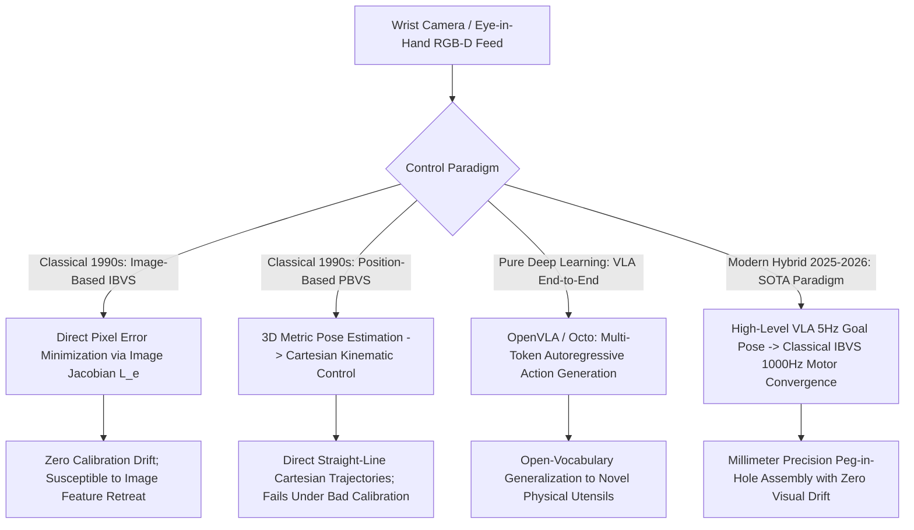

# 📐 Visual Guidance & Robotics: Classical Visual Servoing & Hybrids

A deep mathematical formulation of classical Visual Servoing (Image-Based IBVS, Position-Based PBVS), image Jacobian interaction matrices, kinematic singularity avoidance, and modern hybrid Vision-Language-Action (VLA) controllers.

Related notes: [[topics/visual-guidance-and-robotics/00-visual-guidance-and-robotics-moc|Visual Guidance MOC]], [[topics/visual-guidance-and-robotics/03-controllers-and-open-problems|Controllers & VLA Frontiers]].

---

## 1. Classical Visual Servoing vs. End-to-End Deep VLA Policies

### Visual Guidance Control Paradigms Compared
| Paradigm | Feedback Space | Mathematical Convergence Proof? | Susceptible to Calibration Errors? | Control Loop Frequency | Best Application |
| :--- | :--- | :--- | :--- | :--- | :--- |
| **Image-Based (IBVS)** | 2D Pixel plane $(u, v)$ | **Yes (Lyapunov)** | **No (Self-calibrating)** | **$100-1000\text{ Hz}$** | Precision industrial alignment, docking |
| **Position-Based (PBVS)**| 3D Cartesian frame $\mathbb{R}^3 \times SO(3)$| **Yes** | Yes (Severe) | $100-500\text{ Hz}$ | Large-workspace pick-and-place |
| **Pure VLA ($\pi_0$ / OpenVLA)**| Normalized joint velocities | No (Stochastic) | Moderate | $5-10\text{ Hz}$ | General household kitchen manipulation |
| **Hybrid VLA + IBVS** | 2D Pixel + 3D Cartesian | **Yes (Bounded Error)** | **No** | **$1000\text{ Hz}$ (Dual-rate)** | High-speed precision industrial robotics |

---

## 2. Mathematical Formulations: The Image Jacobian Interaction Matrix

### Image-Based Visual Servoing (IBVS - Chaumette & Hutchinson):
Let $s = (x, y)$ be normalized image coordinates of a visual feature. Its time derivative $\dot{s} = (\dot{x}, \dot{y})$ is linearly related to the 6-DoF camera spatial velocity $v_c = (v_x, v_y, v_z, \omega_x, \omega_y, \omega_z)^T$ through the **Interaction Matrix (Image Jacobian)** $L_s$:

$$\dot{s} = L_s v_c$$

For a 3D point at metric depth $Z$:
$$L_s = \begin{bmatrix} 
-\frac{1}{Z} & 0 & \frac{x}{Z} & x y & -(1 + x^2) & y \\
0 & -\frac{1}{Z} & \frac{y}{Z} & 1 + y^2 & -x y & -x 
\end{bmatrix}$$

To drive image error $e(t) = s(t) - s^*$ exponentially to zero ($\dot{e} = -\lambda e$), the control velocity law is formulated using the Moore-Penrose pseudo-inverse:
$$v_c = -\lambda L_s^+ e = -\lambda (L_s^T L_s)^{-1} L_s^T (s - s^*)$$

This provides **exponential asymptotic stability guaranteed by Lyapunov theory**, ensuring zero steady-state tracking error.

---

## 3. Production Hybrid Pattern: VLA Action Chunking + High-Frequency IBVS

End-to-end Vision-Language-Action (VLA) foundation models (OpenVLA, $\pi_0$) run at only **$5\text{ to }10\text{ Hz}$**, introducing dangerous phase-lag instabilities when attempting tight-tolerance insertions (e.g. threading a needle or plugging a USB cable).

### The Production Two-Layer Controller:
1. **Semantic Foundation Layer ($5\text{ Hz}$)**: The VLA model processes multi-modal camera frames and user natural language prompts, outputting coarse 3D target waypoint goals and target pixel anchor coordinates.
2. **Deterministic Kinematic Layer ($1000\text{ Hz}$)**: A classical **IBVS controller** takes over the low-level motor joint velocities, using high-speed optical flow tracking to drive the end-effector to the target anchor.
3. **Result**: Combines open-world semantic intelligence with microsecond deterministic control stability and millimeter-accurate insertion.
