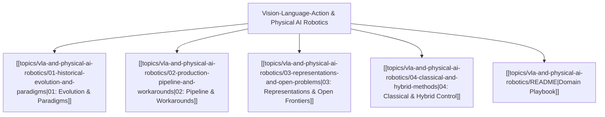

# 🤖 Vision-Language-Action & Physical AI Robotics MOC

## Overview
Vision-Language-Action (VLA) models unify high-level semantic language understanding and open-world visual perception directly with continuous, high-frequency physical motor control ($\Delta x, \Delta y, \Delta z, \Delta\theta, \text{gripper}$). Moving beyond discrete tokens, modern VLAs leverage **diffusion policies** and **flow matching** ($\pi_0$, OpenVLA, Octo) to execute dexterous robotic manipulation.

---

## 🗺️ Master Domain Map

---

## 📚 Core Chapter Navigation
- [[topics/vla-and-physical-ai-robotics/01-historical-evolution-and-paradigms|01: Historical Evolution & Paradigms]]: From RT-1 / RT-2 discrete action tokenization to OpenVLA (7B LLaMA backbone) and $\pi_0$ continuous flow matching.
- [[topics/vla-and-physical-ai-robotics/02-production-pipeline-and-workarounds|02: Production Pipeline & Workarounds]]: Action chunking ($H = 16$ to $64$ timesteps), real-time ROS 2 integration, and mitigating action flickering.
- [[topics/vla-and-physical-ai-robotics/03-representations-and-open-problems|03: Representations & Open Frontiers]]: Flow matching mathematical foundations, World-Action Models (WAMs), and non-Markovian policy traps.
- [[topics/vla-and-physical-ai-robotics/04-classical-and-hybrid-methods|04: Classical & Hybrid Control]]: Dual-system architecture (5 Hz Semantic VLM + 500 Hz Operational Space Control / Impedance Controller).
- [[topics/vla-and-physical-ai-robotics/README|Domain Playbook]]: OpenVLA, Physical Intelligence $\pi_0$, Octo, and LeRobot SDK.

---

## 🔗 Cross-Domain Obsidian Links
- Deeply integrates with [[topics/visual-guidance-and-robotics/00-visual-guidance-and-robotics-moc|Visual Guidance & Robotics MOC]].
- Enforces certified boundaries via [[topics/safety-verification-and-robustness/00-safety-verification-and-robustness-moc|Safety Verification MOC]].
