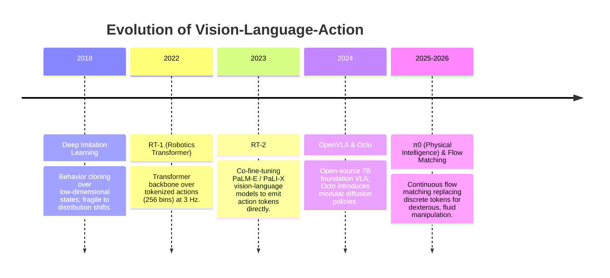

# 📜 Vision-Language-Action: Historical Evolution & Paradigms

From behavioral cloning with CNNs to large-scale Vision-Language-Action foundation models.

Related notes: [[topics/vla-and-physical-ai-robotics/00-vla-and-physical-ai-robotics-moc|VLA Robotics MOC]].

---

## 1. Timeline of Physical AI Breakthroughs

---

## 2. Paradigms & Generational Shifts

- **1st Generation: Discrete Tokenization (RT-1, RT-2, early OpenVLA)**:
  - Discretized continuous end-effector velocities $\Delta x, \Delta y, \Delta z, \Delta\theta$ into 256 uniform bins, reusing standard cross-entropy language losses.
  - *Limitation*: Jerky, stepped robot motion and severe discretization error preventing fine assembly tasks.
- **2nd Generation: Diffusion Policies (Octo, Diffusion Policy, Chi et al.)**:
  - Treats action prediction as reverse denoising of a Gaussian noise trajectory. Naturally models multimodal action distributions (e.g. passing an obstacle to the left vs. right).
- **3rd Generation: Continuous Flow Matching & Action Chunking ($\pi_0$)**:
  - Solves an Ordinary Differential Equation (ODE) generating smooth continuous action chunks ($H = 32$ timesteps) in single-digit inference steps, enabling $50\,\text{Hz}$ dexterous manipulation.
