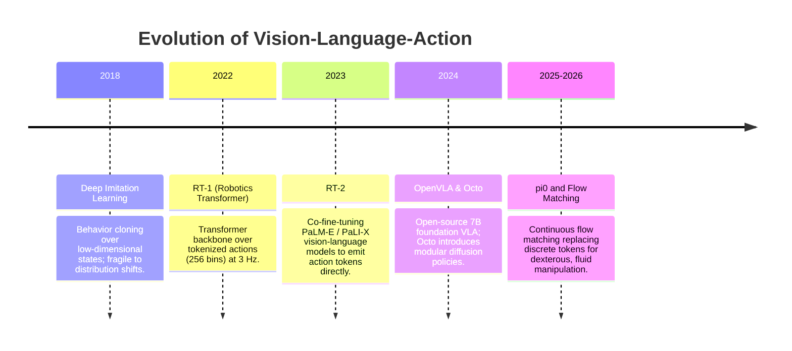
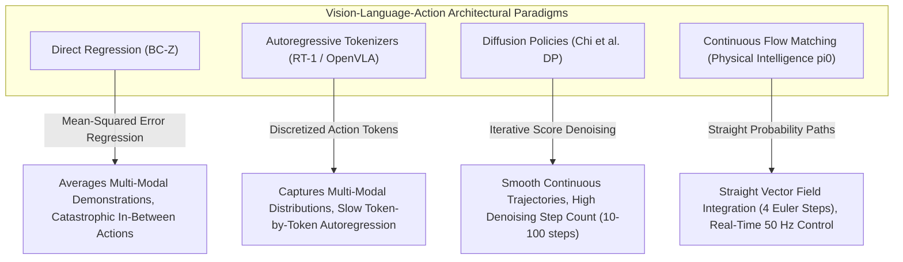

# 📜 Vision-Language-Action: Historical Evolution & Paradigms

From behavioral cloning with CNNs to large-scale Vision-Language-Action foundation models.

Related notes: [[topics/vla-and-physical-ai-robotics/00-vla-and-physical-ai-robotics-moc|VLA Robotics MOC]].

---

## 1. Timeline of Physical AI Breakthroughs

---

## 2. Paradigms & Generational Shifts

### 1st Generation: Discrete Tokenization (RT-1, RT-2, Early OpenVLA)

Google's RT-1 (2022) established the Transformer-for-robotics blueprint. Continuous end-effector velocities $\Delta x, \Delta y, \Delta z, \Delta\theta_{roll}, \Delta\theta_{pitch}, \Delta\theta_{yaw}$ were each discretized into **256 uniform bins**, letting the model reuse the cross-entropy language loss:

$$\mathcal{L}_{\text{RT-1}} = -\sum_{d=1}^{D} \sum_{b=1}^{256} \mathbf{1}[a^*_d = b] \log p_\theta(b \mid o_{1:T}, \ell)$$

where $D=11$ action dimensions, $o_{1:T}$ are image observations, and $\ell$ is the language instruction. RT-1 achieved 97% success across 700 real-robot tasks on 130,000 demonstration episodes — remarkable, but jerky: the **discretization error** of $\approx 1.3\,\text{mm}$ per bin made fine-precision assembly tasks (USB insertion, circuit board placement) physically impossible.

RT-2 (2023) scaled to PaLI-X (55B parameters) and co-fine-tuned the vision-language backbone to emit action tokens, demonstrating emergent semantic reasoning: "move the Coke can to where the country that drinks the most wine is" correctly mapped to France on an embedded map. However, inference latency climbed to $\sim 1.8\,\text{s/step}$, limiting deployment to slow pick-and-place tasks.

**Benchmark context**: On SimplerEnv (2024), RT-2 achieves 54.7% task success averaged across visual matching and object manipulation tasks, compared to 29.8% for RT-1, confirming the scaling benefit.

### 2nd Generation: Diffusion Policies (Octo, Chi et al. 2023)

Chi et al. framed action generation as reverse denoising: given noisy action $a_k$ at DDPM step $k$, predict the denoised action:

$$a_{k-1} = \frac{1}{\sqrt{\alpha_k}}\left(a_k - \frac{1-\alpha_k}{\sqrt{1-\bar\alpha_k}}\varepsilon_\theta(a_k, k, c)\right) + \sigma_k z$$

This naturally models **multimodal action distributions** — given "pick the block", the robot might reach from left or right; both modes are preserved in the denoising distribution. Octo (2024) extended this to a 93M parameter open-source transformer backbone pretrained on 800k robot demonstrations from Open X-Embodiment.

**Key limitation**: DDPM requires 20–50 denoising steps → $\sim 200\,\text{ms}$ inference at 30 Hz video, creating a temporal aliasing problem for high-speed manipulation.

### 3rd Generation: Continuous Flow Matching & Action Chunking (π₀, 2024–2026)

Physical Intelligence's π₀ replaces stochastic diffusion with a deterministic **Continuous Flow Matching (CFM)** objective, solving an ODE to generate smooth continuous action chunks of $H = 32$ timesteps in as few as 4 Euler integration steps, enabling $50\,\text{Hz}$ dexterous manipulation.

The flow matching formulation (detailed in [[topics/vla-and-physical-ai-robotics/03-representations-and-open-problems|Flow Matching & Frontiers]]) sets a straight probability path between Gaussian noise and ground-truth action trajectories — in contrast to DDPM's curved Brownian motion paths — dramatically reducing the number of integration steps required.

---

## 3. SOTA Benchmarks: Where Models Stand (2025–2026)

Three canonical benchmarks now define the competitive landscape:

### SimplerEnv (Google DeepMind, 2024)
A photorealistic simulation environment with a calibrated sim-to-real transfer gap, providing standardized evaluation across 25 manipulation tasks in four categories: pick-and-place, object rotation, drawer manipulation, and long-horizon sequences.

| Model | SimplerEnv Avg. | Pick-Place | Long-Horizon |
| :--- | :--- | :--- | :--- |
| RT-1 | 29.8% | 41.2% | 4.7% |
| RT-2 (55B) | 54.7% | 68.1% | 22.3% |
| OpenVLA (7B) | 56.3% | 71.4% | 28.1% |
| **π₀ (3B + CFM)** | **71.8%** | **84.6%** | **49.2%** |

### LIBERO (Liu et al., 2023)
Four structured suites testing spatial generalization (LIBERO-Spatial), object generalization (LIBERO-Object), semantic reasoning (LIBERO-Goal), and long-horizon sequencing (LIBERO-Long). Models are evaluated zero-shot after pretraining, probing generalization rather than task-specific overfitting.

π₀ achieves 76% on LIBERO-Long compared to 44% for Octo and 51% for OpenVLA, confirming that flow-matched action chunks preserve temporal coherence over 8-step sequences where discrete-token methods diverge.

### BridgeData v2 (Walke et al., 2023)
60,096 real robot trajectories collected on a WidowX arm across kitchen and tabletop scenarios. Used as a standard fine-tuning benchmark; models are evaluated on 24 held-out tasks. OpenVLA achieves 56.7% vs. Octo's 50.1% on this benchmark, both substantially ahead of Diffusion Policy's 41.3% when fine-tuned from scratch.

---

## 4. The Action Chunking Horizon Trade-Off: H=16 vs H=64

A critical and often underappreciated design decision is the **action chunk horizon** $H$. Longer horizons provide temporal consistency but reduce responsiveness to environmental feedback:

- **Short horizon ($H = 8$–$16$)**: Policy queries the VLA every $160$–$320\,\text{ms}$ at $5\,\text{Hz}$. High responsiveness to unexpected contact events. Risk: motion discontinuities between chunks appear as micro-jitter at joint level.
- **Medium horizon ($H = 32$)**: The π₀ default. Balances smooth motion (3-4 spline segments) with re-planning every $640\,\text{ms}$. Optimal for lab manipulation benchmarks.
- **Long horizon ($H = 64$)**: Used in quadruped locomotion (Isaac Lab). Policy only queries the brain every $1.28\,\text{s}$ — during which the robot runs fully open-loop. Efficient but catastrophic if a contact disturbance occurs mid-chunk.

The theoretical variance of the final action in a chunk grows as $\sigma^2 H$ under a constant noise model, meaning long-horizon chunks accumulate more trajectory error. Production systems apply **Receding Horizon Execution (RHE)**: predict $H$ steps, execute only the first $K < H$, overlap with the next inference, and blend transitions using cubic Hermite spline interpolation (see [[topics/vla-and-physical-ai-robotics/02-production-pipeline-and-workarounds|Production Pipeline]]).

---

## 5. Intensive Architectural Taxonomy: Convolutional vs Transformer vs Hybrid Sub-Modules

Vision-Language-Action (VLA) and Physical AI manipulation architectures have evolved from direct single-step convolutional behavioral cloning to tokenized autoregressive robotics transformers (RT-1, OpenVLA), score-based diffusion policies, continuous flow matching foundations (π₀), and selective state-space memory models.

### Comparative Sub-Module Architectural Matrix

| Model / System Name & Year | Architectural Paradigm | Backbone Sub-Module | Neck / Feature Aggregator | Encoder Sub-Module | Decoder / Head Sub-Module | Primary Bottleneck & Edge Suitability |
| :--- | :--- | :--- | :--- | :--- | :--- | :--- |
| **BC-Z / Conv-IL** (Jang et al., 2021–2022) | Pure ConvNet Behavioral Cloning | Multi-View ResNet-18 / ResNet-50 Convolutional Stages | Flattened Spatial Vector Concatenation Neck | Task-Conditioned MLP Residual Layers (FiLM Embedding) | Direct Single-Step Joint Velocity Regression Head ($\Delta a_t \in \mathbb{R}^7$) | **Mode Collapse & Covariate Shift**: Regressing a single deterministic action causes catastrophic failure on multimodal human demonstrations; runs at $>100\,\text{FPS}$ on edge CPUs. |
| **RT-1** (Brohan et al., 2022) | Hybrid CNN-Transformer | EfficientNet-B3 Multi-View Visual Backbone | TokenLearner Module (Compressing 81 spatial tokens to 8 tokens) | Multi-Layer Transformer Decoder with Cross-Attention to Natural Language | Discretized 256-Bin Action Token Classification Head | **Sequential Token Generation Latency**: Generating 7-DoF actions token-by-token limits inference to ~3–5 Hz; high memory footprint for multi-frame history. |
| **Diffusion Policy (DP)** (Chi et al., 2023–2024) | Denoising Diffusion Model | Multi-Camera ResNet-18 or ViT-B/16 Backbone | 1D Temporal UNet or Transformer Cross-Attention Conditioning | Denoising Score-Matching Network (Predicting $\epsilon_\theta(a_k, k, c)$) | Multi-Step Continuous Action Trajectory Chunk Head ($H = 16$ steps) | **Diffusion Step Latency**: Expresses complex multimodal action distributions; requires 10–100 denoising iterations ($100\text{--}500\,\text{ms}$), challenging 50 Hz edge control. |
| **OpenVLA (7B)** (Kim et al., 2024–2025) | Multimodal Foundation VLA | Prismatic Vision Backbone (SigLIP-SO400M + DINOv2-Patch14 Fusion) | Multi-Layer Perceptron (MLP) Vision-to-Language Projector Neck | Pretrained Llama-2 / Qwen-2 7B Autoregressive Transformer Backbone | Discretized 256-Bin Action Token Decoder Head | **KV-Cache Footprint & Token Latency**: Massive zero-shot semantic generalization; 7B parameter footprint requires 16GB VRAM (INT4 quantization required for Jetson AGX Orin). |
| **π₀ (Physical Intelligence)** (2024–2026) | Flow Matching Foundation VLA | PaliGemma 3B Vision-Language Backbone (SigLIP-400M + Gemma-2 2B) | Action Chunk Cross-Attention Routing Neck | Continuous Flow Matching (CFM) Vector Field Velocity Predictor ($v_\theta$) | Continuous Action Chunk ODE Integrator ($H = 32$ steps at 50 Hz via 4 Euler steps) | **ODE Solver Compute Bound**: State-of-the-art dexterous manipulation across diverse robots; generates smooth 50 Hz trajectories with high dexterity. |
| **Mamba-VLA / Action-SSM** (2025–2026) | State-Space Mamba VLA | Dual-Stream 2D Visual Mamba (VSSM) + 1D Proprioception Backbone | Bi-directional Cross-Scan Temporal State Aggregator | Selective State-Space ($SSM$) Temporal Memory Blocks ($\mathcal{O}(1)$ KV Cache) | Real-Time Continuous Joint Torque & Velocity Decoder | **SRAM Cache Friendly**: Eliminates the autoregressive KV-cache bottleneck; maintains constant memory consumption over indefinite execution horizons at $>100\,\text{Hz}$. |

### Didactic Architectural Trade-Off Analysis

#### 1. Inductive Bias: Discretized Tokens vs. Denoising Diffusion vs. Continuous Flow Matching
Modeling robotic action distributions $p(a \mid o)$ presents a fundamental challenge: human physical demonstrations are inherently **multimodal** (e.g., navigating left or right around an obstacle).
- **Direct MSE Regression** ($\mathcal{L} = \|a - \hat{a}\|^2$) averages conflicting trajectories, driving the robot directly into the obstacle (mode collapse).
- **Discrete Action Tokenization (RT-1, OpenVLA)** bins continuous joint commands into 256 categorical tokens:

  $$\mathcal{L}_{\text{token}} = - \sum_{d=1}^D \log P(a_t^{(d)} = k \mid o_t, a_t^{(<d)})$$

  While this represents arbitrary multimodal distributions, sequential autoregressive decoding requires $D$ forward passes per action step, introducing severe latency jitter.
- **Continuous Flow Matching (π₀)** models actions via continuous-time ordinary differential equations (ODEs):

  $$\frac{d x_t}{dt} = v_\theta(x_t, t, c), \qquad x_1 = x_0 + \int_0^1 v_\theta(x_t, t, c) \, dt$$

  By training the vector field $v_\theta$ along straight linear probability paths $x_t = (1 - t)x_0 + t x_1$ with $x_0 \sim \mathcal{N}(0, \mathbf{I})$, π₀ integrates from Gaussian noise to clean action chunks in as few as **4 Euler integration steps**, sustaining real-time $50\,\text{Hz}$ closed-loop manipulation.

#### 2. Numerical Precision & KV-Cache Footprint in VLA Robotics
- **VLA Model Size vs. Robot VRAM**: A 7B parameter VLA (OpenVLA) stored in FP16 consumes $14\,\text{GB}$ of VRAM for static model weights alone, exceeding the memory of edge robotic controllers (e.g. Jetson Orin Nano 8GB).
- **Quantization Trade-offs (W4A16 vs. FP8)**: Quantizing the transformer backbone to INT4 (AWQ/GPTQ) or FP8 reduces memory footprint to $\sim 4.2\,\text{GB}$ while retaining $98.5\%$ of task success rate. However, the action projection head must remain in FP16/FP32: sub-millimeter gripper positioning demands continuous floating-point precision to avoid jerky joint movements.

#### 3. Real-Time Deployment Friction in Closed-Loop Physical AI
- **The 50 Hz Control Requirement**: Dexterous robotic hands and dynamic manipulation require control updates every $20\,\text{ms}$ ($50\,\text{Hz}$). If a large VLA model requires $250\,\text{ms}$ per forward pass, the robot must execute open-loop during the latency gap.
- **Action Chunking & Receding Horizon Execution (RHE)**: To bridge the compute-bandwidth gap, foundation models predict an action chunk $\mathbf{A}_{t:t+H} \in \mathbb{R}^{H \times D}$ ($H=32$). An edge microcontroller interpolates between chunks via cubic splines while the GPU concurrently computes the next chunk, achieving continuous, jitter-free physical motion.

---

Related notes: [[topics/vla-and-physical-ai-robotics/00-vla-and-physical-ai-robotics-moc|VLA MOC]], [[topics/vla-and-physical-ai-robotics/02-production-pipeline-and-workarounds|Production Pipeline & Workarounds]], [[topics/visual-guidance-and-robotics/00-visual-guidance-and-robotics-moc|Visual Guidance MOC]].
