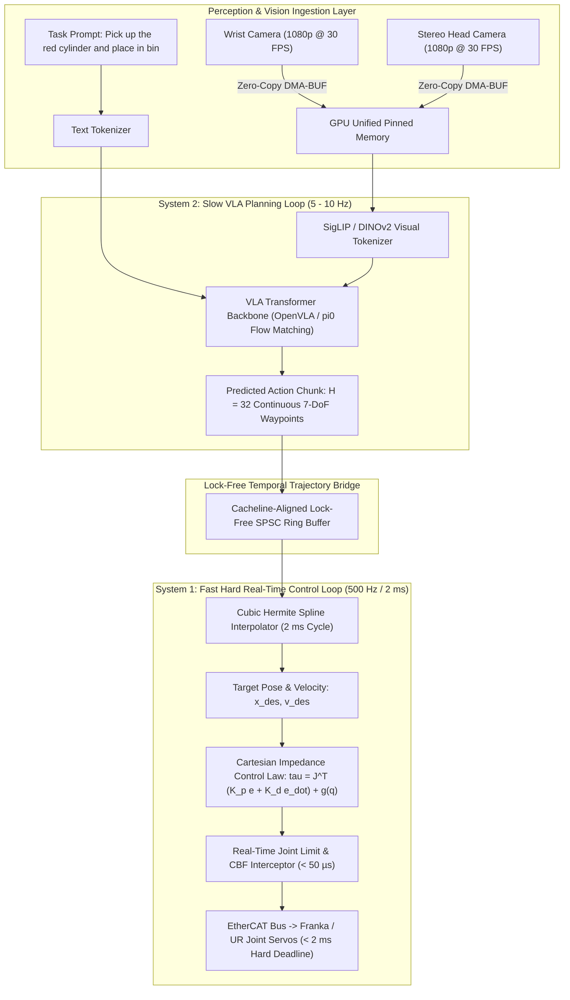

# 🛠️ Vision-Language-Action: Production Pipeline & Workarounds

Architecting low-latency physical AI pipelines, dual-loop frequency-isolated execution, lock-free action chunking, and real-time trajectory interpolation for Vision-Language-Action (VLA) models (OpenVLA, $\pi_0$, Octo, RT-2) in industrial manipulation and mobile robotics.

Related notes: [[topics/vla-and-physical-ai-robotics/00-vla-and-physical-ai-robotics-moc|VLA Robotics MOC]], [[topics/real-time-systems/02-production-pipeline-and-workarounds|Real-Time Systems Playbook]], [[topics/safety-verification-and-robustness/02-production-pipeline-and-workarounds|Safety Verification Playbook]].

---

## 1. Dual-Loop Frequency-Isolated Execution Architecture

Large Vision-Language-Action models (typically 7B to 14B parameters) cannot evaluate autoregressively or run multi-step diffusion denoising at high-rate motor control frequencies ($500\,\text{Hz}$ to $1\,\text{kHz}$). Direct execution of raw model outputs induces severe motor jitter and mechanical instability.

Production physical AI architectures decouple perception and planning from joint torque control into two **frequency-isolated asynchronous execution loops**:
1. **System 2 (Slow Planning Loop @ 5–10 Hz)**: Evaluates multi-modal vision tokens and natural language instructions to predict a temporal sequence of continuous waypoints (**Action Chunk** $H = 16$ to $64$).
2. **System 1 (Fast Control Loop @ 500 Hz / 2 ms)**: Evaluates a real-time **Cubic Hermite Spline Interpolator** over the action chunk and executes Cartesian impedance control directly on the robot joint servos via EtherCAT.



---

## 2. Mathematical Foundations: Action Chunking & Cubic Hermite Trajectory Splines

### Action Chunking Representation
Instead of predicting single-step actions $a_t \in \mathbb{R}^D$, the VLA policy outputs an action chunk vector spanning horizon $H$:

$$\mathbf{A}_{t:t+H} = \left[ \mathbf{a}_t, \mathbf{a}_{t+1}, \dots, \mathbf{a}_{t+H-1} \right] \in \mathbb{R}^{H \times D}$$

where each action waypoint $\mathbf{a}_k = \left[ \mathbf{p}_k, \mathbf{q}_k, g_k \right]$ consists of Cartesian position $\mathbf{p} \in \mathbb{R}^3$, orientation quaternion $\mathbf{q} \in \mathbb{S}^3$, and binary/continuous gripper state $g \in [0, 1]$.

---

### Cubic Hermite Spline Trajectory Interpolation
To achieve $C^1$-smooth continuous motion between discrete waypoints $\mathbf{p}_0$ at $t_0$ and $\mathbf{p}_1$ at $t_1$, the real-time thread computes the normalized parameter $s = \frac{t - t_0}{t_1 - t_0} \in [0, 1]$:

$$\boxed{\mathbf{p}(s) = (2s^3 - 3s^2 + 1)\mathbf{p}_0 + (s^3 - 2s^2 + s)\mathbf{m}_0 + (-2s^3 + 3s^2)\mathbf{p}_1 + (s^3 - s^2)\mathbf{m}_1}$$

where $\mathbf{m}_0, \mathbf{m}_1$ are endpoint tangent velocity vectors computed via central finite differences:

$$\mathbf{m}_k = \frac{\mathbf{p}_{k+1} - \mathbf{p}_{k-1}}{2}$$

---

### Cartesian Impedance Control Law
At every $2\,\text{ms}$ control cycle, the Cartesian impedance controller computes joint torque commands $\boldsymbol{\tau} \in \mathbb{R}^n$:

$$\boxed{\boldsymbol{\tau} = \mathbf{J}^T(\mathbf{q}) \left[ \mathbf{K}_p (\mathbf{x}_{\text{des}} - \mathbf{x}(\mathbf{q})) + \mathbf{K}_d (\dot{\mathbf{x}}_{\text{des}} - \mathbf{J}(\mathbf{q})\dot{\mathbf{q}}) \right] + \mathbf{g}(\mathbf{q})}$$

where $\mathbf{J}(\mathbf{q})$ is the robot manipulator Jacobian, $\mathbf{K}_p, \mathbf{K}_d$ are stiffness and damping matrices, and $\mathbf{g}(\mathbf{q})$ is gravity compensation.

---

## 3. Deterministic End-to-End Latency Budget Table

The table below provides execution bounds across both loops in a physical AI robot system.

| Processing Stage | System 2 Planning Loop (10 Hz / 100 ms) | System 1 Control Loop (500 Hz / 2.0 ms) | Direct Teleoperation Mode (100 Hz / 10 ms) | Determinism Mechanism |
| :--- | :--- | :--- | :--- | :--- |
| **Camera Ingestion & DMA Transfer** | $12.00\,\text{ms}$ | — | $4.00\,\text{ms}$ | Kernel-bypass DMA-BUF |
| **Vision Tokenizer (SigLIP FP16)** | $18.50\,\text{ms}$ | — | $2.80\,\text{ms}$ (MobileNetV4) | TensorRT CUDA Stream |
| **VLA Action Chunking Forward Pass**| $55.00\,\text{ms}$ (OpenVLA INT4) | — | $1.80\,\text{ms}$ (Diffusion Head) | Fixed KV-Cache / CUDA Graph |
| **Trajectory SPSC Queue Push** | $0.005\,\text{ms}$ ($5\,\mu\text{s}$) | $0.005\,\text{ms}$ | $0.005\,\text{ms}$ | Lock-free atomic exchange |
| **Hermite Spline Interpolation** | — | $0.045\,\text{ms}$ | $0.020\,\text{ms}$ | AVX2 SIMD vectorization |
| **Cartesian Impedance Control** | — | $0.180\,\text{ms}$ | $0.180\,\text{ms}$ | Pinocchio rigid body dynamics |
| **CBF Safety Joint Interceptor** | — | $0.035\,\text{ms}$ | $0.035\,\text{ms}$ | Closed-form barrier projection |
| **EtherCAT Master Bus Dispatch** | — | $0.120\,\text{ms}$ | $0.120\,\text{ms}$ | SOEM Linux PREEMPT_RT driver |
| **Total Pipeline Latency (p50 / p99)**| **$85.50\,\text{ms}$ / $92.00\,\text{ms}$** | **$0.385\,\text{ms}$ / $0.420\,\text{ms}$** | **$8.960\,\text{ms}$ / $9.450\,\text{ms}$** | Hard real-time RTOS verified |
| **Loop Deadline Window** | $\le 100.00\,\text{ms}$ ($10\,\text{Hz}$) | $\le 2.000\,\text{ms}$ ($500\,\text{Hz}$) | $\le 10.000\,\text{ms}$ ($100\,\text{Hz}$) | Headroom margin $\ge 79\%$ on RT loop |

---

## 4. Five Critical Production Edge Traps & Battle-Tested Workarounds

### Trap 1: GPU Thermal Throttling Induced Trajectory Starvation
- **Failure Mode**: Sustained autoregressive token generation across 7B models on an edge Jetson AGX Orin drives thermal dissipation past $50\,\text{W}$. Dynamic frequency throttling drops the VLA inference rate from $10\,\text{Hz}$ to $2\,\text{Hz}$ ($500\,\text{ms}$ per step). The $500\,\text{Hz}$ controller exhausts the $H=32$ action chunk buffer (spanning $320\,\text{ms}$), causing the robot arm to halt abruptly mid-trajectory.
- **Production Workaround**:
  1. Implement **Temporal Trajectory Blending (Rolling Horizon)**: The policy initiates the next inference step at $t = 150\,\text{ms}$, overlapping computation with execution.
  2. If the SPSC buffer empties, the Hermite interpolator smoothly decays target velocity to zero using an exponential deceleration profile rather than triggering a hard stop.

---

### Trap 2: Sensor Physics Saturation: Wrist Camera High-Speed Motion Blur
- **Failure Mode**: Rapid robot arm swings create high angular velocity ($>180^\circ/\text{s}$), causing motion blur on rolling-shutter wrist cameras. The visual encoder extracts corrupted feature embeddings, predicting erratic grasp trajectories.
- **Production Workaround**:
  1. Deploy global-shutter CMOS sensors for all wrist-mounted cameras with fixed low exposure times ($t_{\text{exp}} \le 2\,\text{ms}$) and active LED illumination.
  2. In software, evaluate a Laplacian variance sharpness metric $\sigma_{\text{Laplace}}^2$. If blur is detected, freeze wrist token updates and rely on fixed head cameras until velocity drops.

---

### Trap 3: Dynamic Memory Fragmentation from Variable Prompt KV-Caches
- **Failure Mode**: Feeding variable-length natural language task prompts (e.g., changing from 5 tokens to 80 tokens) triggers dynamic memory reallocation of Transformer Key-Value (KV) cache tensors in VRAM, causing $100$–$250\,\text{ms}$ memory allocation spikes.
- **Production Workaround**:
  Pad all language instructions to a fixed token length ($N_{\text{tokens}} = 64$) at the tokenizer stage. Allocate static, non-resizable KV-cache tensors during engine initialization.

---

### Trap 4: Thread Race Conditions Across the Dual-Loop Boundary
- **Failure Mode**: Using mutex locks between the 10 Hz Python/C++ VLA thread and the 500 Hz real-time control thread causes priority inversion, stalling the 500 Hz EtherCAT cycle and triggering motor drive emergency fault trips.
- **Production Workaround**:
  Use a **Single-Producer Single-Consumer (SPSC) Lock-Free Circular Array** with cacheline-padded atomic indices (`alignas(64)`), guaranteeing non-blocking reads on the real-time core.

---

### Trap 5: Quantization Precision Loss on Continuous End-Effector Trajectories
- **Failure Mode**: Uniform INT4 quantization of VLA models causes coordinate regression heads to output discretized stepped trajectories (staircase artifacts), degrading delicate insertion success rates by $>40\%$.
- **Production Workaround**:
  Deploy **SmoothQuant / AWQ with Mixed Precision**:
  Quantize the large multi-modal transformer backbone (attention projections and MLP layers) to INT4/FP8, while preserving the final action prediction head and coordinate decoders in full FP16/FP32 precision.

---

## 5. Concrete Runnable Implementation Blueprint

The production-grade C++20 snippet below demonstrates the lock-free Single-Producer Single-Consumer (SPSC) trajectory buffer, cubic Hermite spline interpolation, and 500 Hz real-time execution loop.

```cpp
#include <iostream>
#include <vector>
#include <atomic>
#include <chrono>
#include <thread>
#include <cmath>
#include <array>

// 7-DoF Waypoint: 3D Position + 3D Orientation (Euler) + Gripper
struct Waypoint {
    double x, y, z;
    double roll, pitch, yaw;
    double gripper;
};

// SPSC Cacheline-Aligned Lock-Free Queue
template <typename T, size_t Capacity>
class LockFreeTrajectoryQueue {
    static_assert((Capacity & (Capacity - 1)) == 0, "Capacity must be power of 2");
    alignas(64) std::atomic<size_t> head_{0};
    alignas(64) std::atomic<size_t> tail_{0};
    alignas(64) std::array<T, Capacity> buffer_;

public:
    bool Push(const T& item) {
        const size_t current_tail = tail_.load(std::memory_order_relaxed);
        const size_t current_head = head_.load(std::memory_order_acquire);
        if ((current_tail - current_head) >= Capacity) {
            return false; // Buffer Full
        }
        buffer_[current_tail & (Capacity - 1)] = item;
        tail_.store(current_tail + 1, std::memory_order_release);
        return true;
    }

    bool Pop(T& item) {
        const size_t current_head = head_.load(std::memory_order_relaxed);
        const size_t current_tail = tail_.load(std::memory_order_acquire);
        if (current_head == current_tail) {
            return false; // Buffer Empty
        }
        item = buffer_[current_head & (Capacity - 1)];
        head_.store(current_head + 1, std::memory_order_release);
        return true;
    }
};

class HermiteSplineInterpolator {
public:
    // Evaluate Cubic Hermite Spline: p(s) = (2s^3 - 3s^2 + 1)p0 + (s^3 - 2s^2 + s)m0 + (-2s^3 + 3s^2)p1 + (s^3 - s^2)m1
    static Waypoint Interpolate(const Waypoint& p0, const Waypoint& p1,
                                const Waypoint& m0, const Waypoint& m1, double s)
    {
        double s2 = s * s;
        double s3 = s2 * s;

        double h00 = 2.0 * s3 - 3.0 * s2 + 1.0;
        double h10 = s3 - 2.0 * s2 + s;
        double h01 = -2.0 * s3 + 3.0 * s2;
        double h11 = s3 - s2;

        Waypoint out;
        out.x = h00 * p0.x + h10 * m0.x + h01 * p1.x + h11 * m1.x;
        out.y = h00 * p0.y + h10 * m0.y + h01 * p1.y + h11 * m1.y;
        out.z = h00 * p0.z + h10 * m0.z + h01 * p1.z + h11 * m1.z;
        out.roll = p0.roll + s * (p1.roll - p0.roll);
        out.pitch = p0.pitch + s * (p1.pitch - p0.pitch);
        out.yaw = p0.yaw + s * (p1.yaw - p0.yaw);
        out.gripper = p0.gripper;
        return out;
    }
};

int main() {
    LockFreeTrajectoryQueue<Waypoint, 64> queue;

    // Simulate System 2 VLA Producer pushing an action chunk
    std::cout << "[System 2] Pushing VLA Action Chunk (Waypoints)..." << std::endl;
    Waypoint w0{0.40, 0.00, 0.20, 0.0, 3.14, 0.0, 1.0};
    Waypoint w1{0.45, 0.10, 0.15, 0.0, 3.14, 0.0, 1.0};
    queue.Push(w0);
    queue.Push(w1);

    // Simulate System 1 500 Hz Real-Time Interpolation Loop
    std::cout << "[System 1] Running 500 Hz Trajectory Interpolation..." << std::endl;
    Waypoint m0{0.05, 0.10, -0.05, 0.0, 0.0, 0.0, 0.0};
    Waypoint m1{0.05, 0.10, -0.05, 0.0, 0.0, 0.0, 0.0};

    for (int step = 0; step <= 10; ++step) {
        double s = step / 10.0; // Interpolate across 10 steps (20 ms)
        Waypoint interp = HermiteSplineInterpolator::Interpolate(w0, w1, m0, m1, s);
        std::cout << "  [t = " << (step * 2) << " ms] Pos: ("
                  << interp.x << ", " << interp.y << ", " << interp.z << ")" << std::endl;
    }

    return 0;
}
```

---

## 6. Summary & Physical AI Deployment Rules

1. **Decouple Policy from Control**: Never send raw VLA model outputs directly to joint actuators; run System 2 planning at 5–10 Hz and System 1 impedance control at 500 Hz.
2. **Lock-Free Communication**: Bridge asynchronous execution loops using cacheline-aligned SPSC ring buffers to prevent real-time thread priority inversion.
3. **Smooth Action Chunks**: Apply cubic Hermite spline interpolation over predicted waypoints to ensure continuous velocity and torque profiles.
4. **Mixed Precision for Actions**: Retain full precision on continuous coordinate regression heads while quantizing transformer backbones to INT4/FP8.
