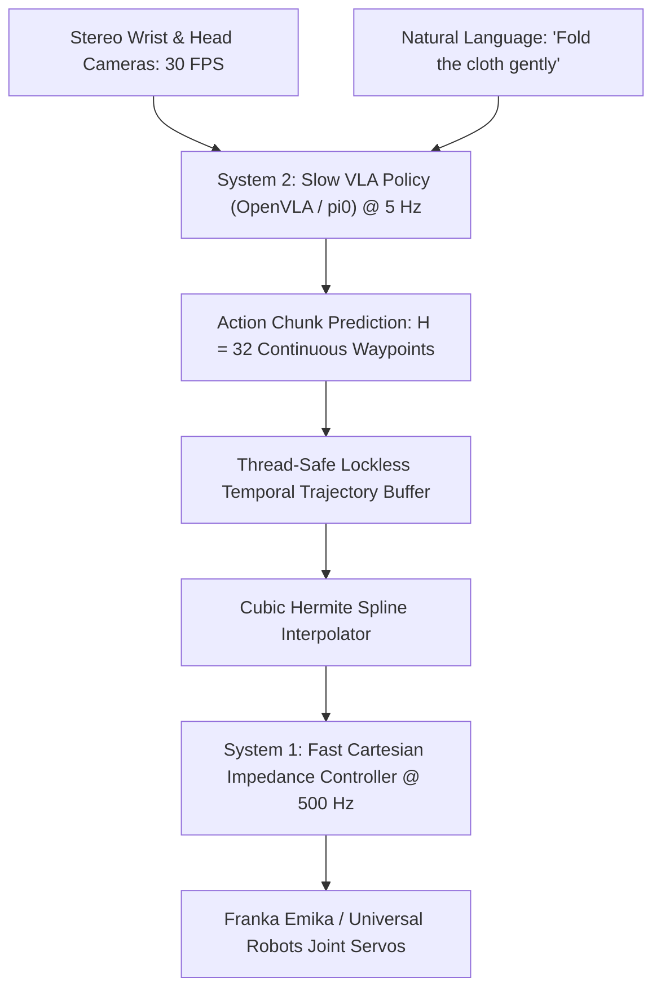

# 🛠️ Vision-Language-Action: Production Pipeline & Workarounds

Architecting low-latency physical AI pipelines, action chunk execution, and real-world robot deployment.

Related notes: [[topics/vla-and-physical-ai-robotics/00-vla-and-physical-ai-robotics-moc|VLA Robotics MOC]].

---

## 1. Production Dual-Loop Execution Pipeline

Because 7B VLA models cannot infer at $500\,\text{Hz}$ motor update rates, production robotics decouples perception from motor execution:

---

## 2. Hard Real-World Production Gotchas & Workarounds

### 1. Action Flickering & Causal Non-Smoothness:
- **Problem**: Querying an unconditioned VLA at every single timestep causes the robot arm to shudder violently because subsequent inferences alternate between multimodal choices.
- **Fix**: **Action Chunking with Receding Horizon Execution (RHE)**:
  - Predict a horizon of $H = 32$ future actions.
  - Execute only the first $K = 8$ steps ($250\,\text{ms}$) while running the next inference in a background thread.
  - Blend overlapping trajectories using **Exponential Moving Average (EMA)** smoothing:
    $$a_t = \sum_{i=0}^{N_{\text{active}}} w_i \cdot a_t^{(i)}$$

### 2. High Inference Latency on Edge Workstations:
- **Problem**: Full FP16 inference of OpenVLA (7B) takes $\sim 280\,\text{ms}$ on an RTX 4090, violating responsiveness budgets.
- **Fix**: Apply **INT4 AWQ / W4A16 Quantization** to the vision-language backbone combined with FlashAttention-2, reducing latency to $<65\,\text{ms}$ ($>15\,\text{Hz}$ inference).

### 3. Out-of-Distribution Motor Runaways:
- **Problem**: A visual anomaly or lighting change causes the VLA to emit unphysical joint velocities.
- **Fix**: Enforce an **Operational Space Saturation Layer** in C++ before joint inverse kinematics:
  $$\|v_{\text{command}}\| \le v_{\text{certified\_max}} \quad (0.35\,\text{m/s})$$
  Any command exceeding acceleration envelopes is clamped, ensuring physical human safety.
