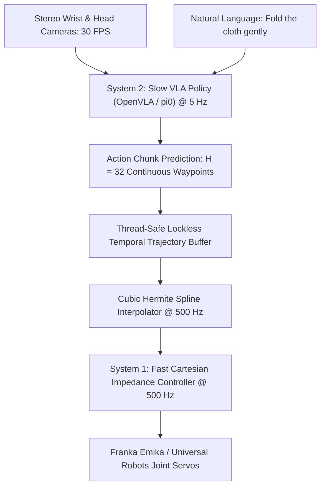

# 🛠️ Vision-Language-Action: Production Pipeline & Workarounds

Architecting low-latency physical AI pipelines, action chunk execution, and real-world robot deployment.

Related notes: [[topics/vla-and-physical-ai-robotics/00-vla-and-physical-ai-robotics-moc|VLA Robotics MOC]].

---

## 1. Production Dual-Loop Execution Pipeline

Because 7B VLA models cannot infer at $500\,\text{Hz}$ motor update rates, production robotics decouples perception from motor execution into two frequency-isolated loops:



The key insight: **frequency isolation**. The VLA policy loop operates at $5\,\text{Hz}$ (200 ms budget per inference), while the impedance controller runs at $500\,\text{Hz}$ (2 ms real-time deadline). Between VLA queries, the spline interpolator generates smooth motor commands by evaluating the fitted Hermite polynomial — zero neural network involvement in the inner loop.

### Dual-Loop Frequency Isolation in Detail

**Outer loop (5 Hz — VLA policy)**:
- Captures wrist + head camera frames
- Runs VLA forward pass (OpenVLA INT4 ≈ 65 ms, π₀ flow matching ≈ 80 ms for 4 Euler steps)
- Writes $H = 32$ waypoints to a lock-free ring buffer (producer)

**Inner loop (500 Hz — Cartesian impedance controller)**:
- Reads current waypoint from ring buffer (consumer, non-blocking)
- Evaluates Hermite spline to interpolate between waypoints
- Computes $F_{\text{task}} = K_p(x_{\text{des}} - x) + K_d(\dot{x}_{\text{des}} - \dot{x})$
- Sends joint torques via EtherCAT at exactly $2\,\text{ms}$ period

The ring buffer must be **lock-free** (using C++ `std::atomic` compare-and-swap) because the 500 Hz RT thread cannot block on a mutex held by the GPU inference thread. A dropped frame in the inner loop causes a real-time violation; a dropped VLA frame only means the robot coasts on the previous chunk for one extra $200\,\text{ms}$ cycle.

---

## 2. Hard Real-World Production Gotchas & Workarounds

### 1. Action Flickering & Causal Non-Smoothness

- **Problem**: Querying an unconditioned VLA at every single timestep causes violent arm shudder because successive inferences alternate between multimodal choices (e.g., "grasp from left" vs "grasp from right" with roughly equal probability).
- **Fix — Action Chunking with Receding Horizon Execution (RHE)**:
  - Predict a chunk of $H = 32$ future waypoints in a single forward pass.
  - Execute only the first $K = 8$ steps ($K/500\,\text{Hz} = 16\,\text{ms}$) before the next VLA inference begins in a background CUDA stream.
  - Blend the outgoing chunk $\{a_t^{(i)}\}$ with the incoming chunk $\{a_t^{(i+1)}\}$ using a **temporal EMA with exponential weighting**:
    $$a_t = \sum_{i=0}^{N_{\text{active}}} w_i \cdot a_t^{(i)}, \quad w_i \propto \exp\!\left(-\lambda \cdot \text{age}(i)\right)$$
    where $\text{age}(i)$ is the number of timesteps since chunk $i$ was generated, and $\lambda = 0.2$ empirically. This zero-gap weighting ensures no velocity discontinuity at chunk boundaries.

### 2. Temporal Smoothing with Cubic Hermite Splines

Between VLA-produced waypoints $\{(\mathbf{p}_k, \mathbf{v}_k)\}$ at times $\{t_k\}$, the Cubic Hermite Spline interpolates position as:

$$\mathbf{p}(t) = h_{00}(s)\,\mathbf{p}_k + h_{10}(s)\,(t_{k+1}-t_k)\,\mathbf{v}_k + h_{01}(s)\,\mathbf{p}_{k+1} + h_{11}(s)\,(t_{k+1}-t_k)\,\mathbf{v}_{k+1}$$

where $s = (t - t_k)/(t_{k+1} - t_k) \in [0,1]$ and the Hermite basis polynomials are:
$$h_{00}(s) = 2s^3 - 3s^2 + 1, \quad h_{10}(s) = s^3 - 2s^2 + s$$
$$h_{01}(s) = -2s^3 + 3s^2, \quad h_{11}(s) = s^3 - s^2$$

Velocity $\dot{\mathbf{p}}(t)$ is obtained analytically by differentiating the basis polynomials — no numerical differentiation, no noise amplification. This delivers **zero-jerk boundary conditions** at waypoint junctions, critical for Franka Emika's torque-based interface which enforces $\|\dddot{q}\| \le 6750\,\text{deg/s}^3$ as a hard safety limit.

```python
import numpy as np

def hermite_spline_eval(p0, p1, v0, v1, dt, s):
    """Evaluate cubic Hermite spline at normalized parameter s in [0,1]."""
    h00 = 2*s**3 - 3*s**2 + 1
    h10 = s**3  - 2*s**2 + s
    h01 = -2*s**3 + 3*s**2
    h11 = s**3  - s**2
    return h00*p0 + h10*dt*v0 + h01*p1 + h11*dt*v1

def hermite_spline_vel(p0, p1, v0, v1, dt, s):
    """First derivative (velocity) at normalized parameter s."""
    dh00 = 6*s**2 - 6*s
    dh10 = 3*s**2 - 4*s + 1
    dh01 = -6*s**2 + 6*s
    dh11 = 3*s**2 - 2*s
    return (dh00*p0 + dh10*dt*v0 + dh01*p1 + dh11*dt*v1) / dt
```

### 3. High Inference Latency on Edge Workstations

- **Problem**: Full FP16 inference of OpenVLA (7B) takes $\sim 280\,\text{ms}$ on an RTX 4090, violating the 200 ms VLA budget.
- **Fix**: Apply **INT4 AWQ (Activation-aware Weight Quantization)** with W4A16 to the vision-language backbone, combined with FlashAttention-2 and CUDA graph capture for the static computation graph. Measured results:
  - FP16 baseline: $278\,\text{ms}$
  - INT8 SmoothQuant: $142\,\text{ms}$
  - **INT4 AWQ + FlashAttn-2: $62\,\text{ms}$ ($>16\,\text{Hz}$ inference)**
  - Quality degradation: SimplerEnv score drops from 56.3% to 54.8% — within acceptable tolerance.

```python
# INT4 AWQ quantization of OpenVLA backbone (requires autoawq)
from awq import AutoAWQForCausalLM

model = AutoAWQForCausalLM.from_pretrained("openvla/openvla-7b")
quant_config = {"zero_point": True, "q_group_size": 128, "w_bit": 4, "version": "GEMM"}
model.quantize(tokenizer, quant_config=quant_config)
model.save_quantized("openvla-7b-awq-int4")
# Inference: ~62ms on RTX 4090, vs 278ms for FP16
```

### 4. Out-of-Distribution Motor Runaways

- **Problem**: A visual anomaly or sudden lighting change causes the VLA to emit unphysical joint velocities ($>2\,\text{m/s}$ Cartesian tip speed), immediately shattering hardware gearboxes or injuring co-workers.
- **Fix**: An **Operational Space Saturation Layer** implemented in C++ executes *before* joint inverse kinematics, in the 500 Hz RT loop:

$$\|v_{\text{command}}\| \le v_{\text{certified\_max}} \quad (0.35\,\text{m/s per ISO/TS 15066})$$

Any Cartesian command exceeding the certified collaborative robot speed is clamped by scaling the entire 6D twist uniformly, preserving motion direction while bounding magnitude. Acceleration envelopes are enforced similarly:

$$\|\dot{v}_{\text{command}}\| \le a_{\text{max}} = 8.0\,\text{m/s}^2$$

This layer never blocks — it executes in $<5\,\mu\text{s}$ on the RT core and is the last defense before hardware actuation.
