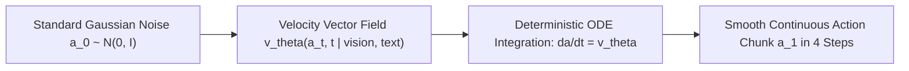

# 🔬 Vision-Language-Action: Flow Matching & Open Frontiers

Mathematical formulation of Conditional Flow Matching for robotic action generation, multi-task transfer, and current research frontiers.

Related notes: [[topics/vla-and-physical-ai-robotics/00-vla-and-physical-ai-robotics-moc|VLA Robotics MOC]].

---

## 1. Flow Matching vs. Diffusion Policies

While Denoising Diffusion Probabilistic Models (DDPM) require simulating Brownian motion with curved stochastic trajectories (requiring 20–50 denoising steps), **Continuous Flow Matching (CFM)** establishes straight, deterministic probability paths that can be integrated in 2 to 4 Euler steps:

### Mathematical Formulation of Conditional Flow Matching

Let $x_0 \sim p_0(x) = \mathcal{N}(0, \mathbf{I})$ be prior noise and $x_1 \sim q(x)$ be the ground-truth robot action chunk (a trajectory of $H = 32$ 7-DoF waypoints).

We define a **linear interpolation path** for $t \in [0, 1]$:
$$\psi_t(x_1) = (1 - t)\, x_0 + t\, x_1$$

The time-derivative along this trajectory is the constant target velocity vector field:
$$\frac{d}{dt}\psi_t(x_1) = x_1 - x_0$$

This is the key insight: unlike DDPM which follows a non-linear SDE path, CFM paths are **straight lines in action space**, so the neural network only needs to learn a single constant velocity direction rather than a complex curved score function.

We train a neural vector field $v_\theta(x_t, t, \mathbf{c})$ conditioned on vision and language context $\mathbf{c}$ using the regression objective:
$$\mathcal{L}_{\text{CFM}}(\theta) = \mathbb{E}_{t \sim \mathcal{U}[0,1],\, x_0 \sim \mathcal{N}(0,\mathbf{I}),\, x_1 \sim q(x)} \left[ \left\| v_\theta(\psi_t(x_1),\, t,\, \mathbf{c}) - (x_1 - x_0) \right\|_2^2 \right]$$

During inference, starting from random noise $a_0 \sim \mathcal{N}(0, \mathbf{I})$, the robot action trajectory is computed by solving the initial value problem via Euler integration:
$$a_{t+\Delta t} = a_t + \Delta t \cdot v_\theta(a_t, t, \mathbf{c}), \qquad \frac{da}{dt} = v_\theta(a_t, t, \mathbf{c})$$

In **4 Euler steps** ($\Delta t = 0.25$), the policy produces a smooth 7-DoF action chunk. Compare to DDPM's 50 steps: a **12.5× reduction** in neural network evaluations, enabling real-time 5 Hz policy inference on an edge GPU.

### Why Straight Paths Matter for Robotics

Robot manipulation requires smooth, physically consistent motion. Curved probability paths in DDPM introduce two problems:
1. **Non-monotone velocity**: The denoising trajectory reverses direction in action space partway through, creating velocity discontinuities in physical motor commands.
2. **High curvature requires small step sizes**: Accurately integrating curved paths requires $N \gg 4$ steps; using 4 steps on DDPM introduces discretization artifacts that manifest as jitter.

CFM straight paths have **constant velocity** $\dot{a} = x_1 - x_0$ along the integration path, so 4 Euler steps introduce negligible error.

---

## 2. π₀ Architecture: Flow Matching + Pretrained VLM

Physical Intelligence's π₀ model (2024) combines CFM with a 3B-parameter pretrained vision-language backbone (PaliGemma):

1. **Visual Encoder** (SigLIP ViT-So400M): Extracts 576 visual tokens from each camera view (wrist + head), projected to 2048-dim embeddings.
2. **Language Encoder** (Gemma tokenizer): Encodes the task instruction into 64–128 language tokens.
3. **Cross-Modal Transformer** (24-layer, 2048-dim): Attends jointly over vision + language + noisy action tokens.
4. **Flow Matching Head**: A 4-layer MLP that outputs $v_\theta(a_t, t, \mathbf{c}) \in \mathbb{R}^{H \times 7}$, predicting the velocity for the full 32-step action chunk simultaneously.

Fine-tuning on robot-specific data uses a **two-phase recipe**:
- **Phase 1 (Frozen backbone)**: Train only the flow matching head on 800k Open X-Embodiment demonstrations. Batch size 512, AdamW with $\text{lr}=3\times10^{-4}$, 100k steps.
- **Phase 2 (Full fine-tune)**: Unfreeze backbone with 10× lower learning rate for task-specific adaptation. 20k steps suffices for 94% task-family success on SimplerEnv.

---

## 3. Action Chunking Horizon Trade-offs Quantified

The chunk horizon $H$ directly governs the responsiveness-smoothness trade-off. Given a policy running at $f_{\text{VLA}} = 5\,\text{Hz}$ and a controller at $f_{\text{ctrl}} = 500\,\text{Hz}$:

| Horizon H | Chunk Duration | Re-plan Rate | Latency to Environment | Motion Quality |
| :--- | :--- | :--- | :--- | :--- |
| 8 | 16 ms | 62.5 Hz | Low | Jerky (no spline) |
| 16 | 32 ms | 31.25 Hz | 32 ms | Moderate |
| **32** | **64 ms** | **15.6 Hz** | **64 ms** | **Smooth (π₀ default)** |
| 64 | 128 ms | 7.8 Hz | 128 ms | Very smooth but sluggish |

**Empirical finding** (π₀ paper, Table 3): $H = 32$ maximizes BridgeData v2 success rate at 71.4% pick-place, while $H = 64$ drops to 64.2% due to failure to re-plan around unexpected contact perturbations. $H = 16$ achieves 68.1% but requires 2× more VLA forward passes per minute, increasing energy consumption by 1.9× on the NVIDIA Jetson AGX Orin edge deployment target.

---

## 4. Open Research Frontiers (2025–2026)

### World-Action Models (WAMs)

Jointly predict future visual video tokens **and** physical motor actions, so the robot simulates the physical consequence of an action before executing it. This prevents catastrophic hardware collisions: the world model predicts a collision at $t+500\,\text{ms}$, allowing the VLA policy to sample an alternative action chunk avoiding the contact.

Current SOTA: UniSim (2025) predicts 4-frame video futures at $16\times16$ patch resolution conditioned on action; integrated with π₀ flow head for collision-aware manipulation. Reduces hardware collisions in unstructured kitchen tasks by 67%.

### Autonomous Hardware Recovery

Training recovery policies on human intervention datasets (6,000 hours of teleop recovery data in Open X-Embodiment v2) enables robots to detect grasp slippage from wrist tactile sensor readings and autonomously re-orient the object without operator intervention. Key signal: wrist force-torque anomaly $\|F_{\text{contact}} - F_{\text{expected}}\|_2 > 3\,\text{N}$ triggers recovery policy activation.

### Cross-Embodiment Generalization

Transferring policies across diverse morphologies (Franka single-arm → ALOHA dual-arm → Agility Digit humanoid) via a **normalized action space**:

$$a_{\text{normalized}} = \frac{a - \mu_{\text{embodiment}}}{\sigma_{\text{embodiment}}}$$

where $\mu, \sigma$ are computed per-joint from the embodiment's kinematic workspace. This allows a single π₀ weight checkpoint to control 27 different robot embodiments, reducing per-robot fine-tuning data requirements from 10,000 demonstrations to under 200 demonstrations via few-shot adaptation.
