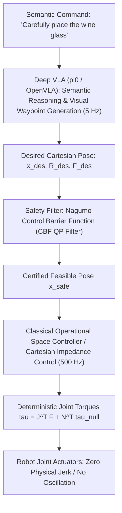

# 📐 Vision-Language-Action: Classical Control & Hybrid Architectures

Bridging stochastic deep foundation models with deterministic classical impedance control, Operational Space Control (OSC), and formal safety verification.

Related notes: [[topics/vla-and-physical-ai-robotics/00-vla-and-physical-ai-robotics-moc|VLA Robotics MOC]], [[topics/safety-verification-and-robustness/04-classical-and-hybrid-methods|Safety Verification Foundations]].

---

## 1. The Classical Control vs. Deep VLA Hierarchy

---

## 2. Mathematical Formulations: Cartesian Impedance Control

Never let a neural network output raw motor joint currents or torques directly. A neural glitch can immediately shatter hardware gearboxes. Instead, let the VLA output a virtual equilibrium attractor $x_{\text{des}} \in \mathbb{R}^6$, and let a classical **Cartesian Impedance Controller** compute compliant torques:

$$F_{\text{task}} = K_p (x_{\text{des}} - x) + K_d (\dot{x}_{\text{des}} - \dot{x})$$
Where:
- $K_p \in \mathbb{R}^{6 \times 6}$: Virtual Cartesian stiffness matrix.
- $K_d \in \mathbb{R}^{6 \times 6}$: Virtual Cartesian damping matrix.

The required joint torques $\tau \in \mathbb{R}^n$ are mapped through the robot's **Kinematic Jacobian** $J(q)$:
$$\tau = J^T(q) F_{\text{task}} + \tau_{\text{gravity}}(q) + (I - J^T \bar{J}^T) \tau_{\text{null}}$$
Where:
- $\tau_{\text{gravity}}(q)$: Analytical gravity compensation.
- $(I - J^T \bar{J}^T) \tau_{\text{null}}$: Nullspace projection allowing secondary posture optimization (e.g. maximizing manipulability) without disturbing the primary end-effector position.

---

## 3. Mission-Critical Verification in Non-Certified Scenarios

When deploying generative AI / VLAs in critical settings (aerospace assembly, medical robotics, nuclear inspection) where generative outputs are not certifiable:
1. **Sandboxed Action Bounds**:
   The VLA output is treated strictly as an **unverified recommendation**. The classical safety executive verifies:
   - Does $x_{\text{des}}$ violate the physical robot joint limit envelopes?
   - Does the velocity $\dot{x}$ violate ISO 10218 / ISO/TS 15066 collaborative robot speed limits ($<250\,\text{mm/s}$)?
   - Does the trajectory intersect any registered obstacle in the safety octree?
2. **Deterministic Fallback**: If any safety constraint is breached, the classical controller engages dynamic braking within $2\,\text{ms}$, holding the arm stationary while alerting human operators.
