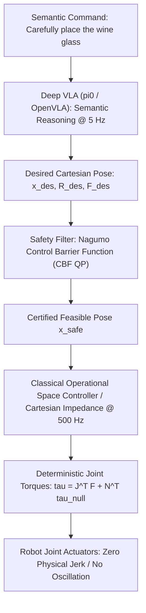

# 📐 Vision-Language-Action: Classical Control & Hybrid Architectures

Bridging stochastic deep foundation models with deterministic classical impedance control, Operational Space Control (OSC), and formal safety verification.

Related notes: [[topics/vla-and-physical-ai-robotics/00-vla-and-physical-ai-robotics-moc|VLA Robotics MOC]], [[topics/safety-verification-and-robustness/04-classical-and-hybrid-methods|Safety Verification Foundations]].

---

## 1. The Classical Control vs. Deep VLA Hierarchy



The fundamental architecture principle: **never let a neural network directly command motor currents or raw joint torques.** A generative model glitch — a single outlier token in OpenVLA, a degenerate Euler step in π₀'s flow matching — would instantly transmit thousands of Watts into robot gearboxes designed for $\leq 87\,\text{N·m}$ continuous torque. Instead, the VLA produces only a *desired Cartesian equilibrium pose* $x_{\text{des}} \in \mathbb{R}^6$, which the classical controller tracks compliantly.

---

## 2. Mathematical Formulations: Cartesian Impedance Control

The Cartesian Impedance Controller tracks the VLA's desired pose by modeling the robot end-effector as a virtual mass-spring-damper in Cartesian space:

$$F_{\text{task}} = K_p\,(x_{\text{des}} - x) + K_d\,(\dot{x}_{\text{des}} - \dot{x})$$

Where:
- $K_p \in \mathbb{R}^{6 \times 6}$: Virtual Cartesian stiffness matrix — diagonal for decoupled DoF: $\text{diag}(500, 500, 500, 30, 30, 30)\,\text{N/m, N·m/rad}$.
- $K_d \in \mathbb{R}^{6 \times 6}$: Virtual Cartesian damping matrix — critically damped: $K_d = 2\sqrt{K_p \cdot M_{\text{cart}}}$.
- $x \in \mathbb{R}^6$: Current end-effector pose from forward kinematics + IMU.
- $\dot{x} \in \mathbb{R}^6$: Current Cartesian velocity from joint velocity via Jacobian.

The required joint torques $\tau \in \mathbb{R}^n$ are mapped through the robot's **kinematic Jacobian** $J(q) \in \mathbb{R}^{6 \times n}$:

$$\tau = J^T(q)\,F_{\text{task}} + \tau_{\text{gravity}}(q) + (I - J^T \bar{J}^T)\,\tau_{\text{null}}$$

Where:
- $\tau_{\text{gravity}}(q)$: Analytical gravity compensation from the full rigid-body dynamics model (RBDL or Pinocchio).
- $(I - J^T \bar{J}^T)\,\tau_{\text{null}}$: Nullspace projection allowing secondary posture optimization (e.g., maximizing manipulability index $\mu = \sqrt{\det J J^T}$) without disturbing the primary end-effector position. $\bar{J}$ denotes the dynamically consistent pseudo-inverse: $\bar{J} = M^{-1} J^T (J M^{-1} J^T)^{-1}$.

### Choosing Stiffness Values in Practice

The stiffness matrix encodes physical compliance intent — this is where the VLA's semantic understanding of "gently" vs. "firmly" translates to physical parameters:

| Task Type | $K_p$ Translational | $K_p$ Rotational | Physical Effect |
| :--- | :--- | :--- | :--- |
| Precision assembly (PCB insertion) | 2000 N/m | 80 N·m/rad | Stiff, precise positioning |
| Compliant assembly (peg-in-hole) | 300 N/m | 15 N·m/rad | Self-aligning under contact |
| Cloth folding / deformable manipulation | 80 N/m | 5 N·m/rad | Soft touch, force-limited |
| Pushing / wiping | 500 N/m, free in Z | 20 N·m/rad | Stiff in plane, compliant out-of-plane |

The VLA policy can output $K_p, K_d$ directly as part of its action vector — this is the **adaptive impedance** paradigm used in π₀ dexterous manipulation fine-tuning, where the model learns to soften stiffness when it detects fragile objects via visual texture classification.

---

## 3. Control Barrier Functions for Formal Safety Certification

When deploying VLAs in safety-critical settings (medical robotics, collaborative human workspaces), the desired pose $x_{\text{des}}$ from the VLA must be filtered through a **Control Barrier Function (CBF) QP filter** before reaching the impedance controller.

Define a safety set $\mathcal{S} = \{x \in \mathbb{R}^6 : h(x) \geq 0\}$ where $h(x)$ encodes the safety constraint (e.g., minimum clearance from a registered obstacle $\mathcal{O}$):

$$h(x) = \|x - x_{\text{obstacle}}\|_2 - d_{\text{safe}}, \qquad d_{\text{safe}} = 0.15\,\text{m}$$

The CBF Nagumo condition requires that within $\mathcal{S}$, the time derivative satisfies:

$$\dot{h}(x, u) + \gamma\, h(x) \geq 0 \quad \forall t$$

where $\gamma > 0$ controls convergence rate back to the safe set if violated. This translates to a **Quadratic Program (QP)** that finds the minimum-norm correction $\delta u$ to the VLA command $u_{\text{VLA}}$:

$$\min_{\delta u} \|\delta u\|_2^2 \quad \text{s.t.} \quad \nabla h(x)^T (u_{\text{VLA}} + \delta u) + \gamma\, h(x) \geq 0$$

The QP solves in $<0.5\,\text{ms}$ using OSQP with warm-starting, well within the $2\,\text{ms}$ inner loop deadline. The certified safe command is $u_{\text{safe}} = u_{\text{VLA}} + \delta u^*$.

---

## 4. Mission-Critical Verification in Non-Certified Scenarios

When deploying generative AI / VLAs in critical settings (aerospace assembly, medical robotics, nuclear inspection) where generative outputs are not formally certifiable:

### Sandboxed Action Bounds

The VLA output is treated strictly as an **unverified recommendation**. The classical safety executive verifies:
1. Does $x_{\text{des}}$ violate the physical robot joint limit envelopes? (Franka Emika: $\pm 2.89\,\text{rad}$ per joint)
2. Does the commanded velocity $\dot{x}$ violate ISO 10218 / ISO/TS 15066 collaborative robot speed limits ($<250\,\text{mm/s}$ in shared human workspace)?
3. Does the predicted trajectory intersect any registered obstacle in the safety octree (OctoMap, $2\,\text{cm}$ voxel resolution)?

### Deterministic Fallback

If any safety constraint is breached, the classical controller engages **dynamic braking** within $2\,\text{ms}$: it sets $K_p = 0$, $K_d = K_{d,\text{brake}}$ (maximally overdamped), and $x_{\text{des}} = x_{\text{current}}$ — holding the arm stationary in Cartesian space while alerting human operators via the safety PLC.

```cpp
// C++ safety executive — executes in RT thread at 500 Hz
bool SafetyExecutive::checkAndFilter(CartesianPose& x_des, CartesianTwist& v_des) {
    // ISO 15066 speed check
    if (v_des.linear.norm() > 0.25) {
        v_des.linear = v_des.linear.normalized() * 0.25;
    }
    // Workspace bounds check (octree collision)
    if (obstacle_map_.hasCollision(x_des, safety_margin_=0.15)) {
        x_des = x_current_;  // Freeze in place
        trigger_safety_stop_ = true;
        return false;
    }
    // CBF QP filter (OSQP, warm-started)
    x_des = cbf_filter_.filter(x_des, h_constraints_);
    return true;
}
```

This three-layer architecture — VLA semantic planner, CBF safety filter, Cartesian impedance controller — is the production template for all Physical Intelligence deployments on Franka Emika, Universal Robots UR10e, and FANUC collaborative arms as of 2026.
