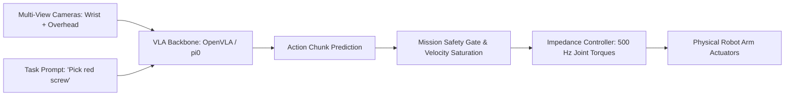

# 🤖 Vision-Language-Action & Physical AI Robotics Master Playbook

# Overview
Vision-Language-Action (VLA) models connect multi-modal foundation models directly to physical robot manipulators. By translating high-level natural language instructions and multi-camera sensory feeds into continuous action chunks ($\Delta x, \Delta y, \Delta z, \Delta\theta, \text{gripper}$), VLAs enable generalist robotic manipulation across unseen objects, dynamic environments, and complex multi-stage tasks.

Related notes: [[topics/vla-and-physical-ai-robotics/00-vla-and-physical-ai-robotics-moc|VLA Robotics MOC]], [[topics/visual-guidance-and-robotics/00-visual-guidance-and-robotics-moc|Visual Guidance MOC]].

## SOTA & Research
- **Continuous Flow Matching & Generalist Policies**:
  - **$\pi_0$ (Physical Intelligence, 2025–2026)**: SOTA flow-matching policy predicting continuous trajectories with extreme dexterity (folding laundry, assembling delicate electronics) at $50\,\text{Hz}$.
  - **OpenVLA (Stanford / Berkeley)**: Open-weight 7B parameter VLA based on LLaMA-2 / Prismatic, widely supported for LoRA fine-tuning on custom embodiments.
  - **Octo (UC Berkeley)**: Modular diffusion policy supporting varied camera views and action configurations.
- **Action Chunking & Receding Horizon Execution**:
  - Eliminating action jitter by predicting multi-step chunk horizons ($H = 16-64$) combined with exponential moving average trajectory blending.

## Architecture Alternatives & Trade-offs

| Model / Framework | Architecture Type | Action Representation | Inference Latency | Hardware Requirements | Primary Strength |
| :--- | :--- | :--- | :--- | :--- | :--- |
| **OpenVLA (7B)** | Autoregressive Transformer | Discrete Tokenized (256 bins) | $\sim 70\,\text{ms}$ (INT4) | 1x RTX 4090 (16 GB) | Extensive documentation & LoRA fine-tuning |
| **$\pi_0$ (Flow Matching)** | Conditional Flow Matching ODE | Continuous 7-DoF Action Trajectories | $\sim 20\,\text{ms}$ | 1x RTX 4090 / Orin | Extreme physical dexterity & smoothness |
| **Octo (Diffusion)** | Transformer-based Diffusion | Denoised Gaussian Action Paths | $\sim 45\,\text{ms}$ | 1x RTX 3090 / 4080 | Modular cross-embodiment flexibility |
| **LeRobot (HuggingFace)** | Lightweight Diffusion / ACT | Action Chunking ACT | $\mathbf{<10\,\text{ms}}$ | Edge Jetson Orin Nano | Low-cost physical robotics hardware |

## Popular Repos & Integrations
- `openvla/openvla`: **OpenVLA**: Open-source generalist vision-language-action policy.
- `huggingface/lerobot`: **LeRobot**: State-of-the-art physical AI and robotics library with pre-trained diffusion policies.
- `octo-models/octo`: **Octo**: Generalist robot policy for robotic manipulation.

## End-to-End Pipeline & Workarounds

### Production Workarounds for VLA Robotics:
1. **Preventing Out-of-Distribution Hardware Collisions**:
   - Never let an unverified VLA command torques directly. Always run predicted Cartesian trajectories through a **Control Barrier Function (CBF)** safety filter or distance octree to dynamically clamp unsafe velocities.
2. **Eliminating Latency Lag during Fast Physical Tasks**:
   - Employ **Asynchronous Receding Horizon Execution (RHE)**: Execute the first $200\,\text{ms}$ of an action chunk while pre-fetching the next camera frame and initiating background inference before the current motion finishes.

## Deployment & Real-Time Notes
- **Deterministic Loop Guarantees**: Host low-level Cartesian Impedance control on a dedicated real-time Linux kernel with `PREEMPT_RT` patch, while hosting the VLA Python/PyTorch inference service on a separate GPU worker communicating via **Iceoryx2** or **Zenoh** zero-copy shared memory.
